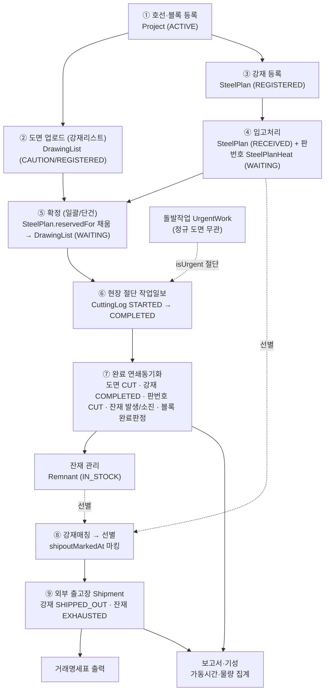
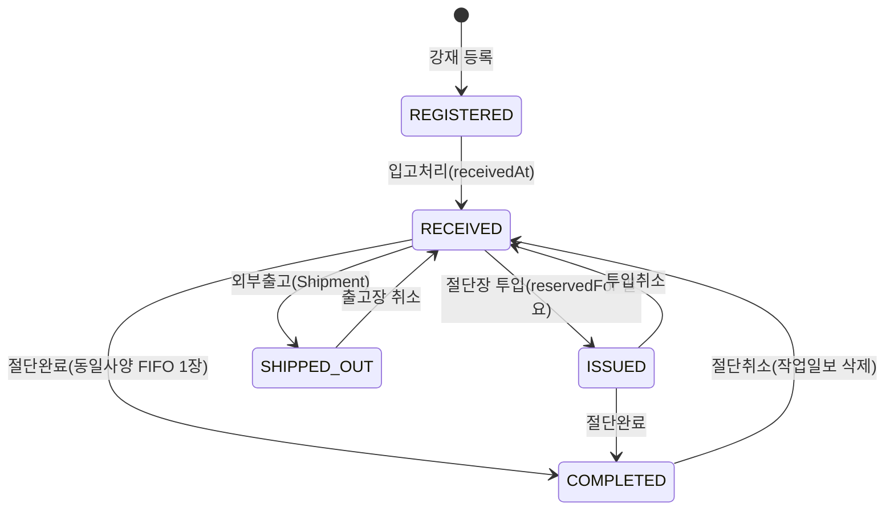
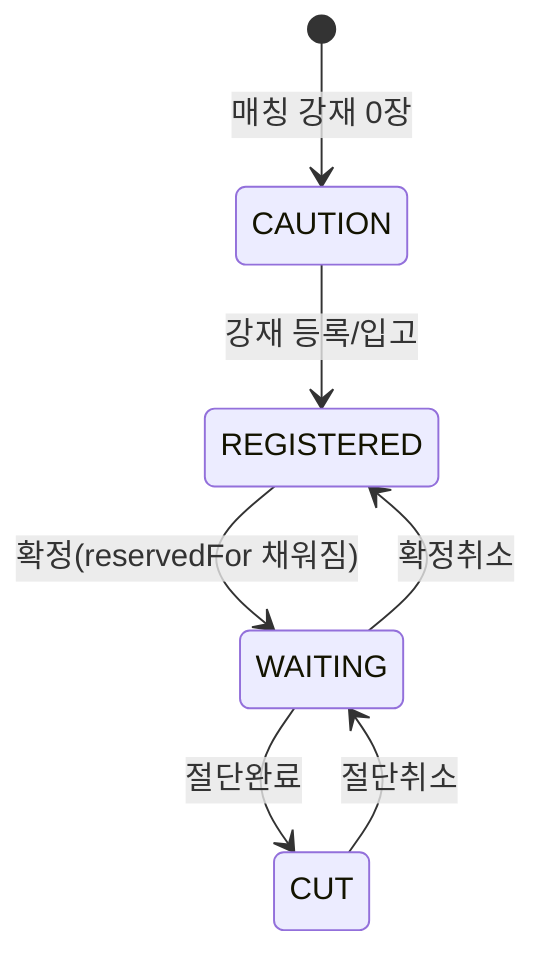
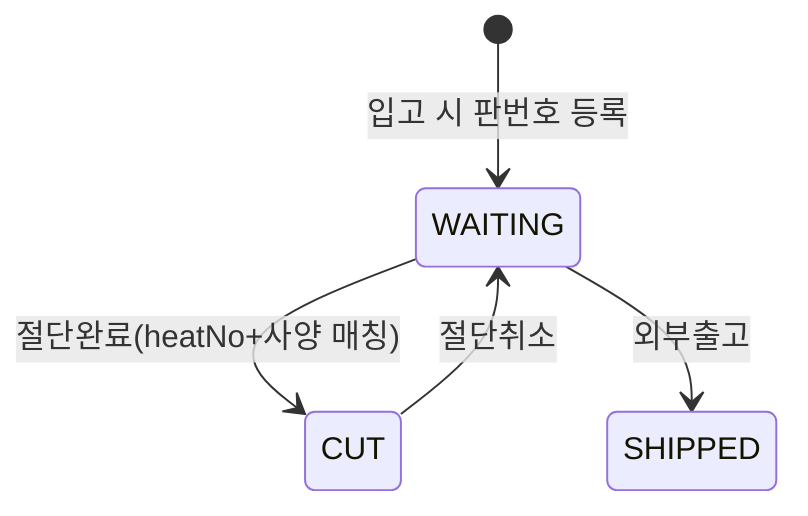
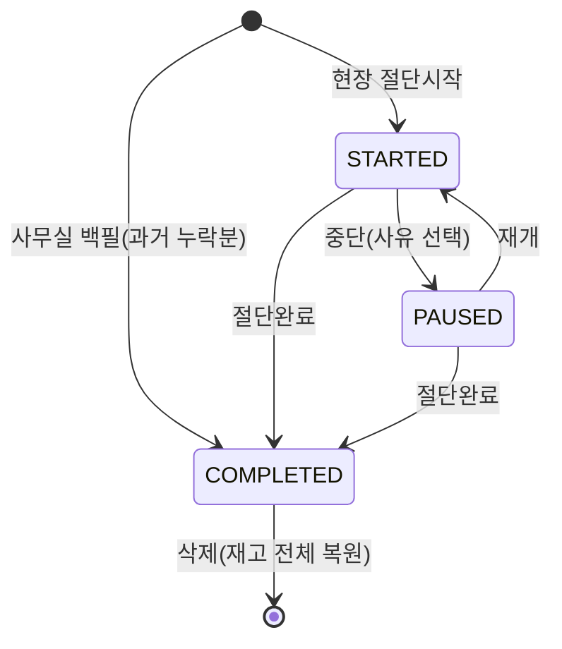
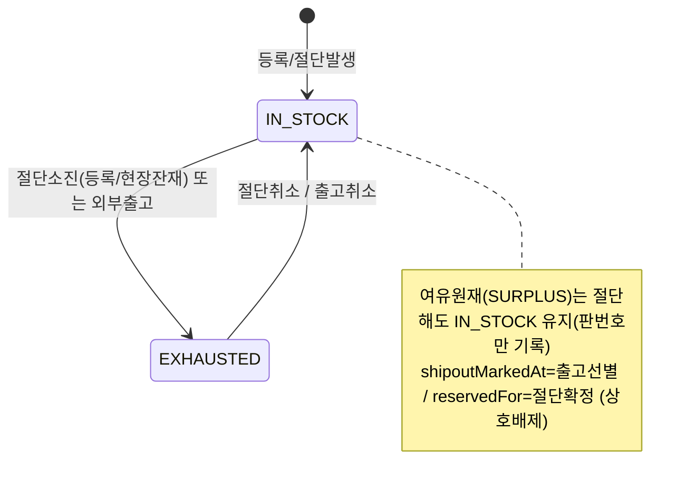
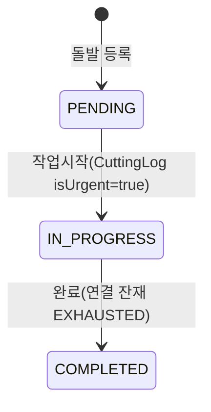
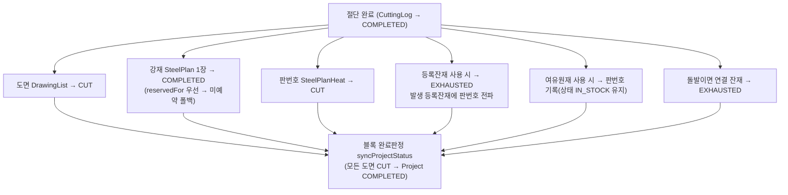
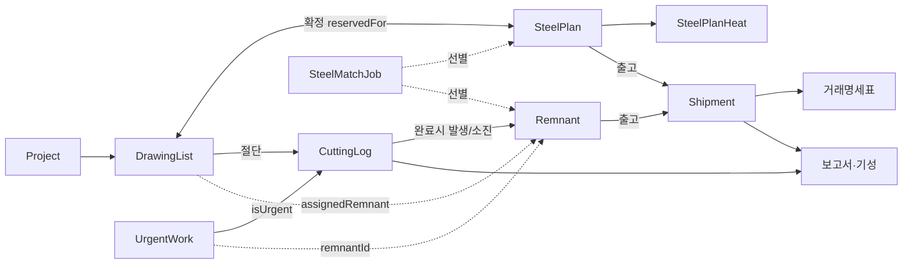
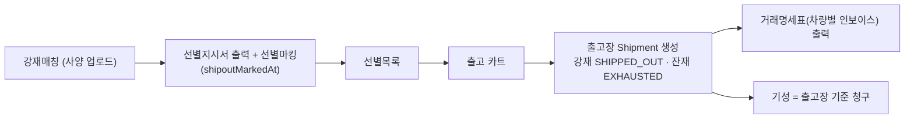

# 절단 파트 공정 흐름 (코드 기준 재구성)

> **이 문서의 목적**
> 절단 파트의 *실제 코드가 하는 동작*을 한 장으로 정리한 **살아있는 기준 문서**입니다.
> - **사용자(현장/관리자)**: 읽고 "여기 이게 현실이랑 다른데?" 를 [§9 확인 필요](#9-확인-필요-빈칸--업무규칙-검증)에 표시해 주세요.
> - **Claude**: 앞으로 절단 파트 판단은 이 문서를 기준으로 합니다. 코드가 바뀌면 이 문서도 같이 갱신합니다.
> - 작성 기준: 2026-06-26 코드. (변경 이력은 맨 아래)

---

## 1. 한눈에 보는 전체 공정

**큰 줄기**: 호선 → 도면 + 강재 → 입고 → 확정(도면↔강재 연결) → 절단 → 완료(자동 동기화) → 잔재/출고/기성.
**두 갈래**: 정규작업(도면 기반)과 돌발작업(잔재/긴급 기반)은 같은 작업일보(CuttingLog)를 쓰되 완료 시 동기화 대상이 다릅니다.
**상호배제 축**: 한 강재/잔재는 *절단용(reservedFor)* 과 *출고용(shipoutMarkedAt)* 중 하나로만 — [§6](#6-핵심-불변식-규칙) 참조.

---

## 2. 도메인 용어 ↔ 데이터

| 현장 용어 | 코드 필드/엔티티 | 비고 |
|---|---|---|
| 호선 | `Project.projectCode` | 프로젝트 단위 (예: RS01, 1022) |
| 블록 | `Project.projectName` / `DrawingList.block` | 선박 구역 단위 (예: F52P) |
| 도면(강재리스트) | `DrawingList` | 절단 대상 1행 = 도면 1장 |
| 도면번호 | `DrawingList.drawingNo` | 비어 있을 수 있음 |
| 원판/강재 | `SteelPlan` | 입고 철판 (호선별 사양) |
| 판번호 | `SteelPlanHeat.heatNo` | 실물 철판 추적 (heatNo) |
| 잔재 | `Remnant` | 여유원재/등록잔재/현장잔재 |
| 대체호선 | `DrawingList.alternateVesselCode` | 다른 호선 강재로 절단 시 |
| 절단확정 | `reservedFor` (`"호선/블록"`) | 절단용 선점 |
| 출고선별 | `shipoutMarkedAt` | 외부출고용 선점 |
| 기성 | `Shipment` (출고장/거래명세서) | 완료 물량 청구 |

---

## 3. 데이터 모델 & 상태값

| 엔티티 | 역할 | 상태(enum) |
|---|---|---|
| **Project** (호선/블록) | 프로젝트 마스터 | `ACTIVE` · `COMPLETED` · `ON_HOLD` |
| **DrawingList** (도면) | 절단 대상 강재리스트 | `CAUTION`(매칭강재0) · `REGISTERED`(강재있음·미확정) · `WAITING`(확정·절단대기) · `CUT`(절단완료) |
| **SteelPlan** (원판) | 입고 강재 | `REGISTERED` · `RECEIVED`(입고) · `ISSUED`(절단장투입) · `COMPLETED`(절단완료) · `SHIPPED_OUT`(외부출고) |
| **SteelPlanHeat** (판번호) | 실물 판 추적 | `WAITING` · `CUT` · `SHIPPED` |
| **CuttingLog** (작업일보) | 절단 1건 | `STARTED` · `PAUSED`(중단) · `COMPLETED` |
| **CuttingPause** (중단) | 중단 구간 | 사유: `EQUIPMENT_FAILURE`·`DRAWING_CHANGE`·`CONSUMABLE`·`WORK_EXTENSION`(야간이월)·`OTHER` |
| **Remnant** (잔재) | 자투리/여유재 | `PENDING`(미사용) · `IN_STOCK`(재고) · `EXHAUSTED`(소진) / 타입: `SURPLUS`(여유원재)·`REGISTERED`(등록잔재)·`REMNANT`(현장잔재) |
| **UrgentWork** (돌발) | 긴급작업 | `PENDING` · `IN_PROGRESS` · `COMPLETED` |
| **Shipment** (출고장) | 거래명세서 | `ACTIVE` · `CANCELLED` |
| **CncSchedule** (스케줄) | 블록 절단 예정 | `PLANNED`·`IN_PROGRESS`·`COMPLETED`·`HOLD`·`CANCELLED` |
| **SteelMatchJob** (강재매칭) | 사양 매칭 작업 | (상태 없음 — 사양 목록 저장) |

#### 판번호 모델 *(A2 확정)*
판번호(heatNo)는 **철판 1장의 고유 식별자**(주민번호 개념)이나, 시스템은 강재를 두 층으로 분리해서 다룬다:
- **강재목록 `SteelPlan`** = *호선+재질+사양* 단위 재고 (몇 장 있다). 입고·확정·소진은 여기서 **사양 단위**로 일어남.
- **판번호목록 `SteelPlanHeat`** = 판번호들의 풀 (사양에 느슨하게 묶임, FK 직접연결 없음).

입고/선별 단계에선 판번호를 일일이 확인할 수 없으므로 **강재 1장 ↔ 판번호를 직접 묶지 않는다.** 대신 **절단/외부출고 시점**에 담당자가 판번호를 확인해 "사용"으로 잡으면 → ① 강재목록에서 그 사양 1장이 소진(COMPLETED/SHIPPED_OUT) + ② 판번호목록에서 그 판번호가 CUT/SHIPPED 처리. **외부출고 때만 판번호 확인이 필수**이고, 내부 절단은 사양 단위로 흐른다.

---

## 4. 상태 전이도 (엔티티별)

### 4-1. 강재 SteelPlan (원판)

- `RECEIVED` 상태에서 두 가지 *선점*이 갈립니다: `reservedFor`(절단확정) ↔ `shipoutMarkedAt`(출고선별). **둘은 상호배제** ([§6](#6-핵심-불변식-규칙)).
- 절단 완료 시 동일 사양(호선+재질+두께+폭+길이) **RECEIVED/ISSUED 1장만** COMPLETED로 소진 (도면 1 : 원판 1).

### 4-2. 도면 DrawingList

- 같은 사양 도면이 여러 장이면, 확정된 강재 수만큼 `createdAt` 앞에서부터 `WAITING`, 나머지는 `REGISTERED` (`syncDrawingListBySpec`).

### 4-3. 판번호 SteelPlanHeat

### 4-4. 작업일보 CuttingLog

- 완료(`COMPLETED`)·삭제 시 **연쇄동기화**는 [§5](#5-완료--삭제-연쇄동기화-핵심)에.
- `PAUSED`(특히 야간이월)는 다음날에도 보이며 **수동 재개** 필요.

### 4-5. 잔재 Remnant

### 4-6. 돌발 UrgentWork

---

## 5. 완료 / 삭제 연쇄동기화 (핵심)

절단 **완료**(`PATCH action=complete` 또는 사무실 백필)와 **삭제**(`DELETE`)는 한 트랜잭션으로 여러 테이블을 동시 갱신합니다. 공용 로직: `lib/cutting-complete.ts` (`applyCuttingComplete` / `applyCuttingRestore`).

- **삭제**는 위를 전부 역방향 복원 (CUT→WAITING, COMPLETED→RECEIVED, 판번호 CUT→WAITING, 잔재 EXHAUSTED→IN_STOCK).
- 잔재(등록/현장) 사용 절단은 정규 강재(SteelPlan)를 건드리지 않습니다(상호배제). 여유원재는 판번호만 추적.

---

## 6. 핵심 불변식 (규칙)

| # | 규칙 | 코드 근거 |
|---|---|---|
| R1 | **절단 ↔ 출고 상호배제**: `reservedFor`(절단확정) 채워진 강재/잔재는 출고선별 불가, `shipoutMarkedAt`(출고선별)된 것은 절단투입/소진 대상에서 제외 | shipout-mark / issue-bulk / reserve-bulk / cutting-complete |
| R2 | **도면 1 : 원판 1 소진(FIFO)**: 완료 시 동일사양 RECEIVED/ISSUED 중 `createdAt` 빠른 1장만 COMPLETED | cutting-complete.ts |
| R3 | **확정한 강재만 소진**: 완료 시 이 블록에 예약(`호선/블록` 또는 `블록`)된 강재만 COMPLETED. **미예약 폴백 없음** — 확정된 강재가 없으면 소진 스킵(관리자 수동). 다른 블록 예약 강재는 절대 안 씀. *(A3 확정: 정확한 재고관리 위해 엄격모드, 2026-06-26)* | cutting-complete.ts |
| R4 | **대체호선**: `alternateVesselCode` 있으면 그 호선 강재로 매칭(없으면 본 호선). 대체호선 강재 미입고면 매칭 실패(절단은 되나 강재 자동소진 안 됨) | cutting-complete.ts / drawings |
| R5 | **블록 완료 자동판정**: 블록의 모든 도면이 CUT이면 `Project.COMPLETED`, 하나라도 아니면 `ACTIVE`. 도면 0개면 미판정(null) | sync-project-status.ts |
| R6 | **완료/삭제 원자성**: 연쇄동기화는 `prisma.$transaction`(timeout 20s)로 전부-또는-전무 | cutting-logs/[id], lib/cutting-complete |
| R7 | **작업일보 수정 안전차단**: 완료 로그의 판번호·치수·완료상태는 사무실에서 변경 불가(삭제 후 재등록). 진행중 로그에 종료일시 입력 불가 | cutting-logs/[id] PATCH |
| R8 | **백필**: 종료일시까지 채운 과거 누락분은 STARTED 안 거치고 바로 COMPLETED 생성(장비 가드 우회) | cutting-logs POST |
| R9 | **중복절단 방지**: 한 도면이 *어느 장비든* 절단중(STARTED/PAUSED)이면 현장 목록에서 제외 + 시작 차단. 장비당 STARTED 1건 | drawings / cutting-logs |
| R10 | **잔재 선별/출고는 작업(매칭이름) 무관 전역**: 잔재는 job 라벨이 없어 사양만으로 매칭(호선 무관) | steel-match-select.ts |

---

## 7. 모듈 연결도

---

## 8. 외부 출고 & 기성 흐름

- 현장(모바일) 출고: 판번호 입력 → 선별목록 후보 → 카트 → 출고장 (PC와 동일 연계).
- 보고서는 `CuttingLog.COMPLETED` 기준 가동시간·물량 집계. 야간이월(`WORK_EXTENSION`) 시간은 총가동에서 차감.

---

## 9. 확인 필요 (빈칸) — 업무규칙 검증

> 아래는 **코드는 이렇게 동작하는데, 그게 현실 업무 의도와 맞는지 코드만으로 단정할 수 없는** 항목입니다.
> 각 항목에 **맞음 / 틀림(이렇게 바뀌어야)** 를 적어 주시면, 제가 그 기준으로 코드를 정리합니다.

### A. 소진·매칭 모델  *(2026-06-26 확정)*
- [x] **A1. 원판 소진 = 도면1:원판1, FIFO 1장만 COMPLETED.** → **맞음.** 도면 1개가 원판 1장을 소진. 단, 절단 후 발생한 **등록잔재(자식)** 로는 이후 다른 도면을 절단할 수 있음(그건 잔재 사용 절단). 원판:도면 = 1:1.
- [x] **A2. 판번호 모델.** → **정정.** 판번호는 *원칙적으로 철판 1장의 고유 식별자*(주민등록번호 개념). 다만 수입/국내 제조사가 많아 같은 번호가 들어올 가능성은 있음. **시스템 사용 방식**: 입고/등록 시 판번호를 강재 1장에 *직접 연결하지 않고*, **강재목록(호선+재질+사양 단위)** 과 **판번호목록(판번호 풀)** 을 분리 보관한다(입고·선별 때 판번호까지 일일이 확인 불가하므로). **절단/외부출고 시점에 담당자가 판번호를 확인해 "사용"으로 잡으면** → 강재목록에서 그 사양 1장이 소진되고 + 판번호목록에서 그 판번호가 사용처리됨. **외부출고 때만 판번호 확인 필수**. → [§3 판번호 모델 참조](#판번호-모델-a2-확정). (현재 코드 구조가 이 모델과 일치 — 강재↔판번호 느슨 연결. 하드 unique 제약은 미적용; 필요 시 *중복 판번호 입력 경고*를 추가할 수 있음.)
- [x] **A3. 확정한 강재만 절단/출고 가능 (미예약 폴백 제거).** → **엄격모드로 변경.** 정확한 재고 파악을 위해, 확정(예약)된 강재만 절단 소진/외부출고 가능. 확정된 게 없으면 자동 소진하지 않음(관리자 수동). *(cutting-complete.ts 미예약 폴백 제거 — 2026-06-26 반영, R3)*

### B. 잔재
- [ ] **B1. 여유원재(SURPLUS)는 절단해도 EXHAUSTED 안 되고 IN_STOCK 유지**(판번호만 기록). → 의도가 맞는지? (재사용 위함?)
- [ ] **B2. 등록잔재 발생 시, 같은 도면의 등록잔재들에 절단 원판의 판번호를 전파.** 이 판번호의 용도(추적/출고/보고서)와 "여러 등록잔재가 같은 판번호 공유"가 맞는지?
- [ ] **B3. 현장잔재(REMNANT)는 판번호 입력칸이 없음**(판번호 미추적). → 현장잔재도 판번호 추적이 필요한가요?
- [ ] **B4. 부모-자식 잔재 트리**: 부모 잔재가 소진(EXHAUSTED)돼도 자식은 독립 유지. 부모 삭제 시에만 연결 해제. → 맞나요?
- [ ] **B5. 잔재 `PENDING` 상태는 실제로 안 쓰임**(항상 IN_STOCK 생성). → 정리해도 되나요?

### C. 대체호선·확정
- [ ] **C1. 대체호선(alternateVesselCode)** 은 어떤 상황에 쓰나요? (예: A호선 블록을 B호선 입고 강재로 절단). 대체호선 강재 미입고면 절단은 되지만 강재 자동소진이 안 됨 — 맞나요?
- [ ] **C2. 일괄확정 취소**는 그 블록에 절단완료(CUT) 도면이 1건이라도 있으면 막히고, "작업일보에서 절단취소 먼저" 안내. → 운영규칙으로 맞나요?

### D. 작업일보
- [ ] **D1. 야간이월(퇴근) 중단**은 다음날 자동 재개가 아니라 작업자가 **수동으로 '재개'** 눌러야 함. → 맞나요?
- [ ] **D2. 완료 로그의 판번호·치수·완료상태 수정은 차단**(삭제 후 재등록). 잦은 실수 대비 관리자 수정권한/수정이력이 따로 필요한가요?
- [ ] **D3. 백필(과거 누락분)은 날짜 제약 없음**(지난주·지난달도 입력 가능). → 맞나요?
- [ ] **D4. 한 도면은 어느 장비든 절단중이면 다른 장비에서 선택 불가.** → 맞나요? (여러 장비 동시 같은 도면 시나리오 없음?)

### E. 돌발
- [ ] **E1. 돌발 완료 후 잔재팝업 '없음' → 즉시 COMPLETED.** 나중에 잔재가 발견되면 처리 경로가 있나요?
- [ ] **E2. `UrgentWork.useWeight`(예상 사용량)와 실제 CuttingLog 물량은 연결 안 됨.** 기성 계산은 예상량 기준인가요?
- [ ] **E3. 돌발은 현장에서 호선/블록 선택 없이 시작**(projectId는 관리자 사전등록값만). → 맞나요?

### F. 출고·기성
- [ ] **F1. 기성 = 출고장(Shipment) 생성 시 자동 인정** (별도 기성 승인 단계 없음). → 맞나요, 아니면 승인 절차가 필요한가요?
- [ ] **F2. 호선 미지정 돌발작업은 호선별 기성 집계에서 제외** (전체 상세에는 표시). → 맞나요?
- [ ] **F3. 같은 사양 강재가 원판+잔재로 선별목록에 중복 등록 가능** (중복검사 없음). → 막아야 하나요?
- [ ] **F4. 거래명세표 inline 자동저장 실패 시 사용자 알림 없음**(콘솔만). → 실패 알림이 필요한가요?

---

## 변경 이력
- 2026-06-26: 최초 작성 (코드 8개 하위공정 매핑 기반).
