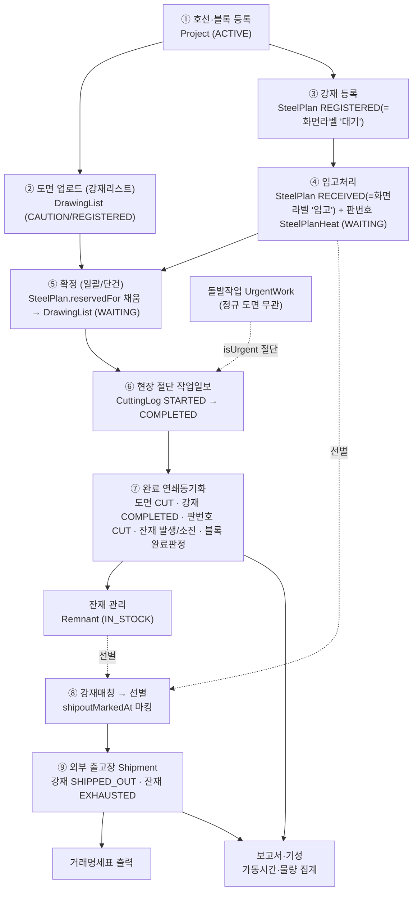
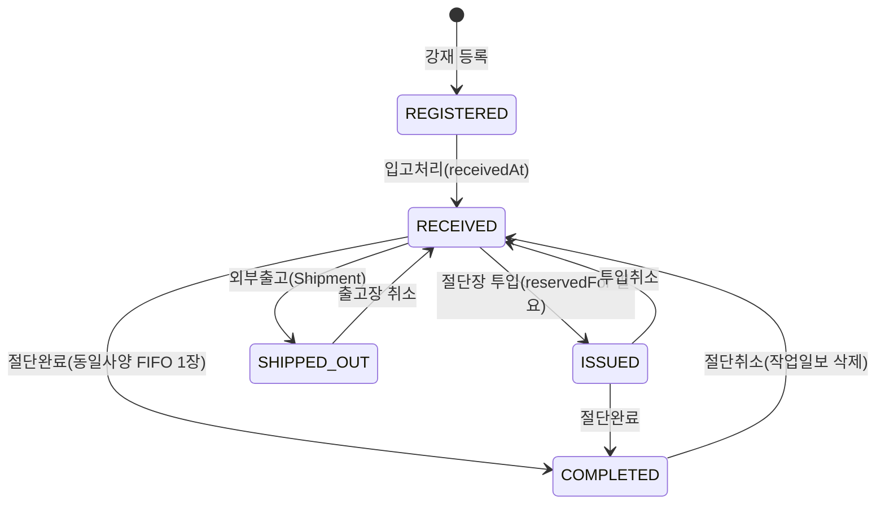
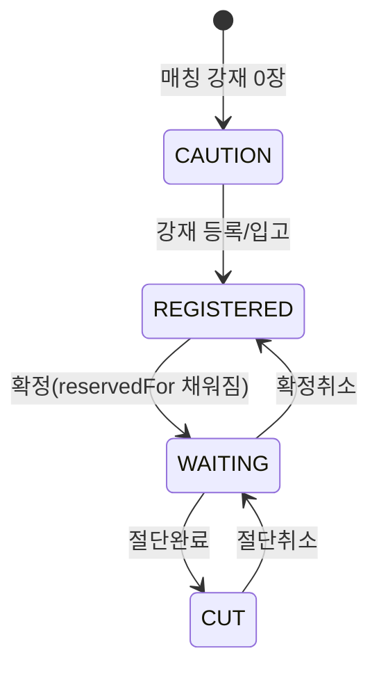
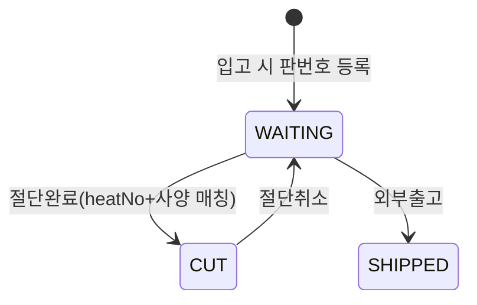
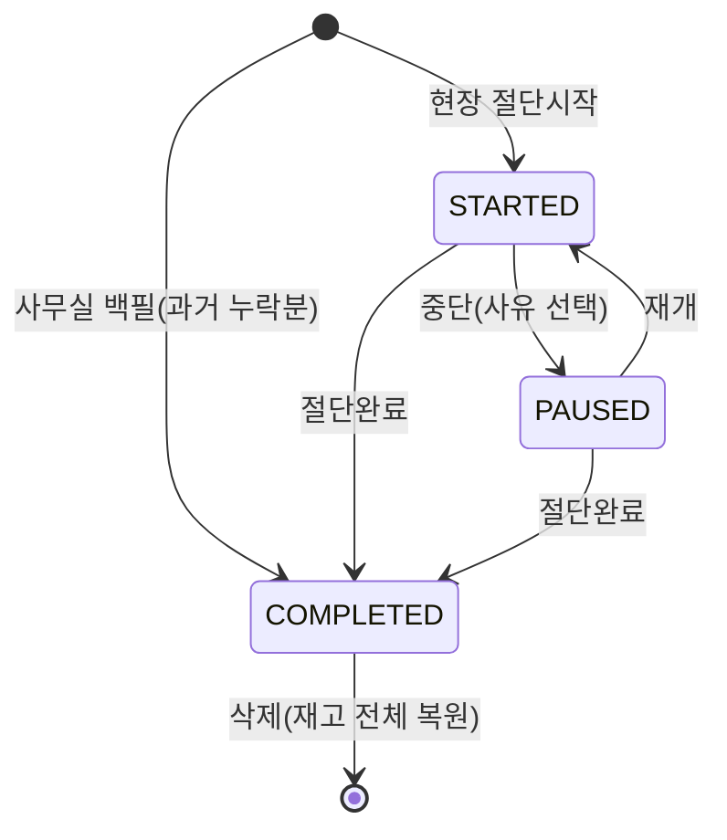
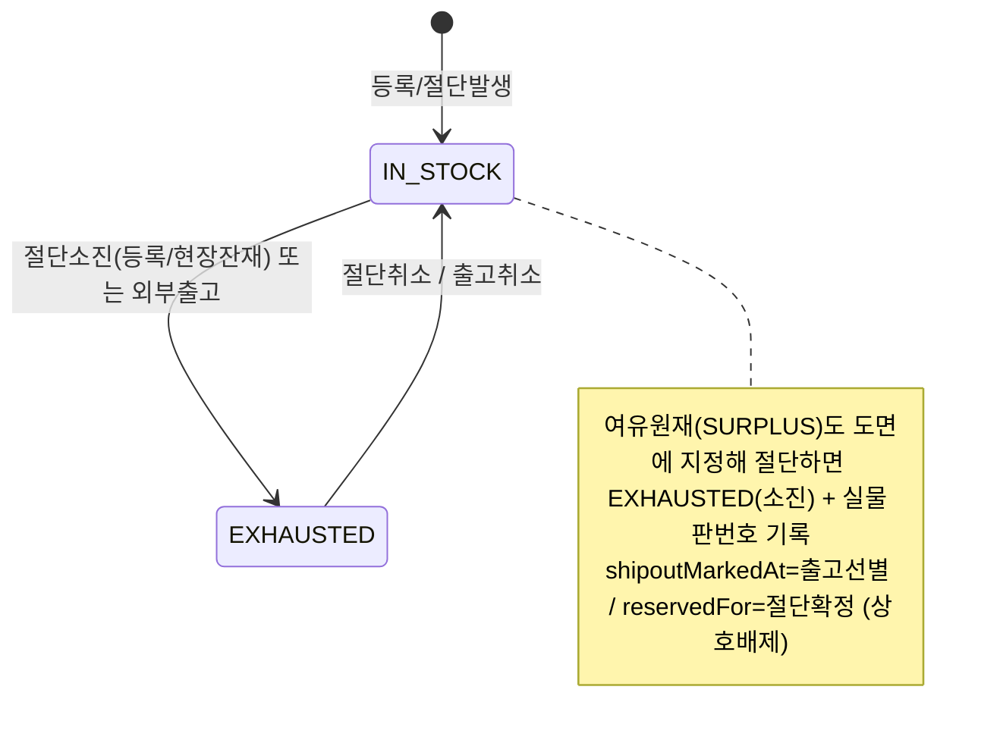
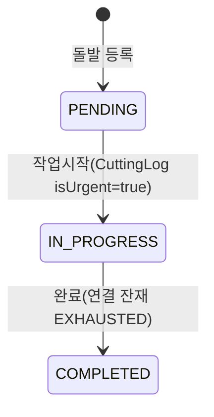
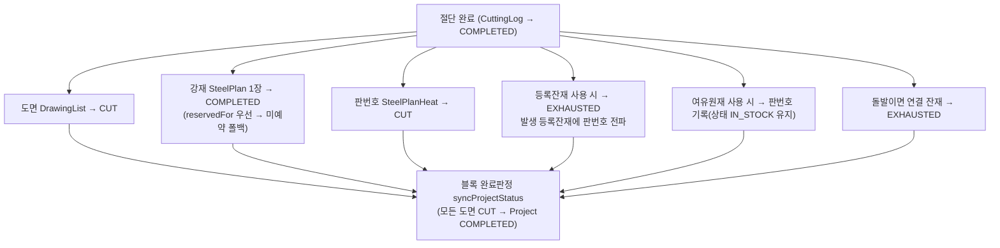
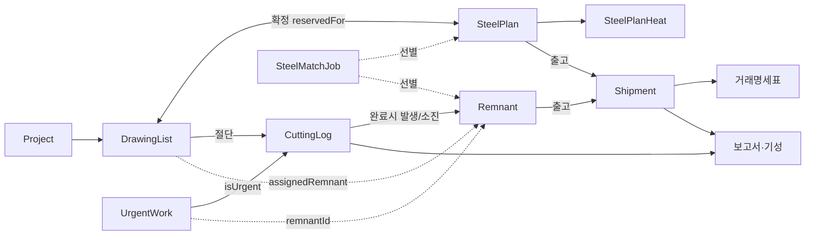

# 절단 파트 공정 흐름 (코드 기준 재구성)

> **이 문서의 목적**
> 절단 파트의 *실제 코드가 하는 동작*을 한 장으로 정리한 **살아있는 기준 문서**입니다.
> - **사용자(현장/관리자)**: 읽고 "여기 이게 현실이랑 다른데?" 를 [§9 확인 필요](#9-확인-필요-빈칸--업무규칙-검증)에 표시해 주세요.
> - **Claude**: 앞으로 절단 파트 판단은 이 문서를 기준으로 합니다. 코드가 바뀌면 이 문서도 같이 갱신합니다.
> - 작성 기준: 2026-06-26 코드. **최근 갱신 2026-07-15** (변경 이력은 맨 아래)
> - **이 문서가 절단파트 단일 기준 문서입니다.** 구버전 `원자재_입고_공정_수정_지침서_v4.md`(2026-04-07)와 `절단파트 구현 지침서.md`(v3, 2026-06-20)를 통합·대체했습니다. 외부 강재 출고의 *깊은 구현 상세*만 별도 `shipout-implementation.md` 참조.

---

## 1. 한눈에 보는 전체 공정



**큰 줄기**: 호선 → 도면 + 강재 → 입고 → 확정(도면↔강재 연결) → 절단 → 완료(자동 동기화) → 잔재/출고/기성.
**두 갈래**: 정규작업(도면 기반)과 돌발작업(잔재/긴급 기반)은 같은 작업일보(CuttingLog)를 쓰되 완료 시 동기화 대상이 다릅니다.
**상호배제 축**: 한 강재/잔재는 *절단용(reservedFor)* 과 *출고용(shipoutMarkedAt)* 중 하나로만 — [§6](#6-핵심-불변식-규칙) 참조.

---

## 2. 도메인 용어 ↔ 데이터

| 현장 용어 | 코드 필드/엔티티 | 비고 |
|---|---|---|
| 호선 | `Project.projectCode` | 프로젝트 단위 (예: RS01, 1022) |
| 블록 | `Project.projectName` / `DrawingList.block` | 선박 구역 단위 (예: F52P) |
| 도면(강재리스트) | `DrawingList` | 절단 대상 1행 = 도면 1장 |
| 도면번호 | `DrawingList.drawingNo` | 비어 있을 수 있음 |
| 원판/강재 | `SteelPlan` | 입고 철판 (호선별 사양) |
| 판번호 | `SteelPlanHeat.heatNo` | 실물 철판 추적 (heatNo) |
| 잔재 | `Remnant` | 여유원재/등록잔재/현장잔재 |
| 대체호선 | `DrawingList.alternateVesselCode` | 다른 호선 강재로 절단 시 |
| 절단확정 | `reservedFor` (`"호선/블록"`) | 절단용 선점 |
| 출고선별 | `shipoutMarkedAt` | 외부출고용 선점 |
| 기성 | `Shipment` (출고장/거래명세서) | 완료 물량 청구 |

---

## 3. 데이터 모델 & 상태값

| 엔티티 | 역할 | 상태(enum) |
|---|---|---|
| **Project** (호선/블록) | 프로젝트 마스터 | `ACTIVE` · `COMPLETED` · `ON_HOLD` |
| **DrawingList** (도면) | 절단 대상 강재리스트 | `CAUTION`(매칭강재0) · `REGISTERED`(강재있음·미확정) · `WAITING`(확정·절단대기) · `CUT`(절단완료) |
| **SteelPlan** (원판) | 입고 강재 | `REGISTERED` · `RECEIVED` · `ISSUED` · `COMPLETED` · `SHIPPED_OUT` — **화면 라벨은 각각 대기/입고/투입/절단/외부** (steel-plan-main.tsx:PLAN_STATUS 매핑, 2026-07-14 변경) |
| **SteelPlanHeat** (판번호) | 실물 판 추적 | `WAITING` · `CUT` · `SHIPPED` |
| **CuttingLog** (작업일보) | 절단 1건 | `STARTED` · `PAUSED`(중단) · `COMPLETED` |
| **CuttingPause** (중단) | 중단 구간 | 사유: `EQUIPMENT_FAILURE`·`DRAWING_CHANGE`·`CONSUMABLE`·`WORK_EXTENSION`(야간이월)·`OTHER` |
| **Remnant** (잔재) | 자투리/여유재 | `PENDING`(미사용) · `IN_STOCK`(재고) · `EXHAUSTED`(소진) / 타입: `SURPLUS`(여유원재)·`REGISTERED`(등록잔재)·`REMNANT`(현장잔재) |
| **UrgentWork** (돌발) | 긴급작업 | `PENDING` · `IN_PROGRESS` · `COMPLETED` |
| **Shipment** (출고장) | 거래명세서 | `ACTIVE` · `CANCELLED` — **CANCELLED 만 영구 삭제 가능** (DELETE /api/shipments/[id], 2026-07-14 신설) |
| **ShipmentItem** (출고품목) | 자재 스냅샷 | 원판·잔재 XOR, `adHocFromField:boolean`(현장직접출고 감사 태그, 2026-07-14 마이그레이션 20260714000010 신설) |
| **CncSchedule** (스케줄) | 블록 절단 예정 | `PLANNED`·`IN_PROGRESS`·`COMPLETED`·`HOLD`·`CANCELLED` |
| **SteelMatchJob** (강재매칭) | 사양 매칭 작업 | (상태 없음 — 사양 목록 저장) |

#### 판번호 모델 *(A2 확정)*
판번호(heatNo)는 **철판 1장의 고유 식별자**(주민번호 개념)이나, 시스템은 강재를 두 층으로 분리해서 다룬다:
- **강재목록 `SteelPlan`** = *호선+재질+사양* 단위 재고 (몇 장 있다). 입고·확정·소진은 여기서 **사양 단위**로 일어남.
- **판번호목록 `SteelPlanHeat`** = 판번호들의 풀 (사양에 느슨하게 묶임, FK 직접연결 없음).

입고/선별 단계에선 판번호를 일일이 확인할 수 없으므로 **강재 1장 ↔ 판번호를 직접 묶지 않는다.** 대신 **절단/외부출고 시점**에 담당자가 판번호를 확인해 "사용"으로 잡으면 → ① 강재목록에서 그 사양 1장이 소진(COMPLETED/SHIPPED_OUT) + ② 판번호목록에서 그 판번호가 CUT/SHIPPED 처리. **외부출고 때만 판번호 확인이 필수**이고, 내부 절단은 사양 단위로 흐른다.

**절단완료 후 판번호 추적 기록 위치** (밀시트 역추적 근거 → B2):
- `DrawingList.heatNo` — 그 도면에 쓰인 판번호
- `SteelPlan.actualHeatNo`/`actualVesselCode`/`actualDrawingNo` — 그 강재 1장이 어디에 쓰였는지
- `SteelPlanHeat.status = CUT` — 그 판번호가 절단됨
- `CuttingLog` — 절단 실적(작업자·일시·도면)

---

## 4. 상태 전이도 (엔티티별)

### 4-1. 강재 SteelPlan (원판)

- `RECEIVED` 상태에서 두 가지 *선점*이 갈립니다: `reservedFor`(절단확정) ↔ `shipoutMarkedAt`(출고선별). **둘은 상호배제** ([§6](#6-핵심-불변식-규칙)).
- 절단 완료 시 동일 사양(호선+재질+두께+폭+길이) **RECEIVED/ISSUED 1장만** COMPLETED로 소진 (도면 1 : 원판 1).
- **표기 주의** (2026-07-14): enum 값과 화면 라벨이 다름 — `REGISTERED`=**대기**, `RECEIVED`=**입고**, `ISSUED`=**투입**, `COMPLETED`=**절단**, `SHIPPED_OUT`=**외부**. 코드/DB 는 enum 값 그대로 유지, UI 만 라벨 변경.

### 4-2. 도면 DrawingList

- 같은 사양 도면이 여러 장이면, 확정된 강재 수만큼 `createdAt` 앞에서부터 `WAITING`, 나머지는 `REGISTERED` (`syncDrawingListBySpec`).

### 4-3. 판번호 SteelPlanHeat


### 4-4. 작업일보 CuttingLog

- 완료(`COMPLETED`)·삭제 시 **연쇄동기화**는 [§5](#5-완료--삭제-연쇄동기화-핵심)에.
- `PAUSED`(특히 야간이월)는 다음날에도 보이며 **수동 재개** 필요.

### 4-5. 잔재 Remnant


### 4-6. 돌발 UrgentWork


---

## 5. 완료 / 삭제 연쇄동기화 (핵심)

절단 **완료**(`PATCH action=complete` 또는 사무실 백필)와 **삭제**(`DELETE`)는 한 트랜잭션으로 여러 테이블을 동시 갱신합니다. 공용 로직: `lib/cutting-complete.ts` (`applyCuttingComplete` / `applyCuttingRestore`).



- **삭제**는 위를 전부 역방향 복원 (CUT→WAITING, COMPLETED→RECEIVED, 판번호 CUT→WAITING, 잔재 EXHAUSTED→IN_STOCK).
- 잔재(등록/현장) 사용 절단은 정규 강재(SteelPlan)를 건드리지 않습니다(상호배제). 여유원재는 판번호만 추적.

---

## 6. 핵심 불변식 (규칙)

| # | 규칙 | 코드 근거 |
|---|---|---|
| R1 | **절단 ↔ 출고 상호배제**: `reservedFor`(절단확정) 채워진 강재/잔재는 출고선별 불가, `shipoutMarkedAt`(출고선별)된 것은 절단투입/소진 대상에서 제외 | shipout-mark / issue-bulk / reserve-bulk / cutting-complete |
| R2 | **도면 1 : 원판 1 소진(FIFO)**: 완료 시 동일사양 RECEIVED/ISSUED 중 `createdAt` 빠른 1장만 COMPLETED | cutting-complete.ts |
| R3 | **확정한 강재만 소진**: 완료 시 이 블록에 예약(`호선/블록` 또는 `블록`)된 강재만 COMPLETED. **미예약 폴백 없음** — 확정된 강재가 없으면 소진 스킵(관리자 수동). 다른 블록 예약 강재는 절대 안 씀. *(A3 확정: 정확한 재고관리 위해 엄격모드, 2026-06-26)* | cutting-complete.ts |
| R4 | **대체호선**: `alternateVesselCode` 있으면 그 호선 강재로 매칭(없으면 본 호선). 대체호선 강재 미입고면 매칭 실패(절단은 되나 강재 자동소진 안 됨) | cutting-complete.ts / drawings |
| R5 | **블록 완료 자동판정**: 블록의 모든 도면이 CUT이면 `Project.COMPLETED`, 하나라도 아니면 `ACTIVE`. 도면 0개면 미판정(null) | sync-project-status.ts |
| R6 | **완료/삭제 원자성**: 연쇄동기화는 `prisma.$transaction`(timeout 20s)로 전부-또는-전무 | cutting-logs/[id], lib/cutting-complete |
| R7 | **작업일보 수정 안전차단**: 완료 로그의 판번호·치수·완료상태는 사무실에서 변경 불가(삭제 후 재등록). 진행중 로그에 종료일시 입력 불가 | cutting-logs/[id] PATCH |
| R8 | **백필**: 종료일시까지 채운 과거 누락분은 STARTED 안 거치고 바로 COMPLETED 생성(장비 가드 우회) | cutting-logs POST |
| R9 | **중복절단 방지**: 한 도면이 *어느 장비든* 절단중(STARTED/PAUSED)이면 현장 목록에서 제외 + 시작 차단. 장비당 STARTED 1건 | drawings / cutting-logs |
| R10 | **잔재 선별/출고는 작업(매칭이름) 무관 전역**: 잔재는 job 라벨이 없어 사양만으로 매칭(호선 무관) | steel-match-select.ts |
| R11 | **블록 절단 상태(대시보드 분류) = 실제 CUT 도면 수 기준** (Project.status 아님). **완료**=등록된 모든 도면 절단완료(cut==total). **진행중**=1장 이상 절단됨(cut>0) 또는 절단작업 진행중(STARTED/PAUSED)이면서 완료 아님. **대기**=절단 0장(등록·확정만)→대시보드 미표시. *(2026-06-26: 등록·확정만 된 블록이 진행중으로 잡히던 문제 수정)* | cutpart/dashboard |
| **R12** | **현장 판번호 매칭은 호선 무관 — 시리즈호선 유연성** *(2026-07-15 정책 확정)*. 현장 작업일보(`/field/worklog`) 의 판번호 picker (`/api/steel-plan/heat-options`) 는 `vesselCode` 조건을 걸지 않고 사양(재질·두께·폭·길이)만 매칭한다. 이유: 시리즈호선 특성상 도면 호선과 실물 판번호 호선이 다를 수 있음(예: A호선 도면에 B호선 판번호 재고 사용). **화면 표시**: 도면 호선과 다른 판번호는 amber(주황) 배지 `2222 · 타호선` 로 시각적 경고 (같으면 회색). 선택은 자유. `applyCuttingComplete` 는 heatNo+effectiveVessel+spec 매칭이라 타호선 판번호 사용 시 원판목록만 소진되고 판번호 마스터에는 해당 heat 가 그대로 남을 수 있는 이론적 desync 가능성은 있으나, 현장 물류상 시리즈호선 판번호 사용은 정상 흐름이라 UI 경고로 대응 (기술적 강제 X). | field-worklog.tsx:344,1178-1208 / heat-options/route.ts |

---

## 7. 모듈 연결도



---

## 8. 외부 출고 & 기성 흐름


- 현장(모바일) 출고: 판번호 입력 → 선별목록 후보 → 카트 → 출고장 (PC와 동일 연계).
- 보고서는 `CuttingLog.COMPLETED` 기준 가동시간·물량 집계. 야간이월(`WORK_EXTENSION`) 시간은 총가동에서 차감.

---

## 9. 확인 필요 (빈칸) — 업무규칙 검증

> 아래는 **코드는 이렇게 동작하는데, 그게 현실 업무 의도와 맞는지 코드만으로 단정할 수 없는** 항목입니다.
> 각 항목에 **맞음 / 틀림(이렇게 바뀌어야)** 를 적어 주시면, 제가 그 기준으로 코드를 정리합니다.

### A. 소진·매칭 모델  *(2026-06-26 확정)*
- [x] **A1. 원판 소진 = 도면1:원판1, FIFO 1장만 COMPLETED.** → **맞음.** 도면 1개가 원판 1장을 소진. 단, 절단 후 발생한 **등록잔재(자식)** 로는 이후 다른 도면을 절단할 수 있음(그건 잔재 사용 절단). 원판:도면 = 1:1.
- [x] **A2. 판번호 모델.** → **정정.** 판번호는 *원칙적으로 철판 1장의 고유 식별자*(주민등록번호 개념). 다만 수입/국내 제조사가 많아 같은 번호가 들어올 가능성은 있음. **시스템 사용 방식**: 입고/등록 시 판번호를 강재 1장에 *직접 연결하지 않고*, **강재목록(호선+재질+사양 단위)** 과 **판번호목록(판번호 풀)** 을 분리 보관한다(입고·선별 때 판번호까지 일일이 확인 불가하므로). **절단/외부출고 시점에 담당자가 판번호를 확인해 "사용"으로 잡으면** → 강재목록에서 그 사양 1장이 소진되고 + 판번호목록에서 그 판번호가 사용처리됨. **외부출고 때만 판번호 확인 필수**. → [§3 판번호 모델 참조](#판번호-모델-a2-확정). (현재 코드 구조가 이 모델과 일치 — 강재↔판번호 느슨 연결. 하드 unique 제약은 미적용; 필요 시 *중복 판번호 입력 경고*를 추가할 수 있음.)
- [x] **A3. 확정한 강재만 절단/출고 가능 (미예약 폴백 제거).** → **엄격모드로 변경.** 정확한 재고 파악을 위해, 확정(예약)된 강재만 절단 소진/외부출고 가능. 확정된 게 없으면 자동 소진하지 않음(관리자 수동). *(cutting-complete.ts 미예약 폴백 제거 — 2026-06-26 반영, R3)*

### B. 잔재
- [x] **B1. 여유원재(SURPLUS) 절단 = EXHAUSTED 소진. → 맞음 (2026-06-26 확정).** *여유원재(잉여재) = 프로젝트용으로 샀다가 손도 안 댄 채 남은 원판(용도 미정).* 한 프로젝트에 쓰면 그 원판으로선 다 쓴 것이라 **소진(EXHAUSTED)이 맞음** + 실물 판번호를 판번호목록(SteelPlanHeat)에 CUT으로 기록. 잘라서 남는 건 **새 잔재(등록/현장)** 로 잡힘. (*최초 문서의 "IN_STOCK 유지"는 코드 오독이었음.*)
- [x] **B6. 정규 절단 '남은 잔재' 현장 팝업 — 불필요 결정 (2026-06-26).** 잔재 등록 경로가 이미 충분하므로 누락 없음:
  1. **강재리스트 등록(업로드)** 시 등록잔재 사전선언 (여유원재 발생분 포함, parent 연결)
  2. **잔재관리 메뉴**(scrap-main → remnant-tabs)에서 3종(여유/등록/현장) **수동 등록 언제든**
  3. **돌발작업 완료 팝업**(현장잔재 REMNANT 생성)
  → 정규 현장 절단 '그 순간'의 자동 팝업은 *편의 기능*일 뿐 필수 아님 → **추가 안 함.** (나중에 현장에서 바로 넣고 싶어지면 정규 완료에도 돌발식 팝업 추가 가능.)
- [x] **B2. 판번호 전파 = 추적(밀시트 역추적)용. → 맞음 (2026-06-26).** 원판 판번호는 **부모→자식 잔재로 끝까지** 따라가야, 어떤 잔재로 자르든 그 판번호로 **밀시트(강재 성적서)까지 역추적** 가능. 잔재는 **잔재번호(고유)** 로 개별 구분 + **판번호(출신 원판)** 는 공유.
  > ⚠️ **현 구현은 부분만.** 자동 전파는 *원판 → 등록잔재(같은 도면) 1단계만*. **(a) 현장잔재(REMNANT)** 는 절단 발생해도 부모 판번호 자동 전파 없음(전파가 REGISTERED 전용). **(b) 다단계**: 등록잔재를 2차 절단할 때 판번호 미입력(`log.heatNo` 빈값)이라 자식에게 전파 끊김. 현재는 잔재관리 '발생판번호' **수동 입력**으로만 보완. → **B3·B4 = 이 전체 자동 전파 구현** (기존 메모리 TODO `cnc-surplus-platenumber-lifecycle-todo`와 동일).
- [x] **B3. 현장잔재 판번호 추적 → 필요 (구현 대상).** B2 확정대로 현장잔재(일반잔재)도 부모 원판 판번호를 받아 밀시트까지 추적돼야 함. 현재는 현장잔재에 부모 판번호 **자동 전파 없음**(돌발 팝업·정규 절단 경로에서 판번호 미입력). → **잔재 판번호 lifecycle 일괄 구현에 포함** (B2 갭과 동일).
- [x] **B4. 부모-자식 잔재 트리 → 맞음 (2026-06-26).** 원판(부모)→잔재(자식). 부모가 소진(EXHAUSTED)되거나 삭제돼도 자식 잔재는 **독립 유지** (부모 삭제 시 `parentRemnantId`만 null 해제, 자식 레코드·판번호는 보존 → 추적 유지). 자식도 따로 절단/출고 가능.
- [x] **B5. 잔재 PENDING 상태 = 미사용 확정.** 모든 잔재 생성이 IN_STOCK(업로드·수동·돌발 전부). PENDING→IN_STOCK 전이(drawings/[id])는 매칭 0건. enum 제거는 마이그레이션 필요 + 실익 적어 **그대로 두되 '미사용'으로 기록**(원하면 추후 정리).

### C. 대체호선·확정  *(2026-06-26 확정)*
- [x] **C1. 대체호선 = 다른 프로젝트 강재를 빌려 쓰는 기능. → 맞음 (의도대로 동작).** 시나리오: A(급함)·B가 같은 재질·사양 철판을 각각 주문했는데 A 것은 일부만 입고·B 것은 다 입고 → A 도면에 **대체호선=B** 지정해 B 강재로 A를 절단. 나중에 A 강재 들어오면 B 도면에 대체호선=A로 대칭 사용.
  - **설정**: 도면 테이블 도면별 '대체호선' 드롭다운(호선목록에서 선택). 업로드/추가/**기존도면 편집** 모두 가능. 변경 시 기존 예약 자동 해제·재계산.
  - **확정**: 대체호선(B) 강재를 찾아 예약하되 `reservedFor`는 **본 호선(A)/블록**으로 기록(=A가 빌려감).
  - **절단**: `effectiveVessel = 대체호선(B)` 으로 B 강재 1장 소진.
  - *(A3 정정)* 대체호선 강재도 **입고+확정돼야** 그 도면이 절단목록(WAITING)에 떠 소진됨. 미입고/미확정이면 절단목록에 안 떠 시작 불가(엄격모드와 일관). *최초 문서의 "미입고면 절단은 되지만 소진 안 됨"은 A3로 정정.*
- [x] **C2. 일괄확정 취소 = CUT 도면 있으면 차단, 작업일보에서 절단취소 먼저. → 맞음.** 운영규칙 확정: CUT 도면은 작업일보에서 절단취소 후에 확정취소 가능.

### D. 작업일보  *(2026-06-26 확정)*
- [x] **D1. 야간이월(퇴근) 중단 = 수동 재개. → 맞음.** 자동 재개면 다음날이 휴무일이어도 계속 '절단중'으로 바뀌므로 무조건 수동 재개.
- [x] **D2. 현장=입력 전용 / 수정은 사무실. → 맞음(명확화).** 현장 작업일보는 입력(시작·완료·중단·재개)만, 완료건 수정/조회 불가(코드 확인: 편집·이력 브라우즈 없음, '중단이력'은 진행중 작업의 읽기표시만). 수정은 사무실 '작업일보관리'에서. **로그인 없어 권한 개념 없음 — 메뉴 접근으로만 구분** → 별도 수정권한/수정이력 기능 불필요(현재). (작업일보관리의 완료 로그 핵심필드 수정 차단 = R7 유지)
- [x] **D3. 백필(작업 누락분) 날짜 제약 없음. → 맞음.** 누락분은 언제든(지난주·지난달) 입력 가능해야 함.
- [x] **D4. 한 도면 = 한 장비에서 완료, 동시 다장비 절대 불가. → 맞음.** 한 도면을 둘 이상 장비가 동시 절단 불가(R9). 드물게 중단 후 나중에 잇는 경우는 **별도로 작업완료시키고 사람이 따로 체크해 마무리**(코드 강제보다 운영으로 처리).

### E. 돌발  *(2026-06-26 확정)*
- [x] **E1. 돌발 완료 '없음' → 즉시 완료. → 그대로 OK.** 돌발은 완료 후 나중에 잔재가 발견될 일이 없음 → 신경 쓸 필요 없음(현 동작 유지).
- [x] **E2. 돌발 '사용중량' = 실제 절단량으로 연결. 🔧 구현 대상.** 현재: 돌발 사용중량은 등록 시 입력한 `UrgentWork.useWeight`(사전값)이고 실제 절단량과 미연결(reports `useWeight = urgentWork.useWeight ?? drawingList.useWeight`). → **변경**: '예상' 개념 제거, **실제 절단량(사용중량)** 이 작업보고서 돌발 집계에 연결되도록. (구현 시 세부 결정: 실제 사용중량을 돌발 완료 시 입력받을지 / 치수로 계산할지.)
- [x] **E3. 돌발은 호선/블록 선택사항. → 맞음.** 돌발 = 갑작스러운 여러 작업(현장 치공구류 / 공사용 부재 / 프로젝트 오작 재절단 등). 호선+블록이 있을 수도·호선만·아예 없을 수도. 그래서 호선/블록 고정이 아니라 **작업내용·요청자·작업이유**를 기입하도록 설계 — 현장 시작 시 호선/블록 선택 생략이 의도대로 맞음.

### F. 출고·기성  *(2026-06-26)*
- [x] **F1. 기성 = 출고장 생성 시 자동 인정. → 맞음.** 로그인 기능이 없어 아직 별도 승인 절차 불필요(현 동작 유지).
- [x] **F2. 돌발은 '돌발' 탭에서 따로 기성 집계. → 맞음.** 호선별 집계(byProject)는 정규만이지만 **돌발작업은 보고서 '돌발' 탭에 따로 모여 집계**됨(호선 미지정 돌발도 포함) → 사장님 의도(돌발은 돌발대로 따로 집계)와 일치. (단 돌발 사용중량 *값*은 E2에서 실제 절단량으로 보정 예정.)
- [x] **F3. 원판+잔재 동시 선별 = 문제없음. → 그대로 둠 (2026-06-26).** 원판/잔재가 화면에 구분 표시되어 사용자가 확인 가능하므로 막을 필요 없음(둘은 다른 실물).
- [x] **F4. 거래명세표 자동저장 실패 알림. 🔧 구현 대상.** 현재 inline 자동저장 실패 시 콘솔만 찍고 사용자 알림 없음 → **실패 시 사용자 알림 표시** 추가.

---

## 10. 검토 결과 — 구현 backlog (§9 확정)

§9 전 항목 검토 완료(2026-06-26). 코드와 의도가 일치한 항목은 확정, 불일치/요청은 아래로 도출.

**완료(반영됨)**
- ✅ **A3** 확정한 강재만 절단 소진 (미예약 폴백 제거) — `lib/cutting-complete.ts`
- ✅ 문서 정정: B1(여유원재 소진), B2 갭 명시, C1 대체호선, 각종 사실 정정

**구현 대기 (검토 끝났으니 추후 일괄 진행)**
1. 🔧 **B3 — 잔재 판번호 lifecycle 자동화 (최우선, 밀시트 추적).** 원판 판번호가 **모든 잔재 + 다단계(代)** 로 자동 전파되어야 함. 현재는 원판→등록잔재(1단계)만 자동. (a) 현장잔재 자동 전파, (b) 등록잔재 2차 절단 시 자식 전파(현재 `log.heatNo` 빈값으로 끊김). → 부모 잔재의 heatNo 상속 로직 필요. (메모리 `cnc-surplus-platenumber-lifecycle-todo`와 동일)
2. 🔧 **E2 — 돌발 사용중량 = 실제 절단량 연결.** 보고서 돌발 사용중량을 사전 예상값(`UrgentWork.useWeight`) 대신 실제 절단량으로. (구현 시: 돌발 완료 입력 vs 치수 계산 결정)
3. 🔧 **F4 — 거래명세표 inline 자동저장 실패 시 사용자 알림** 추가.

**유지/불필요로 종결**: B5(PENDING 미사용·보류), B6(정규 절단 잔재팝업 불필요), F1(기성 승인 불필요), F3(원판+잔재 동시선별 허용)

### 신규 발견 이슈 — 2026-07-15 4-Lens 전체 감사 결과

문서-코드 대조와 절단/출고/판번호/잔재/현장/보고서 전 영역 조사에서 도출.
**진행상태**: ✅ I1~I10 처리 완료 (커밋 `95e4e7dd`·`db64f8b8`·`ea0709df`·후속).

### 시나리오 감사(1111호선) — 2026-07-15 발견 이슈 N1~N24

시나리오("호선 1개 · 판번호 10개 · 3블록 확정 · 절단 · 취소 · 외부출고") 를 코드에서 단계별 시뮬레이션한 결과. **진행상태 표기**.

| ID | 심각도 | 요약 | 상태 |
|---|---|---|---|
| **N1** | critical | 판번호 독립 등록 API/UI 부재 (판번호리스트 탭) — 시나리오 실행 불가 | ✅ 완료 (커밋 `fa68cbfa`) |
| **N2** | (기각) | 현장 heat picker 가 호선 무시 → 타호선 판번호 사용 가능 | ❌ **감사 오탐 (2026-07-15).** 시리즈호선 지원의 의도된 동작. R12 신설로 정책 명문화. UI 는 타호선 판번호에 amber 배지로 시각적 경고 표시 (field-worklog.tsx:1178-1208). |
| **N3** | high | 동일 heatNo 다판(수입재) 절단 시 SteelPlanHeat.updateMany 대량 CUT → 원판 1:heat N desync | ✅ 완료 (옵션 A: findFirst+update 단건 처리, SURPLUS 경로와 통일) |
| **N4** | high | 강재매칭이 reservedFor 제외 자재를 'NOT_RECEIVED'(미입고) 로 오안내 | ✅ 완료 (reason 세분화: RESERVED_FOR_CUTTING 신설. UI 안내에 확정정보·다음 액션 명시) |
| **N5** | medium | reserve-bulk 프로젝트별 호출 강제 → A·B·C 순서 의존 배분 | ✅ 유지 (실무 판단, 2026-07-15): 관리자가 우선순위 블록부터 확정 순서 결정하는 것이 자연스러움. 순서 변경 시 확정취소 후 재확정으로 해결. |
| **N6** | medium | shipout-mark 후 syncDrawingListBySpec 미호출 → 도면 status 스테일 | ✅ 완료 (availability API 응답에 detail.{available, reservedElsewhere, shipoutMarked} 추가. 도면 목록 배지가 "N장 입고 (+X 선점)" · "선점 X장 ⓘ" 로 실제 재고와 선점 원인 함께 표시. 툴팁으로 '선점 취소 후 확정 가능' 안내) |
| **N7** | (기각) | 등록잔재 자동 생성 없음 (문서 B6: 수동 정책) — 시나리오 기대와 갭 | ❌ **감사 오해 (2026-07-15).** 기존 B6 정책(수동 등록) 유지. 정규 절단은 자동 팝업 없이 (1) 도면 업로드 시 사전선언 또는 (2) 잔재관리에서 수동 등록. |
| **N8** | medium | 등록잔재 heatNo propagate 절단취소 시 청소 안 됨 → 스테일 데이터 | ✅ 완료 (applyCuttingRestore 에 remnant.updateMany heatNo=null 추가. complete 시 propagate 와 대칭). |
| **N9** | (기각) | actualHeatNo FIFO 매핑 — 작업자 선택 heatNo 와 원판 소진 매핑 불일치 | ❌ **감사 오해 (2026-07-15).** 문서 §3 A2 정책 그대로 — 강재/판번호는 의도적으로 느슨 연결(fungible). actualHeatNo 는 '이 절단에 사용된 판번호' 이력 표시이지 '이 원판의 판번호' 매핑이 아님. 재고 정합성은 원판/판번호 각각 -1 로 정확. |
| **N10** | medium | 시나리오 8→9 논리 모순: 확정 유지 vs 외부출고 배타. UX 안내 부실 | ✅ 완료 (3개 진입점 안내 개선: (a) 강재전체목록 alert 원인별 분기 (b) 현장직접출고 후보 0건 시 reserved 카운트 조회 후 명시 (c) 현장출고담기 후보 없음 원인 3가지 + 대안 흐름 안내) |
| **N11** | medium | 현장직접출고 후보 없음 안내 오진단 | ✅ **N10 (c) 로 함께 처리** — shipout-field-adhoc API 에 reservedCount/notReceivedCount 응답 + AdHocTab 이 원인별 안내 |
| **N12** | medium | 강재전체목록 [외부출고] alert 가 확정취소 경로 안내 없음 | ✅ **N10 (a) 로 함께 처리** |
| **N13** | medium | 현장 [출고담기] 순환 안내 (사무실도 못하는 액션 요청) | ✅ **N10 (d) 로 함께 처리** |
| **N14** | medium | 확정취소 시 특정 판재 지목 불가 (LIFO 자동) | ✅ 완료 (옵션 A: reserve-bulk DELETE 응답에 released 목록 포함. UI alert 에 해제된 강재 사양+판번호 표시 + "원한 강재가 아니면 다시 확정 후 순서 조정" 안내) |
| **N15** | low | PATCH steel-plan receivedAt=null 처리 엣지 | ⏳ 대기 |
| **N16** | low | SteelPlanHeat CUT 필터에 shipoutMarkedAt 개념 없음 | ⏳ 대기 |
| **N17** | low | REGISTERED 잔재 heatNo 절단취소 시 원복 안 됨 | ⏳ 대기 |
| **N18** | low | 등록잔재 생성 시점 시나리오/코드 불일치 (문서화) | ⏳ 대기 |
| **N19** | low | DELETE reserve unreserve 대상 비결정적 | ⏳ 대기 |
| **N20** | low | storageLocation 출고 시 null → 취소 복원 안 됨 | ⏳ 대기 |
| **N21** | low | 판번호 물리 판재 일치 보장 없음 (설계상 fungible) | ⏳ 대기 |
| **N22** | info | heatNo 대소문자 정규화 비일관 | ⏳ 대기 |
| **N23** | info | restore 후 감사 추적성 낮음 (CuttingLog 완전 삭제) | ⏳ 대기 |
| **N24** | info | restore SteelPlan 3차 폴백(vessel 무시) 이론적 위험 | ⏳ 대기 |

| ID | 심각도 | 요약 | 근거 파일 |
|---|---|---|---|
| **I1** | high | **현장직접출고가 사무실 선별(`shipoutMarkedAt`)된 원판을 조용히 탈취.** 후보 필터에 `shipoutMarkedAt` 조건이 없어 사무실이 A 납품처용으로 선별해둔 자재를 현장이 B 납품처로 가져가면 선별목록에서 소리 없이 사라짐(POST 성공 시 shipoutMarkedAt/shipoutHeatNo=null 로 정리). 유일한 흔적은 `adHocFromField=true`. 해결 방향: (a) UI 담기 시 "사무실이 {shipoutLabel}용으로 선별한 자재입니다" 확인 다이얼로그, 또는 (b) 서버 가드로 차단. | `app/api/steel-plan/shipout-field-adhoc/route.ts:38-54`, `components/field-shipout.tsx:AdHocTab` |
| **I2** | high | **SURPLUS 절단 → orphan WAITING heat 잔류.** 여유원재를 절단할 때 사양+heatNo 매칭 heat 가 없으면 신규 `SteelPlanHeat(status=CUT)` create. 작업일보 삭제 시 SURPLUS 는 IN_STOCK 로 되돌아오지만 이 heat 는 WAITING 으로 남아, 다음 절단(다른 alt vessel)에서 또 새 heat 를 생성하면 orphan 축적. 해결: create 시 마커 남기고 restore 에서 delete. | `lib/cutting-complete.ts:129-150,288-297` |
| **I3** | high | **DrawingList DELETE 무가드 + Remnant Cascade 삭제.** CUT 도면을 status 검사 없이 삭제 가능하며, `Remnant.drawingListId onDelete: Cascade` 라 그 도면에서 발생한 등록잔재까지 물리 삭제됨 → §9 B4 "부모 소진·삭제되어도 자식 잔재 독립 유지" 원칙 위배(밀시트 역추적 근거 소실). 해결: (a) status IN (WAITING, CUT) 또는 CuttingLog 존재 시 409, (b) `Remnant.drawingListId` → `onDelete: SetNull` 마이그레이션. | `app/api/drawings/[id]/route.ts:154-211`, `prisma/schema.prisma:1239` |
| **I4** | medium | **보고서 요약 카드 '총 가동시간' 라벨-값 불일치.** `sumDurationMs` 는 실가동시간(end-start-pauseMs-nightOffMs)을 합산하는데 카드 라벨은 '총 가동시간'. 같은 화면 아래 장비별 표의 '총가동시간'은 `totalSpanMs`(end-start-nightOff)로 다른 값. 해결: 요약 카드 라벨을 '실 가동시간' 으로 변경. | `components/reports-main.tsx:153-159, 328` |
| **I5** | medium | **정규/돌발 상세표 totalTime 필터 accessor 가 야간이월 무시.** getVal 이 `formatDurationMs(durationMs(startAt, endAt))` 로 end-start 만 반환. 표시값(totalSpanMs)과 다름 → 필터 드롭다운 값과 화면 표시값 불일치. 해결: `calcTotalMs(startAt, endAt, pauses)` 로 교체. | `components/reports-main.tsx:614, 636` |
| **I6** | medium | **AdHocTab 판번호 사전 중복검사 부재.** AddTab 은 `prefilledHeatNo` 로 사전 alert 하지만 AdHocTab 은 `cart.has(steelPlanId)` 만 검사 → 다른 원판에 같은 판번호 담기면 서버 POST 에서만 dupeHeat 로 걸림(즉시성 부족). 해결: `AddTab.addCandidate` 처럼 사전 검사. | `components/field-shipout.tsx:AdHocTab.requestAdd` |
| **I7** | medium | **출고장 취소 시 shipoutLabel 까지 nulled.** SHIPPED_OUT → RECEIVED 복원 시 `shipoutLabel` 마저 null → 사무실이 "어느 선별 작업 자재였는지" 추적 불가. 해결: shipoutLabel 유지 or `cancelledFromLabel` 별도 컬럼. | `app/api/shipments/[id]/cancel/route.ts:68-73` |
| **I8** | low | **DrawingList 개별 삭제 시 `syncProjectStatus` 미호출.** 마지막 REGISTERED 도면 삭제로 남은 도면 전부 CUT 이 되어도 Project.status 는 stale. 해결: DELETE 말미에 `syncProjectStatus(projectId)` 호출. | `app/api/drawings/[id]/route.ts:155-201` |
| **I9** | low | **UrgentWork.status stale.** (a) `field-worklog.handleUrgentComplete` 후 팝업 미처리 시 UrgentWork 는 IN_PROGRESS 로 남음, (b) 관리자 로그 단독 삭제 시 UrgentWork.status=COMPLETED 그대로. 해결: (a) 즉시 PATCH, (b) `applyCuttingRestore` 에서 `urgentWorkId → PENDING`. | `components/field-worklog.tsx:239-267`, `components/worklog-admin.tsx:255-259` |
| **I10** | low | **shipout-field-adhoc 조회에서 같은 heatNo·다른 사양 heat 중 첫 것만 반환.** 수입재 케이스에서 사용자 오판 유발. 사양 폴백 UI 가 있어 완화 가능하지만 안내 메시지 추가 필요. | `app/api/steel-plan/shipout-field-adhoc/route.ts:75-77` |

## 11. 메뉴 구조 & 파트별 역할

### 파트별 역할
| 파트 | 메뉴 | 역할 |
|---|---|---|
| **사무실** | 프로젝트(호선/블록 · 블록강재리스트 · 블록BOM) | 호선/블록 등록, 도면+잔재 할당 등록, 일괄확정 |
| **자재파트** | 강재입고관리 | 강재 입고처리 · 절단장 투입(ISSUED) · 외부출고(선별/출고장) |
| **현장** | 현장 작업일보(모바일, 별도 레이아웃) | 확정 도면 보고 판번호 선택 후 절단 시작/중단/재개/완료 — **입력 전용**(수정·조회 불가) |
| **현장** | 현장 출고관리 `/field/shipout` (모바일, 별도 레이아웃) | 3탭: **①출고 담기**(사무실 선별목록 판번호/잔재번호 매칭) · **②현장직접출고**(2026-07-14 신설, 사무실 선별 없이 판번호/사양으로 즉시 담기, `adHocFromField=true` 감사 태그) · **③출고장 목록**(이력 조회). 두 담기 탭은 같은 카트(`field-shipout-cart-v1`) 공유 |
| **사무실** | 작업일보 관리 | 작업일보 수정·삭제·백필(누락분 추가) |
| **사무실/현장** | 잔재관리 | 등록잔재·현장잔재·여유원재 관리 + 돌발등록 |

### 메뉴 구조
```
절단파트 (cutpart/)
├── 대시보드            /cutpart
├── 프로젝트            /cutpart/projects   (호선/블록 · 블록강재리스트=DrawingList · BOM)
├── 강재입출고          (강재전체목록/여유·등록·현장 잔재 매칭 · 강재매칭 · 선별목록 · 외부출고)
├── 잔재관리            /cutpart/scrap      (등록/현장/여유 잔재 + 돌발등록)
├── 작업일보 관리       /cutpart/worklog
├── 보고서              /cutpart/reports
└── 출고관리            /cutpart/shipments  (출고장 이력, 취소·삭제)

현장 (field/) — 별도 모바일 레이아웃
├── 현장 작업일보       /field/worklog
└── 현장 출고관리       /field/shipout      3탭: [출고 담기] · [현장직접출고] · [출고장 목록]
```

---

## 12. 외부 강재 출고 (선별지시 / 출고장)  *(절단과 별개 분기)*

절단을 거치지 않고 **원판(SteelPlan)·잔재(Remnant)를 사외로 출고**하는 흐름. 깊은 구현 상세는 `docs/shipout-implementation.md` 참조.

### 선별지시 ≠ 출고장 (두 행위 분리)
| 구분 | **선별지시(Selection)** | **출고장(Shipment)** |
|---|---|---|
| 의미 | "골라내라" 준비/예약 | 실제 사외 출고(거래명세표 발행) |
| 강재 상태 | 입고(RECEIVED) 유지 | 외부(SHIPPED_OUT) |
| 판번호 | WAITING 유지 | SHIPPED |
| 마킹/표시 | `shipoutMarkedAt` + 빨강 "선별" | status 전환 + 빨강 "출고" |
| 되돌리기 | 선별 취소 | 출고 취소(RECEIVED/WAITING 복원) |

순서: **선별(준비) → 출고장(실제 출고)**. 선별만 하고 나중에 출고장, 또는 선별 없이 바로 출고장도 가능.

> **예외: 흐름 ④ 현장직접출고** (2026-07-14) 는 **선별 단계를 완전히 건너뜀**. `shipoutMarkedAt`·`selectionPrintedAt` 둘 다 채워지지 않으며 유일한 흔적은 `ShipmentItem.adHocFromField=true`. R1(절단↔출고 상호배제) 은 `reservedFor` 로만 유지되며, 사무실이 선별해둔 자재도 후보에 노출됨(정책상 의도 — [§10 이슈 I1](#10-검토-결과--구현-backlog-9-확정) 참고).

### 4대 업무 흐름 (2026-07-14 확장)
- **① 입고확인+선별**: 사양 엑셀 → 매칭(모든 상태 표시) → 필요 자재 선택 → 선별지시서 출력(확정정보 "선별")
- **② 바로출고**: 현장 판번호 → 출고등록(판번호 매칭) → 차분 출고증(선별 없이 바로) — *사무실 PC 흐름*
- **③ 선별 후 출고**: 소요 사양 → 선별 → 선별 풀 → 현장 판번호 확인 → 차분 구성 → 출고증
- **④ 현장직접출고** *(2026-07-14 신설, 커밋 a6861925)*: /field/shipout → [현장직접출고] 탭 → 판번호 스캔(또는 사양 폴백) → GET `/api/steel-plan/shipout-field-adhoc` → **shipoutMarkedAt 무관**하게 `status=RECEIVED + reservedFor=null` 원판 후보 노출 → 담기 → 카트(같은 세션스토리지, [출고담기] 탭과 공유) → 출고장 생성. 담긴 자재는 `ShipmentItem.adHocFromField=true` 감사 태그. 판번호가 시스템에 없으면 새 SteelPlanHeat(autoCreatedFromShipment=true, status=SHIPPED) 자동 생성.
  - **표준 흐름과의 차이**: shipout-mark 단계를 건너뛰므로 `shipoutMarkedAt` / `selectionPrintedAt` 둘 다 채워지지 않음. R1(절단↔출고 상호배제)은 `reservedFor` 로 유지.
  - **카트에 자재 있을 때 다이얼로그**: [현재 카트에 추가 = 같은 거래명세서] vs [카트 비우고 새로 담기 = 새 거래명세서]
  - **감사 표시**: 카트 펼침 목록, 출고장 상세 자재 행, 거래명세표 인쇄에 `현장직접` cyan 배지 노출

### 절단 ↔ 출고 상호배제 = R1 (§6)
`reservedFor`(절단확정)·`shipoutMarkedAt`(출고선별) 둘 다 status를 RECEIVED로 유지하므로, 각 풀에서 **반대편 필드를 명시 제외** + 쓰기 경로 **409 가드**로 상호배제. (Phase 0~3 구현 완료: 커밋 cd2a7c5f·0e987ca4·2dd1165e·c7f33931)

### 원판 + 잔재 통합 출고 (2026-06-20, adb9e77f)
선별 목록에 **[잔재 추가]** 로 잔재(여유/등록/현장)를 원판과 **같은 출고장**으로 함께 출고.
- **현장 출고관리(/field/shipout) 출고담기**: '잔재 출고' 체크박스 — 해제=판번호(원판), 체크=**잔재번호**로 출고담기(2026-06-26). 잔재번호로 IN_STOCK+미확정(reservedFor null)+미출고 잔재를 찾아 담음(선별 마킹 불필요, 출고 시 EXHAUSTED). 잔재번호는 대문자·숫자·특수문자 허용.
- `ShipmentItem` = `steelPlanId` **XOR** `remnantId`.
- 출고 잔재 불변식: **IN_STOCK + reservedFor=null** (PENDING·절단확정·EXHAUSTED 출고 차단).
- 잔재 lifecycle: 선별=`shipoutMarkedAt` 마킹 / 출고=EXHAUSTED / 취소=IN_STOCK 복원.
- **거래명세표 "잔재번호" 컬럼**(2026-07-01, 3f5b4576): 기존 "절단예정일" 컬럼 대체. 잔재 출고 시 `ShipmentItem.remnantNo`(출고 시점 잔재번호 스냅샷)를 서버측에서 채워 명세표에 읽기전용 표기(원판 출고는 공란). 잔재번호는 불변 식별자라 스냅샷이 안전.
- **카트 개별 취소**(2026-07-01): 출고 카트를 쓰는 **모든 곳**에서 담은 자재를 1건씩 취소(`cart.remove`). 기존엔 "비우기(전체)" 만 있었음.
  - **현장**(field-shipout, 2026-07-14 이후 3탭 모두 동일 카트 공유): 담기/현장직접출고 탭 하단 카트바의 "N건" → 담은 목록 펼침 + 각 자재 🗑️.
  - **PC**(강재전체목록·선별목록 공용 `shipout-bar`): 하단 카트바 "출고 카트" 클릭 → 담은 목록 펼침 + 🗑️. "출고장 만들기" 모달의 미배차 자재 테이블에도 삭제 열 추가. (강재전체목록 "출고등록" 모달은 카트 담기 전 staging 목록이라 자체 삭제가 이미 있었음 — 별개 단계.)

### 취소된 출고장 영구 삭제 *(2026-07-14 신설)*
`DELETE /api/shipments/[id]` — 상태 `CANCELLED` 인 출고장만 삭제 허용 (`ACTIVE` 이면 400). `ShipmentVehicle` / `ShipmentItem` 은 스키마 `onDelete: Cascade` 로 함께 삭제되며, SteelPlan / SteelPlanHeat / Remnant 상태 복원은 이미 `/cancel` 단계에서 완료된 것을 전제로 함(삭제 API 는 추가 정리 수행 X). UI: `/cutpart/shipments` 목록의 취소 행에 🗑️ 아이콘 버튼(확인 다이얼로그 → 리스트에서 제거).

### selectionPrintedAt = 선별지시서 출력일
`SteelPlan.selectionPrintedAt` — 일괄확정(reservedFor)과 무관한 별도 필드. "🖨️ 선별지시서 출력" 버튼 누를 때만 그 시점 기록(`POST /api/steel-plan/mark-printed`). 확정(블록 선점)과 종이 인쇄 시점이 다를 수 있어 분리.

---

## 13. 강재↔판번호 정합성 복구 & 진단 (2026-07-03)

강재전체목록(`SteelPlan`)과 판번호리스트(`SteelPlanHeat`)의 상태(절단/외부/재고)가 어긋나던 문제를 실데이터 진단·복구하고 재발방지 코드를 적용했다. (회사 DB 공인 IP `…:5003` 직접 접속으로 진단/복구 — 배포 없이 데이터 정리 가능)

### 어긋난 원인 (실데이터로 확정)
- **부족(선행절단)**: 강재 소진은 확정(reservedFor)+입고/투입 상태를 요구하는데, 판번호(heat)는 상태를 안 따져 전환됨. 선행절단·백필에서 강재만 '투입/재고'에 멈춰 판번호와 어긋남. (약 1,020장)
- **과다(유령)**: 2026-06-26 엄격모드 이전의 '미예약 폴백' 때문에, 중복 절단 시 확정 안 된 엉뚱한 철판을 절단으로 소진 → 실물이 남아있는데 강재는 절단으로 표기. (약 6장)
- **대체호선(정상)**: 판번호는 빌려준 호선에, 절단은 빌린 호선에 기록 = 정상. 진단이 이를 불일치로 잡을 수 있으나 오류 아님(§9 C1).
- **중복 작업일보**: 이미 쓴 판번호가 절단 목록(picker)에서 안 빠져 재선택되며 중복 기록.

### 데이터 복구 (적용됨, 되돌리기 로그 보존)
- 부족 1,020장 → 절단완료 보정 (작업일보 기준, 확정 철판 우선). 사양불일치 **464→18**.
- 유령 6장 → 재고 복원.
- 완전중복 작업일보 12건 → 정상 소요 1건만 남기고 로그 직접 삭제(강재/판번호/도면 상태 보존). 중복절단 17→5.
- 남은 진단 숫자는 대부분 **대체호선(정상)** + 사장님 판단 유보분(같은도면 다른작업자·P/R 재절단) + 호선없는 정규로그 1건(`12468654635`, 삭제 대상 아님).

### 재발방지 코드 (배포 필요)
- **삭제 버그**: 취소(CANCELLED) 출고장이 `ShipmentItem` Restrict FK로 강재 삭제를 영구 차단하던 문제 → 삭제 API가 취소 참조를 자동 정리, 활성 출고는 명확 안내. (`app/api/steel-plan/route.ts`)
- **입력 검증**: 호선명 등에 필터를 깨뜨리는 문자(쉼표/슬래시 등) 차단 + 사용가능 문자 안내. (`lib/validate-name.ts`) — 예: `"잉여재,러그"` 콤마로 필터 깨짐 재발 방지.
- **판번호 재사용 가드(B)**: 절단 시작/백필 시 남은 재고(WAITING heat − 진행중 STARTED) ≤ 0이면 차단. 수입재 같은 heatNo 다중 대응 위해 '잔량'으로만 판단(오탐 방지), 방치 PAUSED 제외. (`app/api/cutting-logs/route.ts`)
- **정합성 진단**: 관리자 페이지 + `/cutpart/steel-plan/integrity` — 5개 불일치 + 안전 정리 대상(유령 판번호·유령 확정) 집계. (`app/api/steel-plan/integrity`)

### 시도했다 되돌린 것 (A — 절단완료 로직 완화)
선행절단·백필에서 강재를 REGISTERED까지 소진하도록 완화하려 했으나, **적대적 회귀 리뷰에서 형제 도면 철판 과다소진 + 복원 비대칭 위험**이 확인되어 되돌림. 리뷰가 확인한 사실: **정상 절단은 현 코드가 이미 강재↔판번호를 일치 처리**(확정 도면이 WAITING이 되려면 RECEIVED/ISSUED 철판이 예약돼 있어야 하므로). 멈췄던 1,020장은 과거 백필/구코드 흔적으로 데이터 복구로 해결.

### 유지보수 도구 (`scripts/*.mjs`, 로컬에서 DB 직접 실행)
`diagnose-integrity`(진단), `repair-cut`(부족 보정), `find-phantoms`(유령 탐지/복원), `remove-dup-logs`(완전중복 정리), `orphan-scan`(안전정리 대상), `fix-vessel-delete`/`rename-vessel`(삭제·이름정리), `categorize-remaining`(잔여 분류), `shipout-integrity`(출고 정합성 스캔). 모두 미리보기(dry-run) 기본 + `--apply`.

---

## 14. 출고(shipout) 로직 검증 & 정합성 수정 (2026-07-03)

출고 흐름(선별→출고장→취소→거래명세서, 원재+잔재 3종)을 다중 에이전트로 전체 검증했다. **출고 실데이터는 깨끗**(강재 SHIPPED_OUT ↔ 판번호 SHIPPED ↔ 잔재 EXHAUSTED 불일치 0, 절단↔출고 상호배제 위반 0 — `scripts/shipout-integrity.mjs`)이라 데이터 복구는 없었고, 아래는 **특정 조건에서 터질 잠재 코드 위험**을 예방한 것.

### 수정 10건 (적대적 회귀 리뷰 통과)
- **직접입력 판번호 이중출고·CUT 오염**: 재고(WAITING)만 출고, 이미 사용된 판번호는 차단(매칭 경로와 대칭). `shipments/route.ts`
- **취소 자동생성 판번호 고아**: 삭제 판정에 '활성 출고장만' 필터 — 취소 이력이 삭제를 영구 차단하지 않게. `cancel/route.ts`
- **취소 부분커밋 고아**: 복원 실패(자재 상태 드리프트) 시 취소 전체 롤백(`force` 옵션). `cancel/route.ts`
- **판번호 미입력 출고 desync**: 같은 사양 재고 판번호 1장 FIFO 소진 → 강재↔판번호 개수 정합. `shipments/route.ts`
- **발번 버그**: shipmentNo/invoiceNo 를 문자열정렬→숫자 max (하루 100건+ 영구실패 해결) + 동시생성 충돌 시 409. `lib/shipment-numbering.ts`
- **원판 판번호 중복입력** 서버 차단. `shipments/route.ts`
- **잔재 선별↔절단 상호배제**: 출고선별된 잔재는 일괄확정/절단소진에서 제외(원판과 대칭). `reserve-bulk`, `cutting-complete`
- **선별목록/조회 정합**: 절단확정 잔재 선별목록 배제 + shipout-match 중복차단을 사양·호선으로 스코프(수입재 오차단 방지). `remnants/shipout`, `shipout-match`
- **거래명세서 원판 판번호 인라인 편집 차단**(마스터 정합). `items/[iid]`

### 검증 방식 & 미구현
- 흐름별 다중 에이전트 추적 → 적대적 검증(CONFIRMED 14) → 수정 → 적대적 회귀 리뷰(2건 보정: reserve-bulk 재승격 범위, 직접입력 재고우선).
- **미구현(기능 공백)**: 부분취소(품목/차량 1건만 되돌리기) — 새 엔드포인트·UI 필요, 별도 진행.

---

## 변경 이력
- 2026-07-15: **1111호선 시나리오 감사** — 등록→입고→확정→절단→취소→외부출고 시나리오를 4-lens 로 코드 시뮬레이션, 24건(critical 1·high 3·medium 10·low 7·info 3) 이슈 발견 → §10 backlog 표 신설. N1(판번호 독립 등록) 완료(커밋 fa68cbfa). N2(현장 heat picker 호선 무시) 는 감사 오탐 판정 — 시리즈호선 지원의 의도된 동작, R12 규칙으로 명문화.
- 2026-07-15: **R12 신설 — 현장 판번호 매칭은 호선 무관 (시리즈호선 유연성)**. picker 는 사양만 매칭하고 타호선 판번호는 amber 배지로 시각적 경고.
- 2026-07-15: **4-Lens 전체 감사 (docs/코드 대조 + 절단·출고·판번호 정합 + 잔재 lifecycle + 현장/작업일보/보고서)** — 문서 갱신 (§3/§4-1/§11/§12/변경이력) + §10 신규 이슈 10건(I1~I10, high 3·medium 4·low 3) 등록. 코드 수정 여부는 사용자 승인 대기.
- 2026-07-14: **§12 ④ 현장직접출고 흐름 신설** (커밋 a6861925) — 사무실 선별지시 없이 판번호/사양으로 즉시 담아 출고. 신규 API `GET /api/steel-plan/shipout-field-adhoc`, 신규 컬럼 `ShipmentItem.adHocFromField` (마이그레이션 20260714000010, 감사 태그), `/field/shipout` 2탭 → 3탭 확장(출고담기/현장직접출고/출고장 목록, 카트 공유). `SteelPlanStatus.REGISTERED` 화면 라벨 '등록' → '대기' 로 통일. 취소 출고장 [삭제] 흐름(DELETE `/api/shipments/[id]`, CANCELLED 만 허용) 문서화.
- 2026-07-03: **§14 출고 로직 전체 검증(14 findings) + 정합성 코드 10건 수정** — 실데이터는 깨끗, 잠재 위험 예방.
- 2026-07-03: **§13 강재↔판번호 정합성 복구·진단 추가** — 데이터 복구(464→18, 유령 6장, 중복로그 12건) + 재발방지 코드(삭제버그·입력검증·판번호가드·정합성 진단) + A 완화 시도 리뷰 후 되돌림.
- 2026-06-26: 최초 작성 (코드 8개 하위공정 매핑 기반) + §9 전 항목 검토 완료 + §10 구현 backlog 도출.
- 2026-06-26: **구버전 2개 문서 통합·대체** — `원자재_입고_공정_수정_지침서_v4`(2026-04-07) + `절단파트 구현 지침서`(v3, 2026-06-20) 삭제, 살릴 내용(메뉴·역할 §11, 외부출고 §12, 판번호 추적위치) 흡수. stale 내용(옛 상태값·완료된 TODO·제거된 미예약폴백)은 미반영.
