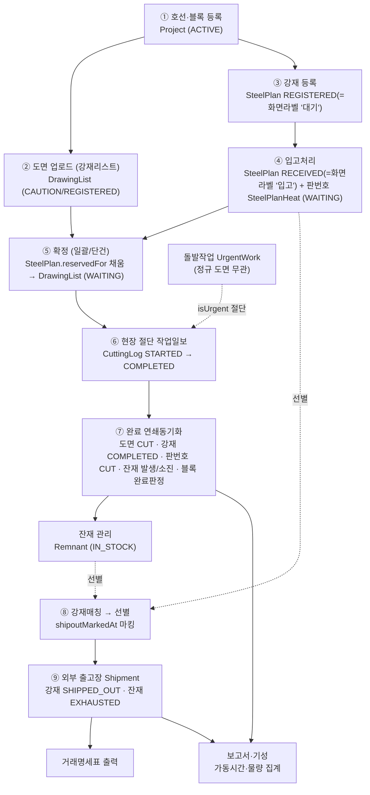
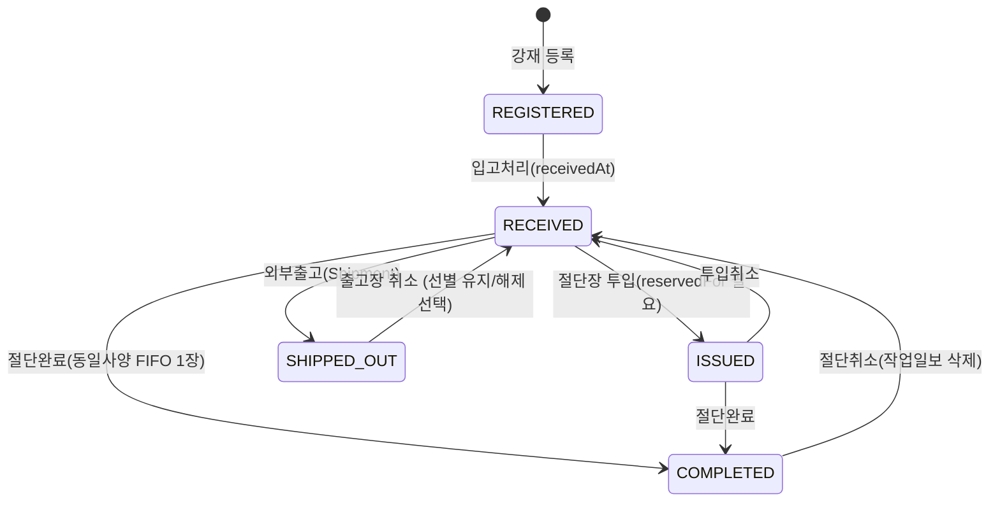
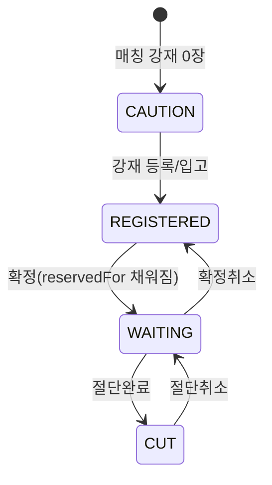
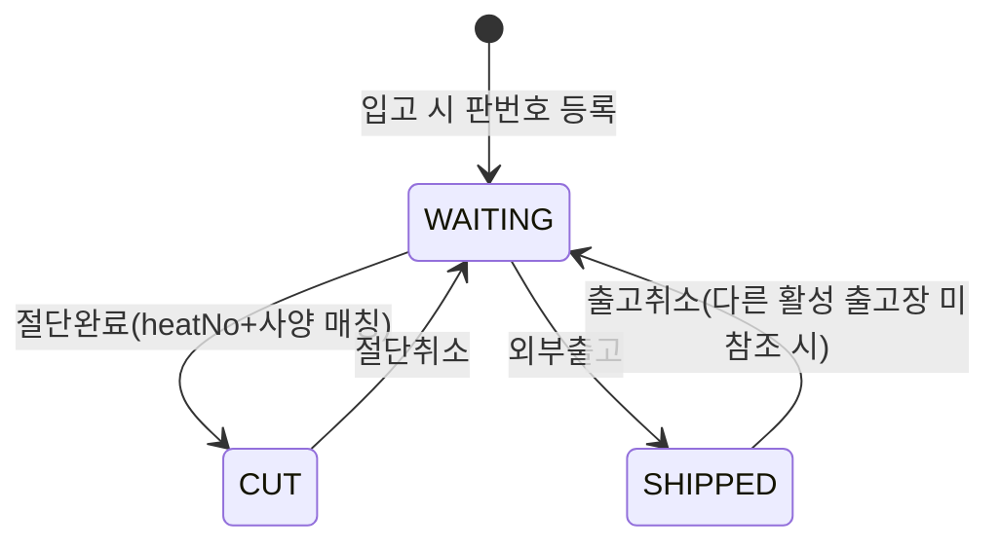
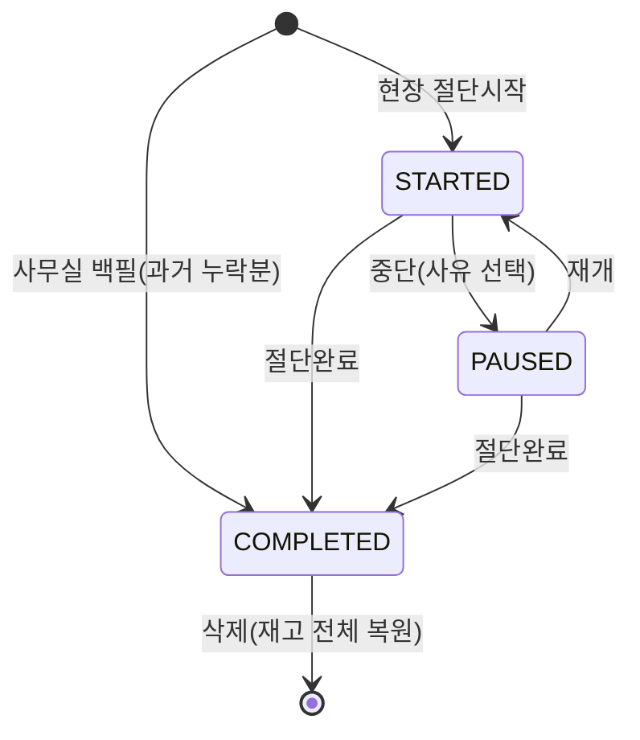
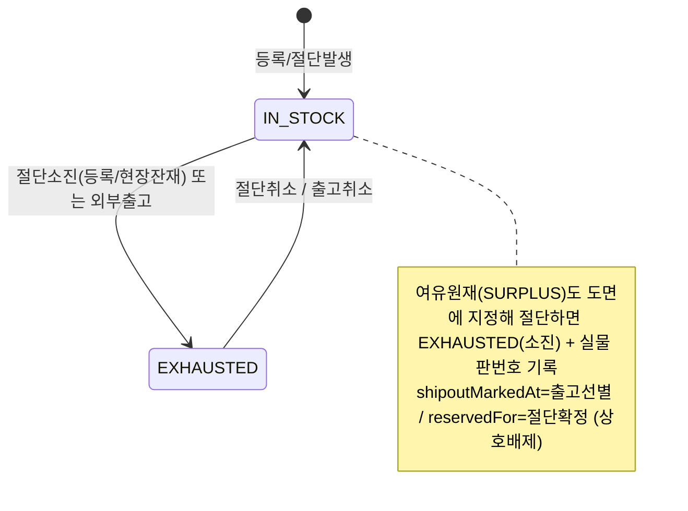
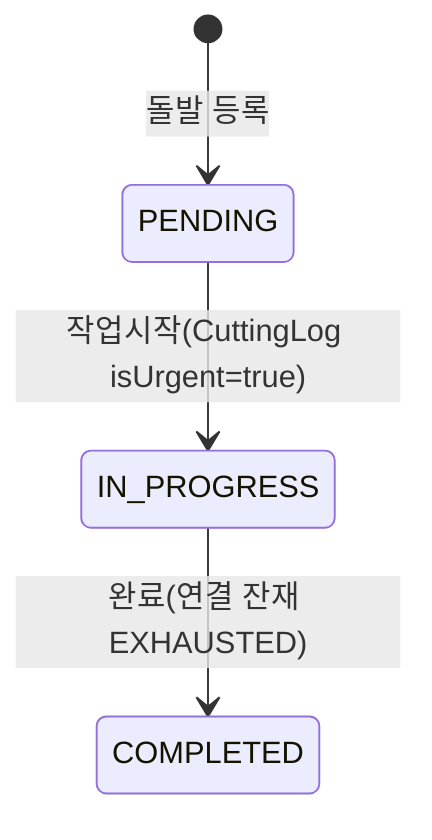
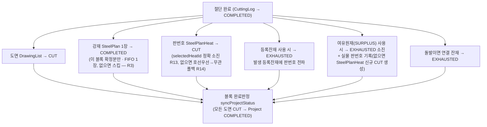
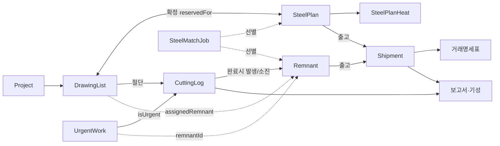

# 절단 파트 공정 흐름 (코드 기준 재구성)

> **이 문서의 목적**
> 절단 파트의 *실제 코드가 하는 동작*을 한 장으로 정리한 **살아있는 기준 문서**입니다.
> - **사용자(현장/관리자)**: 읽고 "여기 이게 현실이랑 다른데?" 를 [§9 확인 필요](#9-확인-필요-빈칸--업무규칙-검증)에 표시해 주세요.
> - **Claude**: 앞으로 절단 파트 판단은 이 문서를 기준으로 합니다. 코드가 바뀌면 이 문서도 같이 갱신합니다.
> - 작성 기준: 2026-06-26 코드. **최근 갱신 2026-08-18** (변경 이력은 맨 아래)
> - **외부출고 현재 동작은 §6 불변식(R1·R12~R16) · §12 · §15 를 먼저 볼 것** — 2026-07-22 대폭 갱신·자체검증 완료, 2026-07-25 출고취소 2모드(R16) 반영.
> - **이 문서가 절단파트 단일 기준 문서입니다.** 구버전 `원자재_입고_공정_수정_지침서_v4.md`(2026-04-07)와 `절단파트 구현 지침서.md`(v3, 2026-06-20)를 통합·대체했습니다. 외부 강재 출고의 *깊은 구현 상세*만 별도 `shipout-implementation.md` 참조.

---

## 1. 한눈에 보는 전체 공정


```mermaid
flowchart TD
    P["① 호선·블록 등록<br/>Project (ACTIVE)"]
    D["② 도면 업로드 (강재리스트)<br/>DrawingList (CAUTION/REGISTERED)"]
    S["③ 강재 등록<br/>SteelPlan REGISTERED(=화면라벨 '대기')"]
    R["④ 입고처리<br/>SteelPlan RECEIVED(=화면라벨 '입고') + 판번호 SteelPlanHeat (WAITING)"]
    C["⑤ 확정 (일괄/단건)<br/>SteelPlan.reservedFor 채움 → DrawingList (WAITING)"]
    CUT["⑥ 현장 절단 작업일보<br/>CuttingLog STARTED → COMPLETED"]
    DONE["⑦ 완료 연쇄동기화<br/>도면 CUT · 강재 COMPLETED · 판번호 CUT · 잔재 발생/소진 · 블록 완료판정"]
    REM["잔재 관리<br/>Remnant (IN_STOCK)"]
    MATCH["⑧ 강재매칭 → 선별<br/>shipoutMarkedAt 마킹"]
    SHIP["⑨ 외부 출고장 Shipment<br/>강재 SHIPPED_OUT · 잔재 EXHAUSTED"]
    INV["거래명세표 출력"]
    REP["보고서·기성<br/>가동시간·물량 집계"]
    URG["돌발작업 UrgentWork<br/>(정규 도면 무관)"]

    P --> D
    P --> S --> R
    D --> C
    R --> C
    C --> CUT --> DONE --> REM
    R -. 선별 .-> MATCH
    REM -. 선별 .-> MATCH
    MATCH --> SHIP --> INV
    DONE --> REP
    SHIP --> REP
    URG -. isUrgent 절단 .-> CUT
```

**큰 줄기**: 호선 → 도면 + 강재 → 입고 → 확정(도면↔강재 연결) → 절단 → 완료(자동 동기화) → 잔재/출고/기성.
**두 갈래**: 정규작업(도면 기반)과 돌발작업(잔재/긴급 기반)은 같은 작업일보(CuttingLog)를 쓰되 완료 시 동기화 대상이 다릅니다.
**상호배제 축**: 한 강재/잔재는 *절단용(reservedFor)* 과 *출고용(shipoutMarkedAt)* 중 하나로만 — [§6](#6-핵심-불변식-규칙) 참조.

---

## 2. 도메인 용어 ↔ 데이터

| 현장 용어 | 코드 필드/엔티티 | 비고 |
|---|---|---|
| 호선 | `Project.projectCode` | 프로젝트 단위 (예: RS01, 1022) |
| 블록 | `Project.projectName` / `DrawingList.block` | 선박 구역 단위 (예: F52P) |
| 도면(강재리스트) | `DrawingList` | 절단 대상 1행 = 도면 1장 |
| 도면번호 | `DrawingList.drawingNo` | 비어 있을 수 있음 |
| 원판/강재 | `SteelPlan` | 입고 철판 (호선별 사양) |
| 판번호 | `SteelPlanHeat.heatNo` | 실물 철판 추적 (heatNo) |
| 잔재 | `Remnant` | 여유원재/등록잔재/현장잔재 |
| 대체호선 | `DrawingList.alternateVesselCode` | 다른 호선 강재로 절단 시 |
| 절단확정 | `reservedFor` (`"호선/블록"`) | 절단용 선점 |
| 출고선별 | `shipoutMarkedAt` | 외부출고용 선점 |
| 기성 | `Shipment` (출고장/거래명세서) | 완료 물량 청구 |

---

## 3. 데이터 모델 & 상태값

| 엔티티 | 역할 | 상태(enum) |
|---|---|---|
| **Project** (호선/블록) | 프로젝트 마스터 | `ACTIVE` · `COMPLETED` · `ON_HOLD` |
| **DrawingList** (도면) | 절단 대상 강재리스트 | `CAUTION`(매칭강재0) · `REGISTERED`(강재있음·미확정) · `WAITING`(확정·절단대기) · `CUT`(절단완료) |
| **SteelPlan** (원판) | 입고 강재 | `REGISTERED` · `RECEIVED` · `ISSUED` · `COMPLETED` · `SHIPPED_OUT` — **화면 라벨은 각각 대기/입고/투입/절단/외부** (steel-plan-main.tsx:PLAN_STATUS 매핑, 2026-07-14 변경) | <br>**출고 `shipout*` 4종**: `shipoutMarkedAt`(선별 마킹) · `shipoutHeatNo`(선별 시 확인 판번호. 출고취소·선별유지 시 `ShipmentItem.heatNo` 스냅샷에서 복원) · `shipoutLabel`(매칭이름 = **강재매칭 귀속 키, 문자열 변형 금지**) · `shipoutCancelledAt`(출고취소 후 선별 유지 표시, 마이그레이션 `20260726000010`, 2026-07-25). `shipoutCancelledAt` 은 정상 출고확정 또는 `keepSelection=false` 취소 때만 null 정리 — 선별해제·상태전환 경로는 지우지 않아 표시가 남을 수 있다(§15-4).
| **SteelPlanHeat** (판번호) | 실물 판 추적 | `WAITING` · `CUT` · `SHIPPED` |
| **CuttingLog** (작업일보) | 절단 1건 | `STARTED` · `PAUSED`(중단) · `COMPLETED` |
| **CuttingPause** (중단) | 중단 구간 | 사유: `EQUIPMENT_FAILURE`·`DRAWING_CHANGE`·`CONSUMABLE`·`WORK_EXTENSION`(야간이월)·`OTHER` |
| **Remnant** (잔재) | 자투리/여유재 | `PENDING`(미사용) · `IN_STOCK`(재고) · `EXHAUSTED`(소진) / 타입: `SURPLUS`(여유원재)·`REGISTERED`(등록잔재)·`REMNANT`(현장잔재) |
| **UrgentWork** (돌발) | 긴급작업 | `PENDING` · `IN_PROGRESS` · `COMPLETED` |
| **Shipment** (출고장) | 거래명세서 | `ACTIVE` · `CANCELLED` — **CANCELLED 만 영구 삭제 가능** (DELETE /api/shipments/[id], 2026-07-14 신설) |
| **ShipmentItem** (출고품목) | 자재 스냅샷 | 원판·잔재 XOR, `adHocFromField:boolean`(현장직접출고 감사 태그, 2026-07-14 마이그레이션 20260714000010 신설) |
| **CncSchedule** (스케줄) | 블록 절단 예정 | `PLANNED`·`IN_PROGRESS`·`COMPLETED`·`HOLD`·`CANCELLED` |
| **SteelMatchJob** (강재매칭) | 사양 매칭 작업 | (상태 없음 — 사양 목록 저장) |

#### 판번호 모델 *(A2 확정)*
판번호(heatNo)는 **철판 1장의 고유 식별자**(주민번호 개념)이나, 시스템은 강재를 두 층으로 분리해서 다룬다:
- **강재목록 `SteelPlan`** = *호선+재질+사양* 단위 재고 (몇 장 있다). 입고·확정·소진은 여기서 **사양 단위**로 일어남.
- **판번호목록 `SteelPlanHeat`** = 판번호들의 풀 (사양에 느슨하게 묶임, FK 직접연결 없음).

입고/선별 단계에선 판번호를 일일이 확인할 수 없으므로 **강재 1장 ↔ 판번호를 직접 묶지 않는다.** 대신 **절단/외부출고 시점**에 담당자가 판번호를 확인해 "사용"으로 잡으면 → ① 강재목록에서 그 사양 1장이 소진(COMPLETED/SHIPPED_OUT) + ② 판번호목록에서 그 판번호가 CUT/SHIPPED 처리. **외부출고 때만 판번호 확인이 필수**이고, 내부 절단은 사양 단위로 흐른다.

**절단완료 후 판번호 추적 기록 위치** (밀시트 역추적 근거 → B2):
- `DrawingList.heatNo` — 그 도면에 쓰인 판번호
- `SteelPlan.actualHeatNo`/`actualVesselCode`/`actualDrawingNo` — 그 강재 1장이 어디에 쓰였는지
- `SteelPlanHeat.status = CUT` — 그 판번호가 절단됨
- `CuttingLog` — 절단 실적(작업자·일시·도면)

---

## 4. 상태 전이도 (엔티티별)

### 4-1. 강재 SteelPlan (원판)

```mermaid
stateDiagram-v2
    [*] --> REGISTERED: 강재 등록
    REGISTERED --> RECEIVED: 입고처리(receivedAt)
    RECEIVED --> ISSUED: 절단장 투입(reservedFor 필요)
    RECEIVED --> COMPLETED: 절단완료(동일사양 FIFO 1장)
    ISSUED --> COMPLETED: 절단완료
    RECEIVED --> SHIPPED_OUT: 외부출고(Shipment)
    COMPLETED --> RECEIVED: 절단취소(작업일보 삭제)
    SHIPPED_OUT --> RECEIVED: 출고장 취소 (선별 유지/해제 선택)
    ISSUED --> RECEIVED: 투입취소
```
- `RECEIVED` 상태에서 두 가지 *선점*이 갈립니다: `reservedFor`(절단확정) ↔ `shipoutMarkedAt`(출고선별). **둘은 상호배제** ([§6](#6-핵심-불변식-규칙)).
- **출고취소 후의 선점 상태** *(2026-07-25, R16)*: 출고장 취소는 두 갈래다(취소 버튼 → 선택 모달 → `cancel` API `keepSelection`). ① **기본(선별 유지)** — `RECEIVED` 로 되돌리면서 `shipoutMarkedAt` 을 **재생성**하고(출고 확정 때 null 로 지워지므로 **선별일이 취소 시각으로 갱신**된다), 판번호는 `ShipmentItem.heatNo` 스냅샷에서 복원, `shipoutCancelledAt` 를 찍는다 → 자재는 **출고선점 풀에 그대로 남아** 절단 확정·소진·도면 매칭·절단투입 풀에서 계속 제외(R1). ② **선별 해제** — 마킹 3종을 모두 null 로 지워 강재전체목록 입고 재고로 완전 복귀. 단 ①에도 **예외**: 원래 선별된 적 없는 자재(현장직접출고 `adHocFromField=true` 이면서 `shipoutLabel`·`originShipoutLabel` 둘 다 없음)는 기본 모드여도 마킹을 새로 만들지 않고 해제한다(절단 풀에서 조용히 빠지는 것 방지, `cancel/route.ts:89`). **화면**: 강재전체목록 확정정보에는 여전히 빨간 `{라벨} 선별` 로만 보이고, **취소 흔적(주황 `출고취소` 배지)은 선별목록 탭에서만** 보인다. 그 자재를 절단에 쓰려면 **선별 취소가 별도로 필요**하다.
- 절단 완료 시 동일 사양(호선+재질+두께+폭+길이) **RECEIVED/ISSUED 1장만** COMPLETED로 소진 (도면 1 : 원판 1).
- **표기 주의** (2026-07-14): enum 값과 화면 라벨이 다름 — `REGISTERED`=**대기**, `RECEIVED`=**입고**, `ISSUED`=**투입**, `COMPLETED`=**절단**, `SHIPPED_OUT`=**외부**. 코드/DB 는 enum 값 그대로 유지, UI 만 라벨 변경.

### 4-2. 도면 DrawingList

```mermaid
stateDiagram-v2
    [*] --> CAUTION: 매칭 강재 0장
    CAUTION --> REGISTERED: 강재 등록/입고
    REGISTERED --> WAITING: 확정(reservedFor 채워짐)
    WAITING --> CUT: 절단완료
    CUT --> WAITING: 절단취소
    WAITING --> REGISTERED: 확정취소
```
- 같은 사양 도면이 여러 장이면, 확정된 강재 수만큼 `createdAt` 앞에서부터 `WAITING`, 나머지는 `REGISTERED` (`syncDrawingListBySpec`).

### 4-3. 판번호 SteelPlanHeat

```mermaid
stateDiagram-v2
    [*] --> WAITING: 입고 시 판번호 등록
    WAITING --> CUT: 절단완료(heatNo+사양 매칭)
    CUT --> WAITING: 절단취소
    WAITING --> SHIPPED: 외부출고
    SHIPPED --> WAITING: 출고취소(다른 활성 출고장 미참조 시)
```
- 출고 확정 때 **자동생성**된 판번호(`autoCreatedFromShipment=true`)는 취소 시 WAITING 복원이 아니라 **레코드 삭제**된다(다른 **활성** 출고장이 참조하면 보존·경고). 취소된 출고장의 이력 item 은 참조로 치지 않아 고아 판번호가 영구히 남지 않는다 — 여유원재 절단취소의 `autoCreatedFromSurplusCut` 삭제(§5)와 같은 원리.

### 4-4. 작업일보 CuttingLog

```mermaid
stateDiagram-v2
    [*] --> STARTED: 현장 절단시작
    [*] --> COMPLETED: 사무실 백필(과거 누락분)
    STARTED --> PAUSED: 중단(사유 선택)
    PAUSED --> STARTED: 재개
    STARTED --> COMPLETED: 절단완료
    PAUSED --> COMPLETED: 절단완료
    COMPLETED --> [*]: 삭제(재고 전체 복원)
```
- 완료(`COMPLETED`)·삭제 시 **연쇄동기화**는 [§5](#5-완료--삭제-연쇄동기화-핵심)에.
- `PAUSED`(특히 야간이월)는 다음날에도 보이며 **수동 재개** 필요.

### 4-5. 잔재 Remnant

```mermaid
stateDiagram-v2
    [*] --> IN_STOCK: 등록/절단발생
    IN_STOCK --> EXHAUSTED: 절단소진(등록/현장잔재) 또는 외부출고
    EXHAUSTED --> IN_STOCK: 절단취소 / 출고취소
    note right of IN_STOCK
      여유원재(SURPLUS)도 도면에 지정해 절단하면 EXHAUSTED(소진) + 실물 판번호 기록
      shipoutMarkedAt=출고선별 / reservedFor=절단확정 (상호배제)
    end note
```

### 4-6. 돌발 UrgentWork

```mermaid
stateDiagram-v2
    [*] --> PENDING: 돌발 등록
    PENDING --> IN_PROGRESS: 작업시작(CuttingLog isUrgent=true)
    IN_PROGRESS --> COMPLETED: 완료(연결 잔재 EXHAUSTED)
```

---

## 5. 완료 / 삭제 연쇄동기화 (핵심)

절단 **완료**(`PATCH action=complete` 또는 사무실 백필)와 **삭제**(`DELETE`)는 한 트랜잭션으로 여러 테이블을 동시 갱신합니다. 공용 로직: `lib/cutting-complete.ts` (`applyCuttingComplete` / `applyCuttingRestore`).


```mermaid
flowchart TD
    A["절단 완료 (CuttingLog → COMPLETED)"] --> B["도면 DrawingList → CUT"]
    A --> C["강재 SteelPlan 1장 → COMPLETED<br/>(이 블록 확정분만 · FIFO 1장, 없으면 스킵 — R3)"]
    A --> D["판번호 SteelPlanHeat → CUT<br/>(selectedHeatId 정확 소진 R13, 없으면 호선우선→무관 폴백 R14)"]
    A --> E["등록잔재 사용 시 → EXHAUSTED<br/>발생 등록잔재에 판번호 전파"]
    A --> F["여유원재(SURPLUS) 사용 시 → EXHAUSTED 소진<br/>+ 실물 판번호 기록(없으면 SteelPlanHeat 신규 CUT 생성)"]
    A --> G["돌발이면 연결 잔재 → EXHAUSTED"]
    B & C & D & E & F & G --> H["블록 완료판정 syncProjectStatus<br/>(모든 도면 CUT → Project COMPLETED)"]
```

- **삭제**는 위를 전부 역방향 복원 (CUT→WAITING, COMPLETED→RECEIVED, 판번호 CUT→WAITING, 잔재 EXHAUSTED→IN_STOCK, 잔재 heatNo→null).
- 잔재(등록/현장) 사용 절단은 정규 강재(SteelPlan)를 건드리지 않습니다(상호배제). **여유원재(SURPLUS)는 잔재 자체를 EXHAUSTED 로 소진하고 실물 판번호를 추적**한다(§9 B1 정정 — 최초 문서의 "IN_STOCK 유지"는 코드 오독이었음).
- **등록잔재 생성 시점 주의** *(N18, 2026-07-15)*: 등록잔재(REGISTERED type)는 **도면 업로드 시점**에 `remnantsData` 로 미리 `IN_STOCK` 생성됩니다. 절단 완료로 잔재가 자동 생성되는 것이 아니라 이미 존재하는 잔재에 **heatNo 만 propagate** 됩니다 (밀시트 역추적 근거). 사용자 관점에서 "아직 안 잘랐는데 잔재 재고에 보임" 은 정상 (B6 결정 참조).
- **여유원재(SURPLUS) 절단 취소 주의**: 절단 시 `SteelPlanHeat` 을 신규 생성했다면(원판 매칭 heat 이 없던 경우) 취소 시 그 heat 은 WAITING 복원이 아니라 **완전 삭제**된다(`autoCreatedFromSurplusCut` 마커) — 실물 원판이 IN_STOCK 으로 되살아나므로 판번호만 유령으로 남지 않게.

---

## 6. 핵심 불변식 (규칙)

| # | 규칙 | 코드 근거 |
|---|---|---|
| R1 | **절단 ↔ 출고 상호배제**: `reservedFor`(절단확정) 채워진 강재/잔재는 출고선별 불가, `shipoutMarkedAt`(출고선별)된 것은 절단투입/소진 대상에서 제외 | shipout-mark / issue-bulk / reserve-bulk / cutting-complete |
| R2 | **도면 1 : 원판 1 소진(FIFO)**: 완료 시 동일사양 RECEIVED/ISSUED 중 `createdAt` 빠른 1장만 COMPLETED | cutting-complete.ts |
| R3 | **확정한 강재만 소진**: 완료 시 이 블록에 예약(`호선/블록` 또는 `블록`)된 강재만 COMPLETED. **미예약 폴백 없음** — 확정된 강재가 없으면 소진 스킵(관리자 수동). 다른 블록 예약 강재는 절대 안 씀. *(A3 확정: 정확한 재고관리 위해 엄격모드, 2026-06-26)* | cutting-complete.ts |
| R4 | **대체호선**: `alternateVesselCode` 있으면 그 호선 강재로 매칭(없으면 본 호선). 대체호선 강재도 **입고+확정**돼야 도면이 WAITING 이 되어 절단목록에 뜨고 소진된다(A3 엄격모드). 미입고·미확정이면 절단 시작 불가. *(최초 문서의 "미입고면 절단은 되지만 소진 안 됨" 은 §9 C1 로 정정됨)* | cutting-complete.ts / drawings |
| R5 | **블록 완료 자동판정**: 블록의 모든 도면이 CUT이면 `Project.COMPLETED`, 하나라도 아니면 `ACTIVE`. 도면 0개면 미판정(null) | sync-project-status.ts |
| R6 | **완료/삭제 원자성**: 연쇄동기화는 `prisma.$transaction`(timeout 20s)로 전부-또는-전무 | cutting-logs/[id], lib/cutting-complete |
| R7 | **작업일보 수정 안전차단**: 완료 로그의 판번호·치수·완료상태는 사무실에서 변경 불가(삭제 후 재등록). 진행중 로그에 종료일시 입력 불가 | cutting-logs/[id] PATCH |
| R8 | **백필**: 종료일시까지 채운 과거 누락분은 STARTED 안 거치고 바로 COMPLETED 생성(장비 가드 우회) | cutting-logs POST |
| R9 | **중복절단 방지**: 한 도면이 *어느 장비든* 절단중(STARTED/PAUSED)이면 현장 목록에서 제외 + 시작 차단. 장비당 STARTED 1건 | drawings / cutting-logs |
| R10 | **잔재 선별/출고는 작업(매칭이름) 무관 전역**: 잔재는 job 라벨이 없어 사양만으로 매칭(호선 무관) | steel-match-select.ts |
| R11 | **블록 절단 상태(대시보드 분류) = 실제 CUT 도면 수 기준** (Project.status 아님). **완료**=등록된 모든 도면 절단완료(cut==total). **진행중**=1장 이상 절단됨(cut>0) 또는 절단작업 진행중(STARTED/PAUSED)이면서 완료 아님. **대기**=절단 0장(등록·확정만)→대시보드 미표시. *(2026-06-26: 등록·확정만 된 블록이 진행중으로 잡히던 문제 수정)* | cutpart/dashboard |
| **R12** | **판번호 매칭은 호선 무관 — 시리즈호선 유연성** *(2026-07-15 정책 확정, 2026-07-22 대부분 경로 확대)*. 판번호는 **철판 한 장의 고유번호**이고 호선은 "어느 호선 예산으로 입고됐나" 라는 꼬리표일 뿐 실물을 구분하지 않는다. 야드에는 같은 규격의 자매호선 철판이 섞여 쌓이므로(실측 1022 대기사양의 ~95%가 1023과 규격 동일), 판번호를 호선 안에 가둬 찾으면 실물을 집어 찍었을 때 "없다" 가 뜬다(실측 출고담기 ~31% 차단). 따라서 **판번호 → 후보 조회는 재질·두께·폭·길이만 매칭**하고 호선은 표시·정렬에만 쓴다. **화면 표시**: 입력 판번호와 다른 호선의 항목은 배지로 경고(작업일보 amber `타호선`, 출고 cyan `다른 호선`). 선택은 자유. <br>**적용 범위 (2026-07-23 기준)**: ✅ 현장 출고담기(`shipout-field`) · 현장직접출고 판번호모드(`shipout-field-adhoc`) · PC 출고 판번호목록(`heat-match`) · **PC 출고등록(`shipout-match`)** · 출고 확정 **직접입력·미입력 FIFO** 갈래(`shipments` POST) · 엑셀 업로드(`excel-upload`) · 절단완료 소진 폴백 **정규원재·여유원재(SURPLUS)**(`cutting-complete` R14) · 현장 작업일보(`field-worklog`→heat-options, 호출부 미전달). ❌ **의도적 호선 격리(예외)**: 사무실 작업일보(`worklog-admin.tsx:588`) — 사무실은 정확한 호선을 알고 입력하므로 격리 유지(§15-4). | heat-options / shipout-field / shipout-field-adhoc / heat-match / shipments(직접입력) / excel-upload / cutting-complete(R14) |
| **R13** | **판번호 소진 = 선택한 재고 id 정확일치** *(P1, 2026-07-21)*. 작업일보에서 판번호를 **목록에서 고르면 그 재고(SteelPlanHeat)의 id 를 `CuttingLog.selectedHeatId` 로 보존**하고, `applyCuttingComplete` 는 이 id 로 **그 판을 정확히 CUT 소진**(글자대조 없음 → 타호선·오타·중복 heatNo desync 원천 차단). **복원 키는 `consumedHeatId`** — `selectedHeatId` 는 '의도', `consumedHeatId` 는 '실제로 소진한 판' 이며 `applyCuttingRestore` 는 후자로 되돌린다(2026-07-21 `b02e11a5`, 형제 판 과다복원 방지). 단 `consumedHeatId`·`selectedHeatId` 는 R13 배포(07-21) 이후 로그에만 있고(측정 시점 각 ~50·~37건), 이전 로그는 `heatNo+사양+호선` 폴백(cutting-complete.ts:355-399)으로 복원한다 — **완료 폴백(R14)은 호선 무관인데 복원 폴백은 호선 잠금**이라, 대체호선 미지정 타호선 소진건은 취소해도 판번호가 CUT 로 남을 수 있다(잔여 비대칭). ⚠ **현실**: 누적 절단완료의 목록 선택은 ~1.7%뿐이나 R13 배포 다음날(07-22)은 하루 완료의 ~63%가 목록 선택 — 레거시는 R14 폴백이, 신규는 R13 이 지탱하며 이행 중. (재현 `scripts/verify-doc-numbers.mjs`) | cutting-complete.ts / cutting-logs POST / field-worklog.tsx / worklog-admin.tsx |
| **R14** | **판번호 소진 폴백 = 호선 우선, 없으면 호선 무관** *(2026-07-22, `89237129`)*. `selectedHeatId` 로 실제 소진에 실패했을 때(= `consumedHeatId` 가 비었을 때 — 직접입력·레거시·선택 판이 이미 소진된 충돌) `applyCuttingComplete` 는 ① 작업호선(또는 대체호선)에서 `heatNo`+사양으로 찾고 ② 못 찾으면 **호선 조건 없이** 다시 찾는다(cutting-complete.ts:123-156, **정규원재 경로만** — 여유원재 SURPLUS 는 :164-200 에서 호선 잠금 유지). ②가 없으면 대체호선을 지정하지 않고 옆 호선 철판을 쓴 경우 **아무 판번호도 소진되지 않아** 유령 WAITING 이 영구히 남았다(실제 31건 누적 → 2026-07-22 오전 `fix-crossvessel-plan.mjs --apply` 로 6건 교정, 현재 잔존 0). ⚠ **두 가지 남은 위험**: (1) **강재(SteelPlan) 차감은 여전히 작업호선** — 대체호선 미지정 시 판번호는 맞고 강재 호선은 어긋난다. (2) **동명 판번호 오소진** — heatNo+사양만 맞으면 호선 무관 소진이라, 수입재 등 같은 판번호가 2장 이상이면 엉뚱한 판이 CUT 될 수 있다. 근본 해소는 **도면에 대체호선을 지정**하는 것(§9 C). | cutting-complete.ts:123-156 |
| **R15** | **판번호 조회는 표기 정규화 폴백** *(2026-07-22, `dd3394c9`)*. 현장 입력창은 바코드 잡문자를 걸러내되 **하이픈은 통과**시킨다(`cleanHeatNo`). 서버는 정확 일치가 실패하면 **영문·숫자만 남긴 형태**로 한 번 더 찾는다(`lib/heat-lookup.ts`, `regexp_replace`). `SUS-4` / `SUS4` / `sus-4` / `SUS 4` 가 모두 같은 판을 가리킨다. 매칭되면 **DB 등록 표기를 응답에 실어** 출고장·거래명세표에 실물 라벨과 같은 표기가 찍히게 한다. 정규화 비교는 인덱스를 타지 않으므로 **정확 일치 실패 시에만** 호출한다. 현재 하이픈 판번호 72개(그중 조회 대상 WAITING 15개, 나머지 CUT), 정규화 후 충돌 0건. **적용(2026-07-23): `shipout-field` · `shipout-field-adhoc` · `shipout-match` · `shipments` POST 손입력.** 미적용: `heat-options` · `heat-match`(둘 다 목록 조회라 사용자가 눈으로 고름 — 폴백 불요). | lib/heat-lookup.ts (`normalizedHeatIds` 는 트랜잭션 주입 지원) / field-shipout.tsx |
| **R16** | **출고취소 = 2모드 복원, 기본은 '선별 유지'** *(2026-07-25, `ffe95d79`·`b26973d4`)*. `POST /api/shipments/[id]/cancel { reason?, keepSelection?, force? }` — `keepSelection` 은 **`false` 를 명시하지 않으면 true**(기본 = 선별목록 유지). **두 모드 공통**: `Shipment→CANCELLED`(+`cancelledAt`·`cancelReason`), 원판 `SHIPPED_OUT→RECEIVED`·`issuedAt=null`, `ShipmentItem.originStorageLocation` 스냅샷이 있으면 `storageLocation` 복원(N20), 판번호는 `autoCreatedFromShipment` 이면 삭제·아니면 `SHIPPED→WAITING`(`shippedAt=null`) — 단 **다른 ACTIVE 출고장이 참조 중이면 보존하고 경고**. **`shipoutLabel` 은 어느 모드에서도 건드리지 않는다** — 라벨은 강재매칭 작업 귀속 키(`steel-match/[id]` 가 `where: { shipoutLabel: job.name }` 완전일치 조회)라 '(취소)' 같은 변형을 붙이면 그 강재가 매칭 커버리지에서 사라져 중복선별·중복출고를 부른다. '취소됨' 표시는 `shipoutCancelledAt` 로만 한다. <br>**① 유지(기본)**: `shipoutMarkedAt` 유지(없으면 now), `shipoutHeatNo` 는 없으면 **`ShipmentItem.heatNo` 스냅샷에서 복원**(출고확정 때 `shipoutMarkedAt`·`shipoutHeatNo`·`shipoutCancelledAt` 이 모두 null 로 정리되므로 — 복원하지 않으면 재출고 시 판번호가 비어 미입력 FIFO 가 엉뚱한 WAITING 판을 소진한다), `shipoutCancelledAt=now`. → 선별목록에 그대로 남아 체크 후 **[출고 카트에 담기]→[출고장 만들기]** 로 바로 재출고 가능, 선별목록 선별칸에 주황 `출고취소` 배지(원판 전용). **예외 가드**: `adHocFromField=true` 이면서 `SteelPlan.shipoutLabel`·`ShipmentItem.originShipoutLabel` 이 둘 다 없는 자재(순수 현장직접출고)는 마킹을 새로 만들지 않고 ②와 동일 처리 — 선별된 적 없는 자재가 조용히 절단 풀에서 빠지는 것 방지. <br>**② 해제**: `shipoutMarkedAt`·`shipoutHeatNo`·`shipoutCancelledAt` 모두 null → 강재전체목록 입고 재고로 완전 복귀(자재를 잘못 골랐을 때). <br>**잔재**: `EXHAUSTED→IN_STOCK` + `shipoutMarkedAt` 만 유지(없으면 now)/해제. **Remnant 에는 `shipoutHeatNo`·`shipoutCancelledAt` 필드가 없어 판번호 스냅샷 복원도, 취소 배지도 없고**, **위 adHoc 가드도 적용되지 않는다**(§15-4 감수). <br>**원자성**: 복원 불가 항목(자재가 이미 SHIPPED_OUT/EXHAUSTED 가 아님)이 1건이라도 있으면 **취소 전체를 롤백**하고 사유 목록을 **HTTP 500 에러 본문**으로 반환(자재 레코드 자체가 없으면 실패로 잡히지 않고 조용히 건너뜀). `force:true` 로만 강행(현재 UI 미노출, API 전용). | app/api/shipments/[id]/cancel/route.ts:25·28·58-69·74-98·104-139·144-146 / components/shipment-detail-main.tsx:53-82·192-221 / selection-list-tab.tsx:82-84·139 / steel-match/[id]/route.ts:94-95 / shipments/route.ts:503-505 |

---

## 7. 모듈 연결도


```mermaid
flowchart LR
    Project --> DrawingList
    DrawingList <-->|확정 reservedFor| SteelPlan
    SteelPlan --> SteelPlanHeat
    DrawingList -->|절단| CuttingLog
    DrawingList -. assignedRemnant .-> Remnant
    CuttingLog -->|완료시 발생/소진| Remnant
    UrgentWork -->|isUrgent| CuttingLog
    UrgentWork -. remnantId .-> Remnant
    SteelMatchJob -. 선별 .-> SteelPlan
    SteelMatchJob -. 선별 .-> Remnant
    SteelPlan -->|출고| Shipment
    Remnant -->|출고| Shipment
    Shipment --> Invoice["거래명세표"]
    CuttingLog --> Reports["보고서·기성"]
    Shipment --> Reports
```

---

## 8. 외부 출고 & 기성 흐름


```mermaid
flowchart LR
    M["강재매칭 (사양 업로드)"] --> SL["선별지시서 출력 + 선별마킹<br/>(shipoutMarkedAt)"]
    SL --> LIST["선별목록"]
    LIST --> CART["출고 카트"]
    HEAT["현장 판번호 스캔"] -.->|② 바로출고·④ 현장직접출고<br/>선별 생략| CART
    CART --> SO["출고장 Shipment 생성<br/>강재 SHIPPED_OUT · 잔재 EXHAUSTED"]
    SO --> IV["거래명세표(차량별 인보이스) 출력"]
    SO --> 기성["기성 = 출고장 기준 청구"]
```
- 출고에는 **선별을 거치는 경로(①③)와 건너뛰는 경로(②바로출고·④현장직접출고)** 가 있다. 상세 4경로는 §12.
- 현장(모바일) 출고: 판번호 입력 → (①③) 선별목록 후보 / (④) 규격 매칭 후보 → 카트 → 출고장 (PC와 동일 연계).
- 보고서는 `CuttingLog.COMPLETED` 기준 가동시간·물량 집계. 야간이월(`WORK_EXTENSION`) 시간은 총가동에서 차감.

---

## 9. 확인 필요 (빈칸) — 업무규칙 검증

> 아래는 **코드는 이렇게 동작하는데, 그게 현실 업무 의도와 맞는지 코드만으로 단정할 수 없는** 항목입니다.
> 각 항목에 **맞음 / 틀림(이렇게 바뀌어야)** 를 적어 주시면, 제가 그 기준으로 코드를 정리합니다.

### A. 소진·매칭 모델  *(2026-06-26 확정)*
- [x] **A1. 원판 소진 = 도면1:원판1, FIFO 1장만 COMPLETED.** → **맞음.** 도면 1개가 원판 1장을 소진. 단, 절단 후 발생한 **등록잔재(자식)** 로는 이후 다른 도면을 절단할 수 있음(그건 잔재 사용 절단). 원판:도면 = 1:1.
- [x] **A2. 판번호 모델.** → **정정.** 판번호는 *원칙적으로 철판 1장의 고유 식별자*(주민등록번호 개념). 다만 수입/국내 제조사가 많아 같은 번호가 들어올 가능성은 있음. **시스템 사용 방식**: 입고/등록 시 판번호를 강재 1장에 *직접 연결하지 않고*, **강재목록(호선+재질+사양 단위)** 과 **판번호목록(판번호 풀)** 을 분리 보관한다(입고·선별 때 판번호까지 일일이 확인 불가하므로). **절단/외부출고 시점에 담당자가 판번호를 확인해 "사용"으로 잡으면** → 강재목록에서 그 사양 1장이 소진되고 + 판번호목록에서 그 판번호가 사용처리됨. **외부출고 때는 판번호 확인이 원칙**이나 강제는 아니다 — 판번호 미입력 출고도 허용되며 같은 규격 WAITING 1장을 FIFO 소진해 개수 정합을 맞춘다(§12). 내부 절단은 사양 단위로 흐른다. → [§3 판번호 모델 참조](#판번호-모델-a2-확정). (현재 코드 구조가 이 모델과 일치 — 강재↔판번호 느슨 연결. 하드 unique 제약은 미적용; 필요 시 *중복 판번호 입력 경고*를 추가할 수 있음.)
- [x] **A3. 확정한 강재만 절단/출고 가능 (미예약 폴백 제거).** → **엄격모드로 변경.** 정확한 재고 파악을 위해, 확정(예약)된 강재만 절단 소진/외부출고 가능. 확정된 게 없으면 자동 소진하지 않음(관리자 수동). *(cutting-complete.ts 미예약 폴백 제거 — 2026-06-26 반영, R3)*

### B. 잔재
- [x] **B1. 여유원재(SURPLUS) 절단 = EXHAUSTED 소진. → 맞음 (2026-06-26 확정).** *여유원재(잉여재) = 프로젝트용으로 샀다가 손도 안 댄 채 남은 원판(용도 미정).* 한 프로젝트에 쓰면 그 원판으로선 다 쓴 것이라 **소진(EXHAUSTED)이 맞음** + 실물 판번호를 판번호목록(SteelPlanHeat)에 CUT으로 기록. 잘라서 남는 건 **새 잔재(등록/현장)** 로 잡힘. (*최초 문서의 "IN_STOCK 유지"는 코드 오독이었음.*)
- [x] **B6. 정규 절단 '남은 잔재' 현장 팝업 — 불필요 결정 (2026-06-26).** 잔재 등록 경로가 이미 충분하므로 누락 없음:
  1. **강재리스트 등록(업로드)** 시 등록잔재 사전선언 (여유원재 발생분 포함, parent 연결)
  2. **잔재관리 메뉴**(scrap-main → remnant-tabs)에서 3종(여유/등록/현장) **수동 등록 언제든**
  3. **돌발작업 완료 팝업**(현장잔재 REMNANT 생성)
  → 정규 현장 절단 '그 순간'의 자동 팝업은 *편의 기능*일 뿐 필수 아님 → **추가 안 함.** (나중에 현장에서 바로 넣고 싶어지면 정규 완료에도 돌발식 팝업 추가 가능.)
- [x] **B2. 판번호 전파 = 추적(밀시트 역추적)용. → 맞음 (2026-06-26).** 원판 판번호는 **부모→자식 잔재로 끝까지** 따라가야, 어떤 잔재로 자르든 그 판번호로 **밀시트(강재 성적서)까지 역추적** 가능. 잔재는 **잔재번호(고유)** 로 개별 구분 + **판번호(출신 원판)** 는 공유.
  > ⚠️ **현 구현은 부분만.** 자동 전파는 *원판 → 등록잔재(같은 도면) 1단계만*. **(a) 현장잔재(REMNANT)** 는 절단 발생해도 부모 판번호 자동 전파 없음(전파가 REGISTERED 전용). **(b) 다단계**: 등록잔재를 2차 절단할 때 판번호 미입력(`log.heatNo` 빈값)이라 자식에게 전파 끊김. 현재는 잔재관리 '발생판번호' **수동 입력**으로만 보완. → **B3·B4 = 이 전체 자동 전파 구현** (기존 메모리 TODO `cnc-surplus-platenumber-lifecycle-todo`와 동일).
- [x] **B3. 현장잔재 판번호 추적 → 필요 (구현 대상).** B2 확정대로 현장잔재(일반잔재)도 부모 원판 판번호를 받아 밀시트까지 추적돼야 함. 현재는 현장잔재에 부모 판번호 **자동 전파 없음**(돌발 팝업·정규 절단 경로에서 판번호 미입력). → **잔재 판번호 lifecycle 일괄 구현에 포함** (B2 갭과 동일).
- [x] **B4. 부모-자식 잔재 트리 → 맞음 (2026-06-26).** 원판(부모)→잔재(자식). 부모가 소진(EXHAUSTED)되거나 삭제돼도 자식 잔재는 **독립 유지** (부모 삭제 시 `parentRemnantId`만 null 해제, 자식 레코드·판번호는 보존 → 추적 유지). 자식도 따로 절단/출고 가능.
- [x] **B5. 잔재 PENDING 상태 = 미사용 확정.** 모든 잔재 생성이 IN_STOCK(업로드·수동·돌발 전부). PENDING→IN_STOCK 전이(drawings/[id])는 매칭 0건. enum 제거는 마이그레이션 필요 + 실익 적어 **그대로 두되 '미사용'으로 기록**(원하면 추후 정리).

### C. 대체호선·확정  *(2026-06-26 확정)*
- [x] **C1. 대체호선 = 다른 프로젝트 강재를 빌려 쓰는 기능. → 맞음 (의도대로 동작).** 시나리오: A(급함)·B가 같은 재질·사양 철판을 각각 주문했는데 A 것은 일부만 입고·B 것은 다 입고 → A 도면에 **대체호선=B** 지정해 B 강재로 A를 절단. 나중에 A 강재 들어오면 B 도면에 대체호선=A로 대칭 사용.
  - **설정**: 도면 테이블 도면별 '대체호선' 드롭다운(호선목록에서 선택). 업로드/추가/**기존도면 편집** 모두 가능. 변경 시 기존 예약 자동 해제·재계산.
  - **확정**: 대체호선(B) 강재를 찾아 예약하되 `reservedFor`는 **본 호선(A)/블록**으로 기록(=A가 빌려감).
  - **절단**: `effectiveVessel = 대체호선(B)` 으로 B 강재 1장 소진.
  - *(A3 정정)* 대체호선 강재도 **입고+확정돼야** 그 도면이 절단목록(WAITING)에 떠 소진됨. 미입고/미확정이면 절단목록에 안 떠 시작 불가(엄격모드와 일관). *최초 문서의 "미입고면 절단은 되지만 소진 안 됨"은 A3로 정정.*
- [x] **C2. 일괄확정 취소 = CUT 도면 있으면 차단, 작업일보에서 절단취소 먼저. → 맞음.** 운영규칙 확정: CUT 도면은 작업일보에서 절단취소 후에 확정취소 가능.

### D. 작업일보  *(2026-06-26 확정)*
- [x] **D1. 야간이월(퇴근) 중단 = 수동 재개. → 맞음.** 자동 재개면 다음날이 휴무일이어도 계속 '절단중'으로 바뀌므로 무조건 수동 재개.
- [x] **D2. 현장=입력 전용 / 수정은 사무실. → 맞음(명확화).** 현장 작업일보는 입력(시작·완료·중단·재개)만, 완료건 수정/조회 불가(코드 확인: 편집·이력 브라우즈 없음, '중단이력'은 진행중 작업의 읽기표시만). 수정은 사무실 '작업일보관리'에서. **로그인 없어 권한 개념 없음 — 메뉴 접근으로만 구분** → 별도 수정권한/수정이력 기능 불필요(현재). (작업일보관리의 완료 로그 핵심필드 수정 차단 = R7 유지)
- [x] **D3. 백필(작업 누락분) 날짜 제약 없음. → 맞음.** 누락분은 언제든(지난주·지난달) 입력 가능해야 함.
- [x] **D4. 한 도면 = 한 장비에서 완료, 동시 다장비 절대 불가. → 맞음.** 한 도면을 둘 이상 장비가 동시 절단 불가(R9). 드물게 중단 후 나중에 잇는 경우는 **별도로 작업완료시키고 사람이 따로 체크해 마무리**(코드 강제보다 운영으로 처리).

### E. 돌발  *(2026-06-26 확정)*
- [x] **E1. 돌발 완료 '없음' → 즉시 완료. → 그대로 OK.** 돌발은 완료 후 나중에 잔재가 발견될 일이 없음 → 신경 쓸 필요 없음(현 동작 유지).
- [x] **E2. 돌발 '사용중량' = 실제 절단량으로 연결. 🔧 구현 대상.** 현재: 돌발 사용중량은 등록 시 입력한 `UrgentWork.useWeight`(사전값)이고 실제 절단량과 미연결(reports `useWeight = urgentWork.useWeight ?? drawingList.useWeight`). → **변경**: '예상' 개념 제거, **실제 절단량(사용중량)** 이 작업보고서 돌발 집계에 연결되도록. (구현 시 세부 결정: 실제 사용중량을 돌발 완료 시 입력받을지 / 치수로 계산할지.)
- [x] **E3. 돌발은 호선/블록 선택사항. → 맞음.** 돌발 = 갑작스러운 여러 작업(현장 치공구류 / 공사용 부재 / 프로젝트 오작 재절단 등). 호선+블록이 있을 수도·호선만·아예 없을 수도. 그래서 호선/블록 고정이 아니라 **작업내용·요청자·작업이유**를 기입하도록 설계 — 현장 시작 시 호선/블록 선택 생략이 의도대로 맞음.

### F. 출고·기성  *(2026-06-26)*
- [x] **F1. 기성 = 출고장 생성 시 자동 인정. → 맞음.** 로그인 기능이 없어 아직 별도 승인 절차 불필요(현 동작 유지).
- [x] **F2. 돌발은 '돌발' 탭에서 따로 기성 집계. → 맞음.** 호선별 집계(byProject)는 정규만이지만 **돌발작업은 보고서 '돌발' 탭에 따로 모여 집계**됨(호선 미지정 돌발도 포함) → 사장님 의도(돌발은 돌발대로 따로 집계)와 일치. (단 돌발 사용중량 *값*은 E2에서 실제 절단량으로 보정 예정.)
- [x] **F3. 원판+잔재 동시 선별 = 문제없음. → 그대로 둠 (2026-06-26).** 원판/잔재가 화면에 구분 표시되어 사용자가 확인 가능하므로 막을 필요 없음(둘은 다른 실물).
- [x] **F4. 거래명세표 자동저장 실패 알림. 🔧 구현 대상.** 현재 inline 자동저장 실패 시 콘솔만 찍고 사용자 알림 없음 → **실패 시 사용자 알림 표시** 추가.

---

## 10. 검토 결과 — 구현 backlog (§9 확정)

§9 전 항목 검토 완료(2026-06-26). 코드와 의도가 일치한 항목은 확정, 불일치/요청은 아래로 도출.

**완료(반영됨)**
- ✅ **A3** 확정한 강재만 절단 소진 (미예약 폴백 제거) — `lib/cutting-complete.ts`
- ✅ 문서 정정: B1(여유원재 소진), B2 갭 명시, C1 대체호선, 각종 사실 정정

**구현 대기 (검토 끝났으니 추후 일괄 진행)**
1. 🔧 **B3 — 잔재 판번호 lifecycle 자동화 (최우선, 밀시트 추적).** 원판 판번호가 **모든 잔재 + 다단계(代)** 로 자동 전파되어야 함. 현재는 원판→등록잔재(1단계)만 자동. (a) 현장잔재 자동 전파, (b) 등록잔재 2차 절단 시 자식 전파(현재 `log.heatNo` 빈값으로 끊김). → 부모 잔재의 heatNo 상속 로직 필요. (메모리 `cnc-surplus-platenumber-lifecycle-todo`와 동일)
2. 🔧 **E2 — 돌발 사용중량 = 실제 절단량 연결.** 보고서 돌발 사용중량을 사전 예상값(`UrgentWork.useWeight`) 대신 실제 절단량으로. (구현 시: 돌발 완료 입력 vs 치수 계산 결정)
3. 🔧 **F4 — 거래명세표 inline 자동저장 실패 시 사용자 알림** 추가.

**유지/불필요로 종결**: B5(PENDING 미사용·보류), B6(정규 절단 잔재팝업 불필요), F1(기성 승인 불필요), F3(원판+잔재 동시선별 허용)

### 신규 발견 이슈 — 2026-07-15 4-Lens 전체 감사 결과

문서-코드 대조와 절단/출고/판번호/잔재/현장/보고서 전 영역 조사에서 도출.
**진행상태**: ✅ I1~I10 처리 완료 (커밋 `95e4e7dd`·`db64f8b8`·`ea0709df`·후속).

### 시나리오 감사(1111호선) — 2026-07-15 발견 이슈 N1~N24

시나리오("호선 1개 · 판번호 10개 · 3블록 확정 · 절단 · 취소 · 외부출고") 를 코드에서 단계별 시뮬레이션한 결과. **진행상태 표기**.

| ID | 심각도 | 요약 | 상태 |
|---|---|---|---|
| **N1** | critical | 판번호 독립 등록 API/UI 부재 (판번호리스트 탭) — 시나리오 실행 불가 | ✅ 완료 (커밋 `fa68cbfa`) |
| **N2** | (기각) | 현장 heat picker 가 호선 무시 → 타호선 판번호 사용 가능 | ❌ **감사 오탐 (2026-07-15).** 시리즈호선 지원의 의도된 동작. R12 신설로 정책 명문화. UI 는 타호선 판번호에 amber 배지로 시각적 경고 표시 (field-worklog.tsx:1178-1208). |
| **N3** | high | 동일 heatNo 다판(수입재) 절단 시 SteelPlanHeat.updateMany 대량 CUT → 원판 1:heat N desync | ✅ 완료 (옵션 A: findFirst+update 단건 처리, SURPLUS 경로와 통일) |
| **N4** | high | 강재매칭이 reservedFor 제외 자재를 'NOT_RECEIVED'(미입고) 로 오안내 | ✅ 완료 (reason 세분화: RESERVED_FOR_CUTTING 신설. UI 안내에 확정정보·다음 액션 명시) |
| **N5** | medium | reserve-bulk 프로젝트별 호출 강제 → A·B·C 순서 의존 배분 | ✅ 유지 (실무 판단, 2026-07-15): 관리자가 우선순위 블록부터 확정 순서 결정하는 것이 자연스러움. 순서 변경 시 확정취소 후 재확정으로 해결. |
| **N6** | medium | shipout-mark 후 syncDrawingListBySpec 미호출 → 도면 status 스테일 | ✅ 완료 (availability API 응답에 detail.{available, reservedElsewhere, shipoutMarked} 추가. 도면 목록 배지가 "N장 입고 (+X 선점)" · "선점 X장 ⓘ" 로 실제 재고와 선점 원인 함께 표시. 툴팁으로 '선점 취소 후 확정 가능' 안내) |
| **N7** | (기각) | 등록잔재 자동 생성 없음 (문서 B6: 수동 정책) — 시나리오 기대와 갭 | ❌ **감사 오해 (2026-07-15).** 기존 B6 정책(수동 등록) 유지. 정규 절단은 자동 팝업 없이 (1) 도면 업로드 시 사전선언 또는 (2) 잔재관리에서 수동 등록. |
| **N8** | medium | 등록잔재 heatNo propagate 절단취소 시 청소 안 됨 → 스테일 데이터 | ✅ 완료 (applyCuttingRestore 에 remnant.updateMany heatNo=null 추가. complete 시 propagate 와 대칭). |
| **N9** | (기각) | actualHeatNo FIFO 매핑 — 작업자 선택 heatNo 와 원판 소진 매핑 불일치 | ❌ **감사 오해 (2026-07-15).** 문서 §3 A2 정책 그대로 — 강재/판번호는 의도적으로 느슨 연결(fungible). actualHeatNo 는 '이 절단에 사용된 판번호' 이력 표시이지 '이 원판의 판번호' 매핑이 아님. ⚠ **2026-07-22 단서**: '원판/판번호 각각 -1 로 정확'은 **작업호선 판번호를 쓴 경우에만** 성립. 대체호선 미지정 유용 시엔 판번호가 하나도 소진되지 않아 정합이 깨졌었다(R14·§15-2 #1, 31건). 기각 결론(actualHeatNo=이력 표시)은 유지. |
| **N10** | medium | 시나리오 8→9 논리 모순: 확정 유지 vs 외부출고 배타. UX 안내 부실 | ✅ 완료 (3개 진입점 안내 개선: (a) 강재전체목록 alert 원인별 분기 (b) 현장직접출고 후보 0건 시 reserved 카운트 조회 후 명시 (c) 현장출고담기 후보 없음 원인 3가지 + 대안 흐름 안내) |
| **N11** | medium | 현장직접출고 후보 없음 안내 오진단 | ✅ **N10 (c) 로 함께 처리** — shipout-field-adhoc API 에 reservedCount/notReceivedCount 응답 + AdHocTab 이 원인별 안내 |
| **N12** | medium | 강재전체목록 [외부출고] alert 가 확정취소 경로 안내 없음 | ✅ **N10 (a) 로 함께 처리** |
| **N13** | medium | 현장 [출고담기] 순환 안내 (사무실도 못하는 액션 요청) | ✅ **N10 (d) 로 함께 처리** |
| **N14** | medium | 확정취소 시 특정 판재 지목 불가 (LIFO 자동) | ✅ 완료 (옵션 A: reserve-bulk DELETE 응답에 released 목록 포함. UI alert 에 해제된 강재 사양+판번호 표시 + "원한 강재가 아니면 다시 확정 후 순서 조정" 안내) |
| **N15** | low | PATCH steel-plan receivedAt=null 처리 엣지 | ✅ 완료 (receivedAt 이 truthy 일 때만 반영. 입고 취소는 별도 REGISTERED 분기가 처리) |
| **N16** | (기각) | SteelPlanHeat CUT 필터에 shipoutMarkedAt 개념 없음 | ❌ **N3 로 무력화 (2026-07-15).** N3 단건 처리 + 판번호/원판 fungible 설계로 이미 방어됨. 별도 수정 불필요. |
| **N17** | low | REGISTERED 잔재 heatNo 절단취소 시 원복 안 됨 | ✅ **N8 로 함께 처리** (커밋 97baba22) — 사실상 동일 이슈. applyCuttingRestore 에 heatNo=null 추가로 해결. |
| **N18** | low | 등록잔재 생성 시점 시나리오/코드 불일치 (문서화) | ✅ 완료 (§5 에 "도면 업로드 시점 IN_STOCK 사전 생성, 절단완료는 heatNo propagate 만" 명시) |
| **N19** | low | DELETE reserve unreserve 대상 비결정적 | ✅ 완료 (drawings/[id]/reserve DELETE 에 orderBy createdAt desc + 응답에 released 강재 정보 포함. reserve-bulk 와 LIFO 정책 통일) |
| **N20** | low | storageLocation 출고 시 null → 취소 복원 안 됨 | ✅ 완료 (옵션 A: ShipmentItem.originStorageLocation 스냅샷 컬럼 신설 + 마이그레이션 20260715000040. shipments POST 저장, cancel 시 복원. 물리 이동은 사용자 확인 필요) |
| **N21** | low | 판번호 물리 판재 일치 보장 없음 (설계상 fungible) | ✅ 완료 (§12 에 A2 정책 재언급 문단 추가, 매뉴얼 안내 필요 명시) |
| **N22** | info | heatNo 대소문자 정규화 비일관 | ✅ 완료 (저장 지점 3곳에 toUpperCase 추가: shipments POST, cutting-logs POST, steel-plan POST. 조회는 이미 case-insensitive) |
| **N23** | info | restore 후 감사 추적성 낮음 (CuttingLog 완전 삭제) | ✅ 유지 (soft-delete 는 큰 변경, 별도 세션 대기) |
| **N24** | info | restore SteelPlan 3차 폴백(vessel 무시) 이론적 위험 | ✅ 유지 (실무 발생 확률 매우 낮음) |

| ID | 심각도 | 요약 | 근거 파일 |
|---|---|---|---|
| **I1** | high | **현장직접출고가 사무실 선별(`shipoutMarkedAt`)된 원판을 조용히 탈취.** 후보 필터에 `shipoutMarkedAt` 조건이 없어 사무실이 A 납품처용으로 선별해둔 자재를 현장이 B 납품처로 가져가면 선별목록에서 소리 없이 사라짐(POST 성공 시 shipoutMarkedAt/shipoutHeatNo=null 로 정리). 유일한 흔적은 `adHocFromField=true`. 해결 방향: (a) UI 담기 시 "사무실이 {shipoutLabel}용으로 선별한 자재입니다" 확인 다이얼로그, 또는 (b) 서버 가드로 차단. | `app/api/steel-plan/shipout-field-adhoc/route.ts:38-54`, `components/field-shipout.tsx:AdHocTab` |
| **I2** | high | **SURPLUS 절단 → orphan WAITING heat 잔류.** 여유원재를 절단할 때 사양+heatNo 매칭 heat 가 없으면 신규 `SteelPlanHeat(status=CUT)` create. 작업일보 삭제 시 SURPLUS 는 IN_STOCK 로 되돌아오지만 이 heat 는 WAITING 으로 남아, 다음 절단(다른 alt vessel)에서 또 새 heat 를 생성하면 orphan 축적. 해결: create 시 마커 남기고 restore 에서 delete. | `lib/cutting-complete.ts:129-150,288-297` |
| **I3** | high | **DrawingList DELETE 무가드 + Remnant Cascade 삭제.** CUT 도면을 status 검사 없이 삭제 가능하며, `Remnant.drawingListId onDelete: Cascade` 라 그 도면에서 발생한 등록잔재까지 물리 삭제됨 → §9 B4 "부모 소진·삭제되어도 자식 잔재 독립 유지" 원칙 위배(밀시트 역추적 근거 소실). 해결: (a) status IN (WAITING, CUT) 또는 CuttingLog 존재 시 409, (b) `Remnant.drawingListId` → `onDelete: SetNull` 마이그레이션. | `app/api/drawings/[id]/route.ts:154-211`, `prisma/schema.prisma:1239` |
| **I4** | medium | **보고서 요약 카드 '총 가동시간' 라벨-값 불일치.** `sumDurationMs` 는 실가동시간(end-start-pauseMs-nightOffMs)을 합산하는데 카드 라벨은 '총 가동시간'. 같은 화면 아래 장비별 표의 '총가동시간'은 `totalSpanMs`(end-start-nightOff)로 다른 값. 해결: 요약 카드 라벨을 '실 가동시간' 으로 변경. | `components/reports-main.tsx:153-159, 328` |
| **I5** | medium | **정규/돌발 상세표 totalTime 필터 accessor 가 야간이월 무시.** getVal 이 `formatDurationMs(durationMs(startAt, endAt))` 로 end-start 만 반환. 표시값(totalSpanMs)과 다름 → 필터 드롭다운 값과 화면 표시값 불일치. 해결: `calcTotalMs(startAt, endAt, pauses)` 로 교체. | `components/reports-main.tsx:614, 636` |
| **I6** | medium | **AdHocTab 판번호 사전 중복검사 부재.** AddTab 은 `prefilledHeatNo` 로 사전 alert 하지만 AdHocTab 은 `cart.has(steelPlanId)` 만 검사 → 다른 원판에 같은 판번호 담기면 서버 POST 에서만 dupeHeat 로 걸림(즉시성 부족). 해결: `AddTab.addCandidate` 처럼 사전 검사. | `components/field-shipout.tsx:AdHocTab.requestAdd` |
| **I7** | medium | **출고장 취소 시 shipoutLabel 까지 nulled.** SHIPPED_OUT → RECEIVED 복원 시 `shipoutLabel` 마저 null → 사무실이 "어느 선별 작업 자재였는지" 추적 불가. 해결: shipoutLabel 유지 or `cancelledFromLabel` 별도 컬럼. | `app/api/shipments/[id]/cancel/route.ts:68-73` ⚠ **재발·재수정 (2026-07-25)**: 선별유지 옵션(`ffe95d79`)이 라벨에 `(취소)` 를 덧붙여, 라벨 **완전일치**로 작업 귀속을 조회하는 강재매칭에서 그 강재가 사라지는 문제(중복선별·중복출고 위험)가 생겼고 `b26973d4` 가 라벨 변형을 되돌렸다. 취소 표시는 신규 컬럼 `SteelPlan.shipoutCancelledAt` 로 분리(R16). |
| **I8** | low | **DrawingList 개별 삭제 시 `syncProjectStatus` 미호출.** 마지막 REGISTERED 도면 삭제로 남은 도면 전부 CUT 이 되어도 Project.status 는 stale. 해결: DELETE 말미에 `syncProjectStatus(projectId)` 호출. | `app/api/drawings/[id]/route.ts:155-201` |
| **I9** | low | **UrgentWork.status stale.** (a) `field-worklog.handleUrgentComplete` 후 팝업 미처리 시 UrgentWork 는 IN_PROGRESS 로 남음, (b) 관리자 로그 단독 삭제 시 UrgentWork.status=COMPLETED 그대로. 해결: (a) 즉시 PATCH, (b) `applyCuttingRestore` 에서 `urgentWorkId → PENDING`. | `components/field-worklog.tsx:239-267`, `components/worklog-admin.tsx:255-259` |
| **I10** | low | **shipout-field-adhoc 조회에서 같은 heatNo·다른 사양 heat 중 첫 것만 반환.** 수입재 케이스에서 사용자 오판 유발. 사양 폴백 UI 가 있어 완화 가능하지만 안내 메시지 추가 필요. | `app/api/steel-plan/shipout-field-adhoc/route.ts:75-77` |

## 11. 메뉴 구조 & 파트별 역할

### 파트별 역할
| 파트 | 메뉴 | 역할 |
|---|---|---|
| **사무실** | 프로젝트(호선/블록 · 블록강재리스트 · 블록BOM) | 호선/블록 등록, 도면+잔재 할당 등록, 일괄확정 |
| **자재파트** | 강재입고관리 | 강재 입고처리 · 절단장 투입(ISSUED) · 외부출고(선별/출고장) |
| **현장** | 현장 작업일보(모바일, 별도 레이아웃) | 확정 도면 보고 판번호 선택 후 절단 시작/중단/재개/완료 — **입력 전용**(수정·조회 불가) |
| **현장** | 현장 출고관리 `/field/shipout` (모바일, 별도 레이아웃) | 3탭: **①출고 담기**(사무실 선별목록 판번호/잔재번호 매칭) · **②현장직접출고**(2026-07-14 신설, 사무실 선별 없이 판번호/사양으로 즉시 담기, `adHocFromField=true` 감사 태그) · **③출고장 목록**(이력 조회). 두 담기 탭은 같은 카트(`field-shipout-cart-v1`) 공유 |
| **사무실** | 작업일보 관리 | 작업일보 수정·삭제·백필(누락분 추가) |
| **사무실/현장** | 잔재관리 | 등록잔재·현장잔재·여유원재 관리 + 돌발등록 |

### 메뉴 구조
```
절단파트 (cutpart/)
├── 대시보드            /cutpart
├── 프로젝트            /cutpart/projects?tab=vessels|pdf   (기본 tab=vessels, 2026-07-21 재설계)
│    ├ [호선/블록] 호선·블록 검색형 드롭다운 + '진행중만' 체크 → 블록 선택 시 뷰토글 [강재리스트=DrawingList]/[BOM] (`view=list|bom`)
│    ├ [절단도면 PDF] PDF 업로드·목록·뷰어·삭제 + 자동추출/수기입력/엑셀일괄 → 블록도면정보 리스트
│    ├ /cutpart/projects/new            호선 등록 (`?code=호선` → 해당 호선에 블록 추가)
│    └ /cutpart/projects/vessel/[호선]  호선 전체 강재리스트
├── 강재입출고          (강재전체목록/여유·등록·현장 잔재 매칭 · 강재매칭 · 선별목록 · 외부출고)
├── 잔재관리            /cutpart/scrap      (등록/현장/여유 잔재 + 돌발등록)
├── 작업일보 관리       /cutpart/worklog
├── 보고서              /cutpart/reports
└── 출고관리            /cutpart/shipments  (출고장 이력, 취소·삭제)

현장 (field/) — 별도 모바일 레이아웃
├── 현장 작업일보       /field/worklog
└── 현장 출고관리       /field/shipout      3탭: [출고 담기] · [현장직접출고] · [출고장 목록]
```

### 조회 정책 — 검색-우선 *(2026-07-21 전환)*
목록 페이지는 **진입 시 자동 전체조회를 하지 않는다.** 조건을 넣고 [조회]를 눌러야 결과가 뜬다(수천 건 로드로 느려지고, 실무는 대부분 특정 호선·블록·사양만 본다).

| 페이지 | 조회 축 | 비고 |
|---|---|---|
| 작업일보관리 | 기간 + 호선·블록·재질·두께·폭·길이 | 정규/돌발 탭 각각. 결과에만 엑셀 |
| 절단보고서 | 기간 + 호선·블록·재질·두께·폭·길이 | SSR `q=1` 플래그. 결과에만 엑셀·인쇄 |
| 강재전체목록 | 호선·재질·두께·폭·길이 + **상태(칩 다중) · 보관위치 · 확정정보 · 입고일/선별지시일/출고일 기간** *(2026-07-25 확장)* | 호선 칸은 등록 호선 드롭다운(체크 다중선택) |
| 판번호 리스트 | 판번호·호선·재질·두께·폭·길이 | |
| 프로젝트 호선/블록 | 호선→블록 드롭다운 + 진행중만 | 폴더트리 폐지, 뷰토글로 강재리스트↔BOM |

- **입력 규칙**: 한 칸에 **쉼표로 여러 값 = OR**, **칸끼리는 AND**. 텍스트(호선·재질·위치·확정)는 부분검색(`contains`, 대소문자 무시), 숫자(두께·폭·길이)는 정확일치(`in`).
- 검색 패널과 **컬럼 드롭다운 필터는 공존**한다 — [조회]는 패널이 소유한 컬럼만 갱신하고 나머지 드롭다운 필터는 보존한다.
- [전체 보기] 는 조건을 무시하고 전량 조회하는 비상구. [초기화]는 패널 입력·부분검색·컬럼필터를 모두 비운다.


---

## 12. 외부 강재 출고 (선별지시 / 출고장)  *(절단과 별개 분기)*

절단을 거치지 않고 **원판(SteelPlan)·잔재(Remnant)를 사외로 출고**하는 흐름. 깊은 구현 상세는 `docs/shipout-implementation.md` 참조.

### 선별지시 ≠ 출고장 (두 행위 분리)
| 구분 | **선별지시(Selection)** | **출고장(Shipment)** |
|---|---|---|
| 의미 | "골라내라" 준비/예약 | 실제 사외 출고(거래명세표 발행) |
| 강재 상태 | 입고(RECEIVED) 유지 | 외부(SHIPPED_OUT) |
| 판번호 | WAITING 유지 | SHIPPED |
| 마킹/표시 | `shipoutMarkedAt` + 빨강 "선별" | status 전환 + 빨강 "출고" |
| 되돌리기 | 선별 취소(unmark — 마킹·라벨 모두 삭제) | 출고 취소 — **2모드**(선별 유지=기본·권장 / 선별 해제). 자재 상태 복원(RECEIVED / 판번호 WAITING, 자동생성 판번호는 삭제)은 공통, 선별 마킹 처리만 갈림 (R16) |

순서: **선별(준비) → 출고장(실제 출고)**. 선별만 하고 나중에 출고장, 또는 선별 없이 바로 출고장도 가능.

> **예외: 흐름 ④ 현장직접출고** (2026-07-14) 는 **선별 단계를 완전히 건너뜀**. `shipoutMarkedAt`·`selectionPrintedAt` 둘 다 채워지지 않으며 유일한 흔적은 `ShipmentItem.adHocFromField=true`. R1(절단↔출고 상호배제) 은 `reservedFor` 로만 유지되며, 사무실이 선별해둔 자재도 후보에 노출됨(정책상 의도 — [§10 이슈 I1](#10-검토-결과--구현-backlog-9-확정) 참고).

### 4대 업무 흐름 (2026-07-14 확장)
- **① 입고확인+선별**: 사양 엑셀 → 매칭(모든 상태 표시) → 필요 자재 선택 → 선별지시서 출력(확정정보 "선별")
- **② 바로출고**: 현장 판번호 → 출고등록(판번호 매칭) → 차분 출고증(선별 없이 바로) — *사무실 PC 흐름*
- **③ 선별 후 출고**: 소요 사양 → 선별 → 선별 풀 → 현장 판번호 확인 → 차분 구성 → 출고증
- **④ 현장직접출고** *(2026-07-14 신설, 커밋 a6861925)*: /field/shipout → [현장직접출고] 탭 → 판번호 스캔(또는 사양 폴백) → GET `/api/steel-plan/shipout-field-adhoc` → **shipoutMarkedAt 무관**하게 `status=RECEIVED + reservedFor=null` 원판 후보 노출 → 담기 → 카트(같은 세션스토리지, [출고담기] 탭과 공유) → 출고장 생성. 담긴 자재는 `ShipmentItem.adHocFromField=true` 감사 태그. 판번호가 시스템에 없으면 새 SteelPlanHeat(autoCreatedFromShipment=true, status=SHIPPED) 자동 생성.
  - **표준 흐름과의 차이**: shipout-mark 단계를 건너뛰므로 `shipoutMarkedAt` / `selectionPrintedAt` 둘 다 채워지지 않음. R1(절단↔출고 상호배제)은 `reservedFor` 로 유지.
  - **카트에 자재 있을 때 다이얼로그**: [현재 카트에 추가 = 같은 거래명세서] vs [카트 비우고 새로 담기 = 새 거래명세서]
  - **감사 표시**: 카트 펼침 목록, 출고장 상세 자재 행, 거래명세표 인쇄에 `현장직접` cyan 배지 노출

### 출고 3경로 — 조회 조건 대조표  *(2026-07-22 전수 검증)*

세 경로 모두 **판번호 → 규격 → 후보 강재** 순으로 흐른다. 차이는 **후보 풀**뿐이다.

| | ① 출고담기 | ② 현장직접출고 | ③ PC 출고등록 |
|---|---|---|---|
| 화면 | `/field/shipout` [출고담기] | `/field/shipout` [현장직접출고] | 강재전체목록 · 선별목록 |
| API | `steel-plan/shipout-field` | `steel-plan/shipout-field-adhoc` | `steel-plan/shipout-match` |
| 후보 풀 | **선별된 것만** `shipoutMarkedAt ≠ null` | **선별 무관** (사무실 지시 없이) | 미선별 `shipoutMarkedAt = null` |
| 블록확정 제외 | 선별 단계에서 이미 걸러짐 | `reservedFor = null` 필수 | `reservedFor = null` 필수 |
| 강재 상태 | `RECEIVED` | `RECEIVED` | `RECEIVED` |
| 호선 조건 | **없음** (R12) | **없음** (R12) | **없음** (R12, 2026-07-23) — 같은 호선 우선 정렬 + `otherVessel` 배지 |
| 정규화 폴백 R15 | ✅ | ✅ | ✅ (2026-07-23) |
| 감사 태그 | — | `ShipmentItem.adHocFromField = true` | — |

> **③ `shipout-match` 도 2026-07-23 호선 잠금을 해제**했다(`022c9851`). 후보 조회·중복검사가 규격만 매칭하고, 같은 호선을 우선 정렬한 뒤 타 호선을 잇는다. 응답의 `plan.otherVessel` 로 UI 가 "다른 호선" 배지를 단다.
>
> **`heat-match` 는 이 표의 경로가 아니다** — 사양 5개를 받아 그 규격의 **판번호 목록**(WAITING+CUT)을 돌려주는 **역방향** API 로, 출고장 만들기 모달(shipout-bar)에서 쓴다. SteelPlan 을 조회하지 않으므로 위 '후보 풀·강재 상태·블록확정' 칸이 적용되지 않는다. 호선은 정렬+`otherVessel` 배지에만 쓴다(R12 적용, route.ts:39·57-59).

**후보 조회 공통 규칙** (①·② 판번호 조회 모드 기준. ③은 아래 단서 참조)
1. 입력 판번호 → `SteelPlanHeat(status=WAITING)` 조회. 실패하면 **표기 정규화 폴백**(R15, ①②만).
2. 못 찾으면 상태 불문 존재 여부로 `NOT_FOUND` / `ALREADY_USED` 구분.
3. 찾은 heat 의 **규격(재질·두께·폭·길이)** 만 취한다. **호선은 버린다**(R12, ③은 예외).
4. 그 규격의 강재를 후보로 반환. **입력 판번호와 같은 호선을 목록 앞에** 두고, 다른 호선에는 `otherVessel = true` 를 실어 UI 가 배지를 단다. *(①②의 판번호 조회 모드만. ③ `shipout-match` 는 단건 반환·`otherVessel` 없음. ②의 사양 폼 모드는 사용자가 호선을 직접 지정하므로 잠금 유지)*
5. 같은 판번호가 여러 규격에 등록된 경우(수입재) ①은 그 규격들을 **전부** 후보로 본다. ②는 대표 규격 + `otherSpecs` 안내(②의 사양 그룹핑 키에는 호선이 포함(field-adhoc:162)돼, 규격 같고 호선만 다르면 `otherSpecs` 로 안내됨 — R12 와 어긋나는 잔여 지점. 현재 다중사양 판번호 0건이라 무해).

**후보 0건일 때 반드시 다음 행동을 제시할 것** — 막다른 길을 만들지 않는다. *(이 3분기 UI 는 현재 ②(현장직접출고)에만 완전 구현. ①은 카운트 없이 정적 안내로 [현장직접출고] 탭 유도, 사양 폼 폴백 없음. ③은 reason 문구만.)*
- `reservedCount > 0` → "블록확정(절단용)이라 출고 불가. 프로젝트에서 확정취소 후 재시도"
- `notReceivedCount > 0` → "이 규격 N장은 이미 절단/출고 처리됨"
- 그 외 → 사양 폼을 열어 호선·규격을 직접 고쳐 재검색 (②는 `NOT_FOUND` 면 폼 즉시, **후보 0건이면 [재검색] 버튼**으로 폼 펼침. `ALREADY_USED` 는 폴백 없음)

### 유령 판번호 방지 — 출고 확정 시 판번호 처리  *(2026-07-22, `ec7ba70e`)*

`POST /api/shipments` 의 판번호 분기는 세 갈래다. **잘못 설계하면 같은 판번호가 두 줄로 늘어나고 실물 추적이 끊긴다.**

| 경로 | 조건 | 동작 |
|---|---|---|
| **매칭됨** | `heatNo 有` + `manualHeatNo=false` + `steelPlanHeatId 有` | 그 heat 을 `WAITING → SHIPPED` 원자적 전환. 이미 바뀌었으면 롤백 |
| **직접입력** | `manualHeatNo = true` (steelPlanHeatId 보다 우선) | ① 같은 호선에서 `heatNo`+규격 WAITING 조회 → ② 없으면 **호선 무관**으로 재조회 → ③ 그래도 없으면 **호선 무관 중복검사**(이미 CUT/SHIPPED 면 트랜잭션 롤백 + 사유 메시지, 응답 **500** — 409 는 발번 충돌 P2002 전용이라 성격 다름) → ④ 통과 시에만 신규 생성(`autoCreatedFromShipment=true`) |
| **미입력** | 판번호 없음 | 규격 WAITING 1장 FIFO 소진 — 같은 호선 우선, 없으면 타 호선(route.ts, 2026-07-23 호선 무관화). 진짜 판번호 미상이면 통과 |

> ⚠ **분기 우선순위**: `manualHeatNo=true` 가 `steelPlanHeatId` 보다 우선한다. `heatNo` 가 빈 채 `heatId` 만 오면 어느 갈래도 안 타 판번호가 WAITING 으로 남는다(현재 UI 미도달 — 신규 호출부 추가 시 주의).
>
> **왜 직접입력의 ②③이 필수인가** — 이게 없으면 옆 호선 철판을 출고할 때 재고 판번호를 못 찾고, 중복검사도 통과해서, **잘못된 호선으로 같은 판번호를 새로 만든다.** 진짜 판번호는 WAITING 으로 남아 나중에 절단이나 다른 출고에 다시 소진된다.

**입구 방어도 같이 있어야 한다** (하나라도 빠지면 위 경로로 떨어진다):
- 후보 목록(`heat-match`·`shipout-match`)이 호선으로 잠겨 있으면 유용 강재 판번호가 **절대 안 뜨고** 반드시 손입력이 된다 → 호선 잠금 금지 *(✅ 둘 다 해제됨)*
- 후보 조회 실패를 `catch {}` 로 삼키면 **멀쩡한 상황에서도 목록이 비어** 손입력이 된다 → 반드시 화면에 노출 *(✅ shipout-bar 는 `optErrors → heatOptError` 로 노출)*
- 엑셀 업로드는 판번호 미매칭을 `HEAT_NOT_FOUND` 로 **구분해 표시**하고 기본 담기 제외 + 명시 동의 체크박스로만 포함 (예전엔 삼항식 양쪽이 모두 `MATCHED` 라 실패가 보이지 않았음)
- 출고 확정 손입력 조회는 **R15 정규화 폴백 적용** *(2026-07-23)* — `SUS-4`↔`SUS4` 표기차여도 기존 판을 찾아 신규생성으로 안 떨어진다.

**현재 실제 피해는 0건이다** — `autoCreatedFromShipment=true` 판번호는 0건(측정 시점). 위는 전부 잠재 경로이며, 이 방어들이 그 상태를 유지시킨다.

### 절단 ↔ 출고 상호배제 = R1 (§6)
`reservedFor`(절단확정)·`shipoutMarkedAt`(출고선별) 둘 다 status를 RECEIVED로 유지하므로, 각 풀에서 **반대편 필드를 명시 제외** + 쓰기 경로 **409 가드**로 상호배제. (Phase 0~3 구현 완료: 커밋 cd2a7c5f·0e987ca4·2dd1165e·c7f33931)

**강재(SteelPlan) 층에서 이미 배타적이다** — 2026-07-22 실측: 입고 재고가 있는 규격 1417종 중 확정과 선별이 동시에 걸린 규격은 **2종**(각 1장씩, 여유 16·4장). 절단은 확정분만 소진하고([cutting-complete.ts](../lib/cutting-complete.ts) `reservedFor: { in: allowedReservedFor }`), 선별은 확정분을 제외한다([shipout-match](../app/api/steel-plan/shipout-match/route.ts) `reservedFor: null` + `RESERVED_FOR_CUTTING` 안내).

> **판번호 층에는 방어가 없고, 있어서도 안 된다.** `heat-options` 에 "선별된 판번호 제외" 로직이 있으나 제외 기준이 `shipoutHeatNo ≠ null` 인데 현재 선별 흐름(선별지시 → 현장 선별 → 판번호 매칭)은 선별 시점에 판번호를 모르므로 이 값이 항상 null → **실질 dead code**. 이를 "수량만큼 FIFO 로 가리기" 로 대체하자는 제안은 **기각**(2026-07-22): 어느 실물이 절단용이고 어느 것이 출고용인지 판번호에 안 적혀 있으므로 수량으로 추측해 가리면 **절단팀이 손에 든 진짜 판번호가 가려져** 오히려 오기입을 유발한다. 강재 층 배타성으로 충분하다.

### 원판 + 잔재 통합 출고 (2026-06-20, adb9e77f)
선별 목록에 **[잔재 추가]** 로 잔재(여유/등록/현장)를 원판과 **같은 출고장**으로 함께 출고.
- **현장 출고관리(/field/shipout) 출고담기**: '잔재 출고' 체크박스 — 해제=판번호(원판), 체크=**잔재번호**로 출고담기(2026-06-26). 잔재번호로 IN_STOCK+미확정(reservedFor null)+미출고 잔재를 찾아 담음(선별 마킹 불필요, 출고 시 EXHAUSTED). 잔재번호는 대문자·숫자·특수문자 허용.
- `ShipmentItem` = `steelPlanId` **XOR** `remnantId`.
- 출고 잔재 불변식: **IN_STOCK + reservedFor=null** (PENDING·절단확정·EXHAUSTED 출고 차단).
- 잔재 lifecycle: 선별=`shipoutMarkedAt` 마킹 / 출고=EXHAUSTED + **마킹 null 정리** / 취소=IN_STOCK 복원 + `keepSelection` 규칙(R16).
  - ⚠ **취소 시 원판과 비대칭** *(2026-07-25)*: 잔재 복원에는 원판의 현장직접출고 예외가 없다. `keepSelection`(기본 true)이면 무조건 `shipoutMarkedAt: rem.shipoutMarkedAt ?? new Date()` — 출고 확정 때 마킹이 이미 지워졌으니 좌변은 항상 null → 실질 **항상 새 마킹**. 결과: **잔재번호로 바로 담아 출고한(선별한 적 없는) 잔재**도 취소하면 선별목록에 새로 등장하고 절단 확정·소진에서 빠진다(`keepSelection=false` 면 미발생). `Remnant` 에 `shipoutCancelledAt` 컬럼이 없어 주황 배지 경고도 없다. 원판 조건을 그대로 복사해도 해결되지 않는다(잔재 담기 경로가 `adHocFromField` 태그를 안 붙여 항상 false) — ① `Remnant.shipoutCancelledAt` ② 출고 전 선별 여부 스냅샷이 함께 필요. 현재는 감수(§15-4).
- **거래명세표 "잔재번호" 컬럼**(2026-07-01, 3f5b4576): 기존 "절단예정일" 컬럼 대체. 잔재 출고 시 `ShipmentItem.remnantNo`(출고 시점 잔재번호 스냅샷)를 서버측에서 채워 명세표에 읽기전용 표기(원판 출고는 공란). 잔재번호는 불변 식별자라 스냅샷이 안전.
- **카트 개별 취소**(2026-07-01): 출고 카트를 쓰는 **모든 곳**에서 담은 자재를 1건씩 취소(`cart.remove`). 기존엔 "비우기(전체)" 만 있었음.
  - **현장**(field-shipout, 2026-07-14 이후 3탭 모두 동일 카트 공유): 담기/현장직접출고 탭 하단 카트바의 "N건" → 담은 목록 펼침 + 각 자재 🗑️.
  - **PC**(강재전체목록·선별목록 공용 `shipout-bar`): 하단 카트바 "출고 카트" 클릭 → 담은 목록 펼침 + 🗑️. "출고장 만들기" 모달의 미배차 자재 테이블에도 삭제 열 추가. (강재전체목록 "출고등록" 모달은 카트 담기 전 staging 목록이라 자체 삭제가 이미 있었음 — 별개 단계.)

### 취소된 출고장 영구 삭제 *(2026-07-14 신설)*
`DELETE /api/shipments/[id]` — 상태 `CANCELLED` 인 출고장만 삭제 허용 (`ACTIVE` 이면 400). `ShipmentVehicle` / `ShipmentItem` 은 스키마 `onDelete: Cascade` 로 함께 삭제되며, SteelPlan / SteelPlanHeat / Remnant 상태 복원은 이미 `/cancel` 단계에서 완료된 것을 전제로 함(삭제 API 는 추가 정리 수행 X). UI: `/cutpart/shipments` 목록의 취소 행에 🗑️ 아이콘 버튼(확인 다이얼로그 → 리스트에서 제거).

### selectionPrintedAt = 선별지시서 출력일
`SteelPlan.selectionPrintedAt` — 일괄확정(reservedFor)과 무관한 별도 필드. "🖨️ 선별지시서 출력" 버튼 누를 때만 그 시점 기록(`POST /api/steel-plan/mark-printed`). 확정(블록 선점)과 종이 인쇄 시점이 다를 수 있어 분리.

### 판번호 = 사양 매칭 추적용 (물리 지목 아님)  *(N21 재언급, 2026-07-15 / 2026-07-22 보강)*
§3 A2 정책 재요약 — 판번호(heatNo) 는 원판 1장의 고유 식별자 의미이지만, **시스템 상 강재(SteelPlan) 와 판번호(SteelPlanHeat) 는 느슨 연결**(FK 없음, 규격으로만 이어짐). 강재매칭이 heatNo → spec → SteelPlan(FIFO oldest) 로 임의 판 반환. 같은 사양이 여러 장이면 시스템이 고른 판재와 사용자 손의 물리 판재가 다를 수 있음. 재고 정합성은 사양 단위 카운트로 정확.
- **출고 시**: 강재매칭 결과에 판재 입고일/위치 표기 → 사용자가 물리 판과 대조 가능
- **매뉴얼 안내**: 필요 시 사용자 교육에 "판번호는 사양 추적, 물리 판 지목 아님" 을 명시.

> **이 느슨 연결이 만드는 두 가지 성질** (2026-07-22 정리 — 버그가 아니라 모델의 귀결이다)
> 1. **호선은 실물을 구분하지 않는다.** 강재 행(SteelPlan)에는 호선이 붙지만 판번호는 규격 풀에 속한다. 그래서 판번호 조회에 호선을 걸면 안 된다(R12). 실측(2026-07-22)으로 출고담기 대기판번호의 약 31%가 이 잠금 때문에 막혀 있었다(§15-1).
> 2. **호선별 장수 정합은 어긋날 수 있다.** "1022 원판을 출고했는데 1023 판번호가 소진" 이 정상 동작으로 발생한다. **총량은 항상 맞고 호선별 배분만 흔들린다.** 기성이 블록·부재 중량 기준이면 영향 없으나, 호선별 강재 소비량으로 정산한다면 별도 검토가 필요하다(미결).

---

## 13. 강재↔판번호 정합성 복구 & 진단 (2026-07-03)

강재전체목록(`SteelPlan`)과 판번호리스트(`SteelPlanHeat`)의 상태(절단/외부/재고)가 어긋나던 문제를 실데이터 진단·복구하고 재발방지 코드를 적용했다. (회사 DB 공인 IP `…:5003` 직접 접속으로 진단/복구 — 배포 없이 데이터 정리 가능)

### 어긋난 원인 (실데이터로 확정)
- **부족(선행절단)**: 강재 소진은 확정(reservedFor)+입고/투입 상태를 요구하는데, 판번호(heat)는 상태를 안 따져 전환됨. 선행절단·백필에서 강재만 '투입/재고'에 멈춰 판번호와 어긋남. (약 1,020장)
- **과다(유령)**: 2026-06-26 엄격모드 이전의 '미예약 폴백' 때문에, 중복 절단 시 확정 안 된 엉뚱한 철판을 절단으로 소진 → 실물이 남아있는데 강재는 절단으로 표기. (약 6장)
- **대체호선(정상)**: 판번호는 빌려준 호선에, 절단은 빌린 호선에 기록 = 정상. 진단이 이를 불일치로 잡을 수 있으나 오류 아님(§9 C1). ⚠ **단 도면에 대체호선을 *지정하지 않고* 옆 호선 실물을 쓴 경우는 정상이 아니라 결함이다**(2026-07-22 §15-2 #1·#2: 유령 판번호 31건·뒤바뀐 재고 6건). 진단의 호선 교차분은 **대체호선 지정 여부**로 갈라 볼 것 — 지정=정상, 미지정=교정 대상(`fix-crossvessel-plan.mjs`).
- **중복 작업일보**: 이미 쓴 판번호가 절단 목록(picker)에서 안 빠져 재선택되며 중복 기록.

### 데이터 복구 (적용됨, 되돌리기 로그 보존)
- 부족 1,020장 → 절단완료 보정 (작업일보 기준, 확정 철판 우선). 사양불일치 **464→18**.
- 유령 6장 → 재고 복원.
- 완전중복 작업일보 12건 → 정상 소요 1건만 남기고 로그 직접 삭제(강재/판번호/도면 상태 보존). 중복절단 17→5.
- 남은 진단 숫자는 대부분 **대체호선(정상)** + 사장님 판단 유보분(같은도면 다른작업자·P/R 재절단) + 호선없는 정규로그 1건(`12468654635`, 삭제 대상 아님).

### 재발방지 코드 (배포 필요)
- **삭제 버그**: 취소(CANCELLED) 출고장이 `ShipmentItem` Restrict FK로 강재 삭제를 영구 차단하던 문제 → 삭제 API가 취소 참조를 자동 정리, 활성 출고는 명확 안내. (`app/api/steel-plan/route.ts`)
- **입력 검증**: 호선명 등에 필터를 깨뜨리는 문자(쉼표/슬래시 등) 차단 + 사용가능 문자 안내. (`lib/validate-name.ts`) — 예: `"잉여재,러그"` 콤마로 필터 깨짐 재발 방지.
- **판번호 재사용 가드(B)**: 절단 시작/백필 시 남은 재고(WAITING heat − 진행중 STARTED) ≤ 0이면 차단. 수입재 같은 heatNo 다중 대응 위해 '잔량'으로만 판단(오탐 방지), 방치 PAUSED 제외. (`app/api/cutting-logs/route.ts`)
- **정합성 진단**: 관리자 페이지 + `/cutpart/steel-plan/integrity` — 5개 불일치 + 안전 정리 대상(유령 판번호·유령 확정) 집계. (`app/api/steel-plan/integrity`)

### 시도했다 되돌린 것 (A — 절단완료 로직 완화)
선행절단·백필에서 강재를 REGISTERED까지 소진하도록 완화하려 했으나, **적대적 회귀 리뷰에서 형제 도면 철판 과다소진 + 복원 비대칭 위험**이 확인되어 되돌림. 리뷰가 확인한 사실: **정상 절단은 현 코드가 이미 강재↔판번호를 일치 처리**(확정 도면이 WAITING이 되려면 RECEIVED/ISSUED 철판이 예약돼 있어야 하므로). 멈췄던 1,020장은 과거 백필/구코드 흔적으로 데이터 복구로 해결.

### 유지보수 도구 (`scripts/*.mjs`, 로컬에서 DB 직접 실행)
`diagnose-integrity`(진단), `repair-cut`(부족 보정), `find-phantoms`(유령 탐지/복원), `remove-dup-logs`(완전중복 정리), `orphan-scan`(안전정리 대상), `fix-vessel-delete`/`rename-vessel`(삭제·이름정리), `categorize-remaining`(잔여 분류), `shipout-integrity`(출고 정합성 스캔). 모두 미리보기(dry-run) 기본 + `--apply`.

### 13-1. 옆 호선 판번호 오기 — 판번호만 대기로 남는 패턴 *(2026-08-17)*

현장 신고("KYTS-1022 12×2450×11600 B56848103 이 대기인데 실제로는 잘렸다")에서 출발해 확인한 **재발형 패턴**. §13 첫머리의 "대체호선 미지정" 결함과 같은 뿌리다.

**증상 판별식** — 사양 단위로 `철판 COMPLETED 수 > 판번호 CUT 수` 이면서 대기 판번호가 남는다. 도면·철판·작업일보는 전부 완료인데 판번호만 대기라 화면상 "안 자른 판"으로 보인다.

**원인** — 작업일보의 `heatNo` 에 **옆 호선(사양 동일)의 판번호**가 들어갔다. 그러면 자기 호선 판번호는 아무도 소진하지 않아 대기로 남는다. 두 경로가 있다:
- **손입력 오기(레거시)** — `selectedHeatId` 가 없는 소급 일괄 입력. B56848103 건이 이 경우로, 작업일보 5건이 2026-06-09 00:32 **같은 1분에** 기록됐고 그 시점엔 정작 맞는 판번호(B56848102·B56848103)가 **DB에 등록조차 안 돼 있었다**(2026-08-17 batch `20260817-03` 로 뒤늦게 업로드). 적힌 `PP79328103` 은 KYTS-1023 소속에 이미 **SHIPPED** — 자를 수 없는 판이라 오기가 확정된다.
- **picker 오선택(현행)** — R12(판번호 조회 호선 무관, §15-1)로 현장 목록에 옆 호선 판이 함께 뜬다. 이때 옆 호선 판번호는 실제로 CUT 으로 소진되므로 **양쪽 호선 재고가 동시에 틀어진다**. 실물을 빌려 쓴 정상 케이스와 구분이 안 되므로 **코드로 자동 판정 불가 — 현장 확인 필요**.

**KYTS-1022 전수 스캔 결과 7종 8장** (사양 1,403종 중). B56848103 만 SHIPPED 판을 적어 오기가 확정됐고, 나머지 6종(2026-08-13~15)은 옆 호선 판이 CUT 으로 소진돼 판정 불가 → §15-4 감수 항목으로 이월.

**조치** — B56848103 만 `WAITING → CUT`(절단일 = CNX039 작업일보 종료시각 2026-06-09 00:32, 형제 판 4개와 동일). **작업일보의 `heatNo="PP79328103"` 은 사용자 지시로 그대로 뒀다** — 화면 정합성은 회복됐으나 작업일보에는 옆 호선 판번호가 남아 있다. 교정 후 철판 완료 6장 = 판번호 CUT 6개 일치 확인. 스크립트 `scripts/fix-b56848103.mjs`(dry-run 기본, undo JSON 생성), 진단 `scripts/diag-b56848103{,b,c,d}.mjs`.

---

## 14. 출고(shipout) 로직 검증 & 정합성 수정 (2026-07-03)

출고 흐름(선별→출고장→취소→거래명세서, 원재+잔재 3종)을 다중 에이전트로 전체 검증했다. **출고 실데이터는 깨끗**(강재 SHIPPED_OUT ↔ 판번호 SHIPPED ↔ 잔재 EXHAUSTED 불일치 0, 절단↔출고 상호배제 위반 0 — `scripts/shipout-integrity.mjs`)이라 데이터 복구는 없었고, 아래는 **특정 조건에서 터질 잠재 코드 위험**을 예방한 것.

### 수정 10건 (적대적 회귀 리뷰 통과)
- **직접입력 판번호 이중출고·CUT 오염**: 재고(WAITING)만 출고, 이미 사용된 판번호는 차단(매칭 경로와 대칭). `shipments/route.ts`
- **취소 자동생성 판번호 고아**: 삭제 판정에 '활성 출고장만' 필터 — 취소 이력이 삭제를 영구 차단하지 않게. `cancel/route.ts`
- **취소 부분커밋 고아**: 복원 실패(자재 상태 드리프트) 시 취소 전체 롤백(`force` 옵션). `cancel/route.ts`
- **판번호 미입력 출고 desync**: 같은 사양 재고 판번호 1장 FIFO 소진 → 강재↔판번호 개수 정합. `shipments/route.ts`
- **발번 버그**: shipmentNo/invoiceNo 를 문자열정렬→숫자 max (하루 100건+ 영구실패 해결) + 동시생성 충돌 시 409. `lib/shipment-numbering.ts`
- **원판 판번호 중복입력** 서버 차단. `shipments/route.ts`
- **잔재 선별↔절단 상호배제**: 출고선별된 잔재는 일괄확정/절단소진에서 제외(원판과 대칭). `reserve-bulk`, `cutting-complete`
- **선별목록/조회 정합**: 절단확정 잔재 선별목록 배제 + shipout-match 중복차단을 사양·호선으로 스코프(수입재 오차단 방지). `remnants/shipout`, `shipout-match`
- **거래명세서 원판 판번호 인라인 편집 차단**(마스터 정합). `items/[iid]`

### 검증 방식 & 미구현
- 흐름별 다중 에이전트 추적 → 적대적 검증(CONFIRMED 14) → 수정 → 적대적 회귀 리뷰(2건 보정: reserve-bulk 재승격 범위, 직접입력 재고우선).
- **미구현(기능 공백)**: 부분취소(품목/차량 1건만 되돌리기) — 새 엔드포인트·UI 필요, 별도 진행.

---

## 15. 외부출고 전체 검증 (2026-07-22)

현장 신고 2건("현장직접출고에서 판번호를 찍으면 재고가 없다고 뜬다", "출고담기가 안 된다")에서 출발해
외부출고 전 경로를 코드·실데이터로 전수 검증했다. **6개 관점 병렬 조사 + 각 발견 적대적 반증**(48 에이전트)
후 사용자 검토로 오탐 2건을 추가 기각했다. 아래는 확정된 사실만 남긴 것이다.

### 15-1. 근본 원인 — 판번호를 호선 안에 가둔 것

야드에는 자매호선(KYTS-1022/1023) 같은 규격 철판이 **섞여 쌓인다**. 실측(2026-07-22, WAITING 판번호 기준):
**1022 대기 사양의 약 95%가 1023과 규격 동일** — 실물로 구분 불가. 그런데 조회는 호선으로 잠겨 있었다.

```
현장이 실물 집어 PC44359203 찍음
  → 시스템: "이건 1022 판번호" → 1022 강재만 탐색
  → H10P 선별목록엔 1023 철판이 올라가 있음 → 후보 0건 → "없다"
```

사무실 선별목록 자체가 호선 혼재다 — `Steellist-1022-H10P(태금1-1)` 41장 중 18장이 1023 강재.
같은 뿌리에서 세 갈래 증상이 나왔다.

> ⚠ **아래 수치는 2026-07-22 오후 측정값의 규모감이다.** 현장이 실시간으로 선별·출고 중이라
> 정확한 값은 시점마다 변한다. 재현: `scripts/verify-doc-numbers.mjs` (읽기 전용).

| 증상 | 경로 | 실측 규모 (호선잠금으로 막히는 대기 판번호 비율) |
|---|---|---|
| 출고담기 "선별 강재 없음" | `shipout-field` | 선별대응 대기판번호의 **약 31%** (측정 시점 ~579개 중 ~180개) |
| 현장직접출고 "입고 자재 없음" | `shipout-field-adhoc` | 미확정 대기판번호의 **약 3%** (같은 호선엔 없고 타 호선엔 미확정 재고가 있는 경우) |
| PC 출고등록 후보 가려짐 → 손입력 유도 | `shipout-match` | 미확정 입고 (호선+규격) 조합의 **약 73%**에서 타 호선 판이 가려짐. 단 후보 0건이 되는 경우는 거의 없음(≈0%) — 앞 두 행과 달리 '막힘'이 아니라 '안 보여 손입력으로 떨어짐' |

**어제 업데이트는 무죄다.** 07-20 마지막 커밋과 검증 시점 HEAD 를 외부출고 전 파일로 diff 하면 변경 0줄.
`shipout-field/route.ts` 는 2026-06-23 신설 이후 손대지 않았다. 결함은 6월부터 있었고,
**이번 주 작업 구간이 호선 혼재 선별지시로 넘어오면서 비로소 터진 것**이다
(차단 판번호를 동일 규격 선별강재의 **최초 마킹일**로 환산하면 07-16·07-17 분에 더해 **07-21 신규 선별분이 약 절반**을 차지 — 07-21 선별 배치로 비로소 대거 막혔다).

### 15-2. 확정된 결함과 조치

| # | 결함 | 조치 | 커밋 |
|---|---|---|---|
| 1 | 절단 시 대체호선 미지정으로 타 호선 판번호를 쓰면 **아무 판번호도 소진 안 됨** → 유령 WAITING + 재고 어긋남 (31건 누적) | 소진 폴백 2단계화 (R14) | `89237129` |
| 2 | 뒤바뀐 재고 6건 (1022 강재 절단완료·1023 강재 입고, 실물은 반대) | 실물 기준 교정 스크립트 + 되돌리기 파일 | `8deec8d5` |
| 3 | 출고담기·현장직접출고 후보가 **호선으로 잠김** | 호선 조건 제거, 규격만 매칭 + `otherVessel` 배지 (R12) | `3a5bb968` |
| 4 | 교정 스크립트가 **선별 강재를 절단 소진** (R1 위반 3장) | `shipoutMarkedAt: null` 가드 + 사후 정리 스크립트 | `ec8d0816` |
| 5 | PC 출고 판번호목록·확정에서 **유령 판번호 생성 경로** (후보 잠금 → 손입력 → 잘못된 호선으로 신규 생성) | `heat-match` 호선 무관화 + shipments 직접입력 갈래 중복검사 호선 무관 + `catch {}` 제거 + 엑셀 `HEAT_NOT_FOUND`. **⚠ 실제 생성 0건(잠재 경로 차단)** — `shipout-match` 는 미해제 | `ec7ba70e` |
| 6 | 하이픈 판번호 15장 **영구 조회 불가** (`SUS-4` → 입력창이 `SUS4` 로) | 입력창 하이픈 허용 + 서버 정규화 폴백 (R15, ①②만) | `dd3394c9` |
| 7 | 트랜잭션 기본 제한 **5초** — 20항목 출고장이 한계선 | 전역 30초 + P2028 안내 | `e5b81d4d` |
| 8 | 현장직접출고 후보 0건이 **막다른 길** | 다른 호선 재고 안내 + 사양 폼 원터치 재검색 | `bf405452` |

### 15-3. 기각된 지적 (조사 결과 문제 아님)

기록해 둔다 — 같은 지적이 다시 올라올 수 있다.

- **"절단 picker 가 출고 선별 철판을 안 걸러낸다"** → 기각. 강재 층에서 이미 배타적이고(§12 R1 항목),
  수량 기준 FIFO 가리기는 오히려 오기입을 유발한다. 상세는 §12 인용문 참조.
- **"출고취소가 선별 마킹과 판번호 연결을 파괴한다"** → 기각. 정합성 검사(2026-07-22) 전 항목 **0건**:
  유령 출고 0(SHIPPED_OUT 이 전부 활성 출고장에 있음) · 유령 소진 0 · 이중 출고 0 · 활성-원판 상태 불일치 0.
  (보관위치 복원은 `originStorageLocation` 스냅샷이 있는 건만 정확 복원되고 N20 이전 건은 스냅샷이 없어 null 유지 — 이는 설계상 정상이며 불일치 아님.) 재현 `scripts/diag-cancel2.mjs`.
  지목된 `B57849503` 은 취소 2건 + 활성 1건으로 **활성이 언제나 1건**인 정상 케이스였다.
  ~~취소 시 `shipoutMarkedAt` 을 지우므로 자동 재선별도 없다~~ → **2026-07-25 변경(R16)**: 취소 시 자재 처리는 **선택**이다(`ffe95d79` 신설 → 같은 날 `b26973d4` 보정). 기본은 [선별목록에 그대로 두기] — 원판은 `shipoutMarkedAt` 을 복원하고 `shipoutHeatNo` 는 출고확정 때 비워지므로 `ShipmentItem.heatNo` 스냅샷에서 되살린 뒤(안 하면 재출고 FIFO 가 엉뚱한 WAITING 판번호를 소진) `shipoutCancelledAt` 을 찍어 선별목록에 주황 `출고취소` 배지로 남는다. 단 **현장직접출고분이면서 선별 이력이 없는 자재**는 기본 취소여도 마킹을 새로 만들지 않는다(절단 풀에서 조용히 빠지는 것 방지). 잔재는 `shipoutMarkedAt` 만 유지되고 배지는 없다(`shipoutCancelledAt` 은 SteelPlan 전용). [선별도 해제하고 재고로] 를 고르면 예전 동작대로 마킹이 모두 지워지고 `shipoutLabel` 만 추적용으로 남는다. 어느 쪽이든 **`shipoutLabel` 은 변형하지 않는다**(강재매칭 귀속 키). 정상 출고 확정 시 `shipoutCancelledAt` 은 정리된다.

> **교훈**: 다중 에이전트 조사는 "사실"과 "그래서 위험하다"를 섞어 낸다. dead code 라는 사실이
> 곧 구멍인 것은 아니다. **수치를 재현하고 도메인 전문가에게 확인받기 전에는 결함으로 보고하지 말 것.**

### 15-4. 미결 / 감수 항목

> ✅ **2026-07-23 해소 (커밋 `022c9851`)**: 아래 4경로의 호선 잠금을 현장과 동일하게 해제했다.
> R12 적용 범위가 이제 `worklog-admin`(의도적 격리)을 뺀 대부분 경로로 넓어졌다.
> - **`shipout-match`**(PC 출고등록): 후보 조회·중복검사 호선 무관 + R15 폴백 + `otherVessel` 배지. 실측 구제 239개
> - **출고 확정 손입력**(`shipments` POST): R15 정규화 폴백 추가(`SUS4`→`SUS-4`), 중복검사도 정규화 포함
> - **미입력 FIFO**(`shipments` route.ts): 호선 우선 → 없으면 타 호선
> - **여유원재(SURPLUS)**(`cutting-complete.ts`): 판번호 매칭 호선 우선 → 무관 (R14 대칭)

| 항목 | 내용 |
|---|---|
| **`worklog-admin` 호선 잠금 (의도적)** | 사무실 작업일보(`worklog-admin.tsx:588`)는 `vesselCode` 를 전달해 호선 격리(주석: "다른 호선 동일스펙 판번호 오노출 방지"). 현장 작업일보(field-worklog)는 미전달로 R12 적용 — **두 화면이 다르게 동작하는 것은 의도된 설계**(2026-07-23 사용자 확인). 사무실은 정확한 호선을 알고 입력하므로 격리가 맞다 |
| **R14 동명 판번호 오소진 위험** | R14·①③ 폴백이 heatNo+사양만 맞으면 호선 무관 소진 — 수입재 등 같은 판번호가 2장 이상이면 엉뚱한 판이 CUT/SHIPPED 될 수 있음. 현재 그런 판번호 0건이라 미발현 |
| 강재 차감 호선 비대칭 | R14 로 판번호는 맞췄으나 **강재 차감은 여전히 작업호선**. 대체호선을 지정하면 둘 다 맞는다. 코드로 자동화하려면 호선별 소비량 집계가 바뀌므로 정책 결정 필요 |
| 호선별 장수 드리프트 | R12 의 정상 귀결. 총량은 맞고 호선별 배분만 흔들린다. 기성 정산 방식에 따라 영향 검토 |
| LB4506 블록확정 | 입고 163장 중 150장(`LB4506/후행` 148 · `LB4508/선행` 2)이 06-19~26 에 확정, 미확정 13장 → 현장직접출고 후보 0건 ~92%. 실제 절단 물량인지 사무실 확인 필요(2026-07-22 현재 그대로 둠) |
| `heat-options` 제외 로직 무동작 | 제외 기준 `shipoutMarkedAt≠null AND shipoutHeatNo≠null`. `shipoutHeatNo` 가 현재 전건 null(측정 시점)이라 무동작이나, **구조적 항상 null 이 아니다** — '선별지시서 출력'(steel-plan-main.tsx:2958→shipout-mark:51)이 이 값을 채우는 현역 쓰기 경로다. 그 버튼을 쓰기 시작하면 절단 picker 에서 판번호가 실제로 가려진다. 제거/유지 미정 |
| **취소유지 가드의 잔여 비대칭** *(2026-07-25)* | 출고취소 기본 모드(`keepSelection=true`)는 선별 마킹을 되살리는데, "선별된 적 없는 자재는 마킹 안 만듦" 가드가 **원판에만**, 그것도 부분적으로 걸려 있다(`cancel/route.ts:89` — `adHocFromField=true` **이면서** `shipoutLabel`·`originShipoutLabel` 이 모두 빈 경우만 건너뜀). ① **잔재**에는 가드가 아예 없어, 선별 없이 잔재번호로 바로 출고한 잔재도 취소하면 선별목록에 올라오고 절단 확정·소진에서 빠진다(배지도 없음). ② **엑셀 업로드 출고**는 미선별 강재만 매칭하는데도 `adHocFromField=false` 라 가드를 통과해 마킹이 새로 생긴다. 둘 다 [선별도 해제하고 재고로]로 취소하면 회피. | 감수 |
| **`shipoutCancelledAt` 정리 경로 부족** *(2026-07-25)* | null 로 지우는 곳은 ① 취소-해제 모드 ② 정상 출고확정 둘뿐. `shipout-mark` 의 mark/unmark 와 강재 상태전환은 이 필드를 건드리지 않아 **선별취소 → 재선별을 거쳐도 주황 `출고취소` 배지가 남는다**. 스키마 주석의 "재선별 시 null 정리"는 미구현. | 감수 |
| **출고취소 모달 안내 문구 stale** *(2026-07-25)* | `shipment-detail-main.tsx` 모달·완료알림이 "선별 라벨에 '(취소)' 표시" 라고 안내하나 `b26973d4` 이후 **라벨은 변형하지 않는다**. 실제 표시는 선별목록의 주황 `출고취소` 배지뿐(원판 전용). 문구 정정 필요. | 🔧 조치예정 |
| `ShipmentItem` XOR 미보장 | 스키마에 CHECK 제약 없음(둘 다 nullable). 테스트 데이터 2건 위반 존재(CANCELLED) |
| **옆 호선 판번호 소진 6종** *(2026-08-17)* | KYTS-1022 작업일보가 KYTS-1023 판번호를 기록하고 그 판이 CUT 으로 소진된 건 — `A 15×2350×11500`(2장) · `AH36 18.5×2550×8000` · `A 10.5×2600×11800` · `A 10.5×2600×13250` · `A 12×2950×10800` · `A 15×2500×8400`. 대기로 남은 1022 판번호 7개. **실물을 빌려 쓴 정상 케이스와 데이터상 구분 불가** → 현장 확인 전까지 손대지 않기로 결정(2026-08-17 사용자 지시). 재스캔은 §13-1 판별식으로. | 감수 |

### 15-5. 진단 도구 (`scripts/`, 로컬에서 DB 직접 실행)

**실행 규약** (이걸 지켜야 스크립트가 돈다):
1. **Prisma 드라이버 어댑터 필수** — 일반 `new PrismaClient()` 는 이 프로젝트에서 실패한다. 템플릿:
   ```js
   import "dotenv/config";
   import { PrismaClient } from "@prisma/client";
   import { PrismaPg } from "@prisma/adapter-pg";
   const prisma = new PrismaClient({ adapter: new PrismaPg({ connectionString: process.env.DATABASE_URL }) });
   ```
   실행: `cd f:/of/erp/cnc-erp && node scripts/<이름>.mjs`. DB 는 회사 공인 IP(`…:5003`) 직접 접속 — 배포 없이 진단·정리 가능.
2. **되돌리기(undo)는 생성만, 복구는 수동** — undo JSON 은 변경 전 스냅샷일 뿐 자동 역적용 스크립트는 없다. 되돌리려면 그 값으로 손으로 되돌린다.
3. **코드 수정은 NAS 재배포까지 해야 현장 반영** (CLAUDE.md 배포 명령).

**아래 표는 전부 읽기 전용이다.** `--apply` 가 붙은 fix-* 2개만 쓰기이며 실행 시 `scripts/*-undo.json` 을 남긴다.

| 스크립트 | 용도 |
|---|---|
| `verify-doc-numbers.mjs` | **이 문서(§15)의 수치를 한 번에 재현** — 측정 시점 확인용 |
| `diag-adhoc-heat.mjs <판번호>` | 판번호 1개 정밀 추적 — heat·강재·작업일보·출고 이력 |
| `diag-adhoc-spec.mjs` | 규격별 판번호 수 vs 강재 장수 정합성 전수 |
| `diag-adhoc-cause.mjs` | 후보 0건 판번호의 원인 분류(블록확정/절단완료/외부출고/강재없음) |
| `diag-h10p-sim.mjs` | 선별 라벨별 호선 혼재 및 현장 조회 실패 시뮬레이션 |
| `verify-vessel-unlock.mjs` | 호선 잠금 해제 전/후 성공률 비교 |
| `verify-hyphen.mjs` | 표기 정규화 폴백 검증(하이픈 판번호 도달률) |
| `verify-ghost-fix.mjs` | 유령 판번호 현황 + 후보 증가량 |
| `diag-cancel2.mjs` | 출고취소 정합성 4종(유령출고·유령소진·이중출고·상태불일치) |
| `check-cut-vs-select.mjs` | 절단확정 ↔ 출고선별 규격 겹침 |
| `fix-crossvessel-plan.mjs [--apply]` | 호선 유용으로 뒤바뀐 재고 실물기준 교정 (undo 남김) |
| `fix-selection-transfer.mjs [--apply]` | 위 교정의 잔여 선별 마킹 정리 (undo 남김) |

> ⚠ **위 표 밖에도 `--apply`/직접 실행으로 DB 를 바꾸는 스크립트가 있고 undo 를 남기지 않는다** —
> `find-phantoms` · `fix-phantom-specs` · `fix-vessel-delete` · `rename-vessel` · `remove-dup-logs` · `repair-cut`.
> 특히 **`fix-vessel-delete` 는 강재/판번호를 영구 삭제**한다. 실행 전 반드시 코드를 읽을 것.

**변경 후 반드시 재검증할 것**: 코드를 고쳤으면 대응 `verify-*.mjs` 를 돌려 수치로 확인한다.
`verify-hyphen.mjs` 는 실제로 `lib/heat-lookup.ts` 의 가드 버그(정규형 입력을 걸러버림)를 잡아냈다.
**이 §15 자체가 6관점 재검증으로 초안의 오류 17건(사실오류 12·부정확 등)을 잡아 고친 결과다** —
정밀 수치를 문서에 박제하면 낡는다. 규모(≈%)와 측정 시점, 재현 스크립트를 함께 적는다.

---

## 15-6. 정합성 진단 H — 완료 블록 잔여 확정 *(2026-08-18 신설)*

현장이 **두 번** 같은 말로 신고한 유형: "블록 절단이 이미 끝났는데 강재전체목록에는 아직 확정으로 남아 있다."
(2026-07 `KYTS-1022/S60PS` 11장, 2026-08 `KYTS-1022/S70PS` 1장)

**기존 진단이 왜 못 잡았나 — 실측 G 포착률 0/1**
| 판정 | 놓친 이유 |
|---|---|
| **G** 유령 확정 | `reservedFor` 블록의 **도면이 존재하는지**만 본다 → 도면은 멀쩡히 있으니 통과 |
| **D** 사양 수량 불일치 | 사양 **총량** 비교라 다른 블록 잔여와 상쇄되면 차이가 0 |

**H 판정** — `reservedFor` 가 있고 상태가 재고(REGISTERED/RECEIVED/ISSUED)인 철판 중,
그 블록의 `DrawingList` 가 1행 이상이면서 **전부 `CUT`** 인 것.
- `reservedFor` 는 `"호선/블록"` · `"블록"` 두 형태 → 후자는 자기 호선 키 우선, 없으면 동명 블록 전체가 **모두 완료일 때만** 지적(보수적)
- 도면이 아예 없으면 제외(그건 G 의 영역)
- `hint` — 그 블록에 **같은 사양 도면이 있으면** "소진 누락 의심", 없으면 "확정 오배정 의심"

**A(중복 절단)와의 관계** — 이번 1건의 근본 원인은 작업일보 2건(CNK001·CNK002)이 **같은 판번호**(`B56927905`)를 기록해 철판 1장이 소진되지 않은 것이라 A 도 잡는다. 그러나 H 는 **원인이 아니라 결과**를 본다 — 소진 누락·확정 오배정·완료처리 누락 등 원인이 무엇이든 "끝난 블록에 재고가 남았다"는 사실 하나로 걸린다. 현장이 실제로 쓰는 표현과 같은 판정이라 신고→확인 경로가 짧다.

**재발 원인까지 추적 — 수동 교정이 [새로고침]에 취소되고 있었다**
이번 1건은 **2026-07-21 에 이미 교정했던 바로 그 철판**이다(`ghost-fix-2026-07-21-undo.json` 의 4장 중 유일하게 살아있는 행). 왜 되돌아왔나:
- 유령 확정 사후정리 같은 **손 교정**은 `status`·`issuedAt` 만 세팅한다 — 소진 근거가 판번호가 아니라 사람 판단이라 `actualHeatNo` 는 비어 있다.
- 그런데 `steel-plan/sync` 에 `COMPLETED + actualHeatNo = null → RECEIVED` 규칙이 있었고, 이건 **강재입고관리 [새로고침] 때마다 자동 실행**된다.
- 즉 **교정이 새로고침 한 번에 조용히 취소**됐다. 되돌린 흔적도 안 남는다.

→ 그 규칙에 `issuedAt: null` 조건을 추가했다. `issuedAt` = "절단완료 처리를 실제로 거쳤다"는 흔적이므로, 있으면 정상 완료로 보고 남긴다. 잘못된 건이면 진단 H·D 가 별도로 띄운다.
> **손으로 데이터를 교정할 때 규칙**: 절단완료로 바꾸려면 `issuedAt` 을 반드시 함께 채울 것. 안 채우면 다음 새로고침에 되돌아간다.

### 15-6b. sync 가 손 교정을 취소하고 있었다 — 판번호까지 *(2026-08-18 실측)*

§15-6 에서 강재(SteelPlan) 쪽 되돌리기(`actualHeatNo=null → RECEIVED`)를 막았는데, **판번호에도 같은 규칙이 있었다.**

`steel-plan/sync` 규칙 ③ — `CUT 판번호 중 heatNo 가 완료 작업일보에 없으면 → WAITING + cutAt 삭제`.
근거를 **손입력 문자열(`CuttingLog.heatNo`)로만** 찾는 게 문제다. 그 문자열은 틀릴 수 있고(옆 호선 판번호 오기),
틀리면 진짜 소진된 판이 "근거 없음"이 되어 [새로고침] 한 번에 되돌아간다.

> **실증**: 2026-08-18 오전 교정한 `B56848103` 이 같은 날 안에 `WAITING`·`cutAt=null` 로 되돌아갔다.
> `status: WAITING, cutAt: null` 을 쓰는 코드는 이 규칙뿐이다.

**조치 — `consumedHeatId` 를 근거로 인정**
스키마가 이미 정답을 갖고 있었다: `consumedHeatId` = *"절단완료 시 **실제로** 소진한 판번호 id — selectedHeatId(의도)와 다를 수 있음"*.
손입력 문자열이 틀려도 실제 소진 판은 이 필드로 정확히 가리킬 수 있다.
- **sync ③** — `consumedHeatId` 로 지목된 판은 되돌리지 않는다
- **sync ①** — 근거 heatNo 집합에 `consumedHeatId` 가 가리키는 판의 heatNo 도 포함(`actualHeatNo` 대조용)
- **진단 C(유령 절단)** — 같은 이유로 `consumedHeatId` 링크가 있으면 근거 있음으로 인정(안 그러면 교정분이 영구히 '유령'으로 뜬다)

**데이터 교정 2건** (`scripts/fix-consumed-links.mjs`, undo JSON 동반) — **작업일보의 `heatNo` 문자열은 그대로 두고** 실제 소진 판만 연결:
| 작업일보 | 기록된 heatNo | 실제 소진 | 추가 조치 |
|---|---|---|---|
| `S50PS/CNX039` | `PP79328103` (KYTS-1023 · SHIPPED, 오기) | `B56848103` | 판번호 → CUT |
| `S70PS/CNK001` | `B56927905` (CNK002 와 중복 기록) | `B56918601` | 판번호 → CUT, 철판 → 절단완료 |
교정 후 진단 **H = 0**.

> ⚠ **배포 순서 주의** — 이 데이터 교정은 **새 sync 가 배포된 뒤에만 유지된다.** 구 코드에서는 [새로고침] 한 번에 다시 되돌아간다(`scripts/diag-sync-revert.mjs` 로 신·구 규칙 비교 확인 가능).
> **손으로 절단완료를 교정할 때 규칙**: 강재는 `issuedAt` 을, 판번호는 작업일보의 `consumedHeatId` 를 반드시 함께 채울 것. 안 채우면 sync 가 되돌린다.

**부가** — `totals` 에 활성/아카이브 분리 집계 추가(`activeSteelPlans`/`archivedSteelPlans` 등). 화면 목록은 아카이브를 제외하는데 진단은 전량을 세므로 숫자가 달라 보이던 것을 §16-6 감수 항목에서 해소.

---

## 16. 아카이브(숨김/복원) — 전면 리뷰 & 수정 *(2026-08-18)*

현장 신고 "복원했다가 다시 아카이브하면 수량이 안 맞는다 / 강재전체목록과 판번호 목록 수량 차이가 크다" 에서 출발. 5관점 리뷰 60건 제기 → 적대적 반증으로 **41건 확정**. 1·2단계 조치 완료.

### 16-1. 아카이브의 정의 (사용자 이해 = 정확)
**삭제가 아니라 숨김이다.** `SteelPlan.archivedAt` / `SteelPlanHeat.archivedAt` 에 시각을 찍으면 활성 목록에서 빠지고 아카이브 화면에서 조회·복원된다. 행은 지워지지 않는다.
- ⚠ **기간 입력칸은 조회 전용**이다. 실행 범위는 오직 상단 "완료·출고된 지 N개월 이상". 두 칸이 붙어 있어 오해가 잦아 화면에 명시 문구를 넣었다(2026-08-18).

### 16-2. 근본 원인 — 판정축이 스스로를 오염시켰다 *(신고 증상 본체)*
대상 판정이 터미널 날짜(`cutAt`/`shippedAt`/`issuedAt`) 결측 시 **`updatedAt` 폴백**을 썼는데, 아카이브(`archivedAt=now`)도 복원(`archivedAt=null`)도 Prisma `@updatedAt` 때문에 `updatedAt` 을 '지금'으로 갱신한다.
> **날짜를 보고 판단하는데, 판단하는 행위 자체가 그 날짜를 망가뜨린다.**

폴백 의존 레코드는 왕복 한 번에 판정에서 이탈하고, 왕복할 때마다 설정 개월 수만큼 뒤로 밀린다(영구 아님 — 단 왕복 주기가 설정보다 짧으면 사실상 영구).

**실측(2026-08-18)** — `cutAt` 결측 CUT 판번호 361건 전부가 `updatedAt = 2026-08-17 02:10:42.602` (밀리초까지 동일 = 단일 일괄 조작 흔적). 결과 **강재 3,341 vs 판번호 2,980 = 360 차이** ≒ 이탈 361건.

**조치** — ① 361건 `cutAt` 을 작업일보에서 백필(`scripts/backfill-heat-cutat.mjs`, **raw SQL 로 써서 `updatedAt` 보존**, 근거 361/361 = heatNo+사양 매칭) ② **`updatedAt` 폴백 자체 제거**. 결과 **판번호 3,384 = 강재 3,384, 격차 0**. 판정축이 전부 불변 업무일자가 되어 **왕복 멱등이 구조적으로 보장**된다.
> 폐기한 대안: `updatedAt` → `createdAt` 폴백. 2년 전 입고·어제 절단한 판이 즉시 대상이 되어 반대로 틀린다. 결측을 0으로 만들고 폴백을 없애는 것이 정답.

### 16-3. 불변식 A1 — 아카이브된 것은 반드시 종료 상태
`archivedAt IS NOT NULL` ⇒ heat ∈ {CUT, SHIPPED} / plan ∈ {COMPLETED, SHIPPED_OUT}.

깨지면 **유령 재고**가 된다 — 상태는 재고인데 숨김이 남아 강재전체목록·판번호리스트·아카이브 어디에도 안 보이면서 **소진은 계속된다**(화면 재고는 그대로인데 실가용만 줄어듦). §13 S60PS 유령 확정과 같은 계열.

터미널 상태에서 빠져나오는 **모든** 전이가 `archivedAt: null` 을 함께 써야 한다. 조치한 7곳:
| 파일 | 경로 |
|---|---|
| `lib/cutting-complete.ts` | `applyCuttingRestore` 4곳 (정확복원 / SURPLUS heat / 일반 heat 1장 / SteelPlan RECEIVED) |
| `app/api/shipments/[id]/cancel/route.ts` | 원판 SHIPPED_OUT→RECEIVED, 판번호 SHIPPED→WAITING |
| `app/api/steel-plan/sync/route.ts` | COMPLETED→RECEIVED 2곳, CUT→WAITING 1곳 (**강재입고관리 [새로고침] 이 매번 자동 실행**) |

추가 안전망: **아카이브 실행 시 유령을 먼저 자동 청소**한 뒤 아카이브한다(같은 트랜잭션). 실행 결과에 `ghostCleaned` 로 보고.

### 16-4. 숨김 적용 범위 — 목록과 필터의 모집단은 같아야 한다
목록 본문에만 `archivedAt: null` 이 걸려 있고 **필터 선택지 쿼리에는 없어**, 숨긴 값이 드롭다운에 남아 고르면 0건이 나왔다("숨겼는데 왜 여기 있지?"). 조치: `steel-plan/distinct`(15개) · `steel-plan/heat/distinct`(8개) · `steel-plan/vessels` 에 동일 조건 추가.
매칭 노출도 차단: `heat-match`(출고장 판번호 후보 — CUT 도 후보라 명시 필요) · `steel-match/[id]`(강재매칭 상세).
> 소진·매칭 쿼리 대부분은 비종료 상태로 걸러 A1 이 지켜지면 자연 배제된다. A1 이 1차 방어선이다.

### 16-5. 그 밖의 조치
- **삭제 가드**: 호선/배치 단위 삭제가 아카이브분을 경고 없이 영구 삭제하던 문제 → 409 + 건수 안내, `forceArchived` 로만 강행.
- **트랜잭션화**: run·restore 를 `$transaction` 으로. 개별 복원은 `archivedAt: {not:null}` 조건을 걸어 비아카이브 행의 `updatedAt` 을 밀지 않는다.
- **KST 기간 조회**: 컨테이너 TZ 가 UTC 라 `T00:00:00` 이 UTC 자정으로 파싱돼 화면(KST)과 9시간 어긋났다(강재 `issuedAt` 5,297건 중 1,353건 = 25.5% 가 KST 로는 하루 뒤). `+09:00` 명시.
- **월말 버그**: 3/31 에 `setMonth(-1)` 하면 2/31 이 없어 3/3 으로 튀어 아직 1개월 안 된 자재까지 대상이 됐다 → 목표 월 말일로 클램프(`cutoffOf`).
- **강재 basis 분기 신설**: `사용일자`·`출고일자` 를 골라도 강재 탭 결과가 안 바뀌던 문제(강재는 `archivedAt` 외 분기가 없었음).
- **숫자 표기**: 판번호+강재 **합계**를 "판번호 N건"으로 표기하던 것을 분리(`eligibleHeats`/`eligiblePlans`). 현재 아카이브 총량을 화면에 상시 표시(기간 밖 분이 존재조차 안 보이던 문제). 전체 복원에 건수 고지 + 완료 알림.

### 16-5b. 3단계(화면) 조치 *(2026-08-18)*
- **다중 선택 복원** — 체크박스 + 페이지 전체선택(indeterminate 포함). 예전엔 1건씩만 되고 복원할 때마다 1페이지로 튕겨 사용자를 [전체 복원]으로 몰았다. 페이지 리셋 기준을 `rows` 참조 → **조회조건(`queriedKey|search`)** 으로 바꿔 같은 조건 재조회는 페이지를 유지한다.
  - ⚠ **선택은 '지금 필터·검색을 통과한 행'으로 교차해 잘라낸다.** Set 에 그대로 두면 필터를 좁힌 뒤 [선택 복원]이 화면에 없는 행까지 복원한다 — §16-3 유령과 같은 '보이지 않는 것에 손대는' 부류라 같은 원칙으로 막았다.
- **판번호 표 컬럼 정리** — 서버가 항상 빈 값을 보내던 죽은 컬럼 `입고정보>블록` 제거, **상태**·**아카이브일** 신설(강재 탭과 대조 가능해짐).
- **조건 변경 배지** — 기준일·기간을 바꿔도 옛 결과가 남아 새 조건 결과처럼 보이던 문제. `queriedKey ≠ curKey` 면 "조건 변경됨 — [조회]를 다시 누르세요".
- **기준일 없어 제외된 건수 표시** — `basis=사용일자/출고일자` 를 고르면 그 값이 없는 행이 조용히 사라졌다. 서버가 `omitted:{heats,plans}` 로 보고.
- **실행 직전 재조회** — [아카이브 실행]·[전체 복원] 모두 최신 건수를 다시 받아 확인창에 쓴다(탭을 오래 켜두면 미리보기 숫자가 낡음). 0건이면 중단.
- **중복 제출 가드** — `busy` 가 확인창 전 재조회 구간까지 덮도록 확장(연타 시 중복 POST). 복원 경로에도 동일 가드 신설.
- 로드 실패 오류 배너.

### 16-5c. `backfill-issued` 연쇄 *(같은 뿌리)*
`issuedAt` 백필도 근거 없을 때 `updatedAt` 을 썼다. `issuedAt` 이 이제 아카이브 판정의 **유일한 축**이라, 아카이브 왕복 뒤 이 기능을 돌리면 출고일이 "아카이브 누른 시각"으로 영구히 덮어써진다.
- 근거를 ① 같은 사양 CUT 판번호의 `cutAt` ② 같은 사양 완료 작업일보의 `endAt` 로 하고, **없으면 건너뛴다**(`skipped` 로 보고 — 화면에도 표시). 추정치를 박느니 비워 두는 편이 안전하다(비면 아카이브 대상에서 빠질 뿐 화면엔 보인다).
- ②의 호선 키는 `project.projectCode` 가 아니라 **`drawingList.alternateVesselCode ?? projectCode`** — 대체호선이면 강재는 '빌려준 호선'에 있어 작업호선으로 찾으면 영영 못 찾는다(`lib/cutting-complete.ts` 의 effectiveVessel 과 동일 기준).

### 16-5d. 스키마 주석 정정
`SteelPlan.actualHeatNo/actualVesselCode/actualDrawingNo` 주석이 **"레거시 필드 (사용 안 함)"** 로 잘못 달려 있었다. 실제로는 절단완료마다 기록되고 `steel-plan/sync` 가 강재↔작업일보 짝을 찾는 **유일한 연결고리**다. 오해로 삭제되면 상태동기화가 오작동한다.

### 16-6. 감수 / 미결
| 항목 | 판단 |
|---|---|
| **강재-판번호 판정축 차이** | 판번호는 절단완료일(`cutAt`), 강재는 투입일(`issuedAt`). 투입이 앞서 강재가 먼저 숨는다. 실측 격차 **1개월 0 / 2개월 66 / 3개월 106**. 1개월 기준에서는 무해하므로 **보류** — 고치려면 강재에 종료일 컬럼 신설(스키마 변경) |
| ~~아카이브 목록 '사용정보' 를 `heatNo` 문자열로 조인~~ | **해소(2026-08-19)** — `consumedHeatId` 정확매칭 우선 + 링크 없는 로그만 heatNo 폴백. 정확매칭된 로그는 그 판 전용이라 형제 판에 넘어가지 않는다 |
| GET 이 아카이브 전량 로드 후 JS 필터 | DB 전체 14MB 규모라 체감 지연 없음. 수만 건 되면 재검토 |
| 복원이 한 번에 1건 | 다중선택 미구현 — 사용자를 [전체 복원]으로 몰아넣는 요인 |
| 정합성 진단(integrity)이 아카이브 포함 집계 | 진단 목적상 전량이 맞다. 다만 화면 수치와 달라 보이므로 '활성/아카이브' 분리 표기 권장 |
| 잔재 아카이브 미구현 | 화면에 "차후 구현" 명시 — 계획된 미구현 |

### 16-7. 기각한 지적 (조사 결과 문제 아님)
- "**복원 대상을 찾는 쿼리에도 숨김 제외를 걸어라**" — 반대다. 아카이브된 행을 찾아야 복원이 된다. 걸면 복원이 통째로 실패.
- "`steel-plan/sync` 가 아카이브를 통째로 되돌린다(high)" — 아카이브 run/restore 는 `archivedAt` 만 쓰고 status·CuttingLog 를 안 건드려 sync 대상 집합을 1건도 늘리지 못한다. 다만 A1 위반은 실재하므로 `archivedAt: null` 은 추가함.
- "전량 로드로 타임아웃" — 실측 DB 14MB, 최악 가정에서도 무영향.

---

## 변경 이력
- 2026-08-19: **배포 검증 + 아카이브 사용정보 조인 정밀화** — 운영에서 `sync` 실호출 결과 `revertedPlans:0 / revertedHeats:0`, 교정 3건 전부 유지 확인(배포 전이면 2건 되돌려질 자리). 부수 효과로 진단 `heatStaleCut` 73→59(consumedHeatId 를 근거로 인정하며 14건이 유령 오탐에서 해제). 아카이브 목록 '사용정보' 를 `consumedHeatId` 정확매칭 우선으로 전환(§16-6 감수 항목 해소).
- 2026-08-18: **sync 가 손 교정을 취소하던 문제 — 판번호까지 (§15-6b)** — `sync` 가 소진 근거를 작업일보 heatNo **문자열**로만 찾아, 손입력이 틀린 경우 진짜 소진 판이 [새로고침] 한 번에 대기로 되돌아가고 절단일까지 지워졌다. 실증: 당일 오전 교정한 `B56848103` 이 같은 날 되돌아감. → sync ①③ 과 진단 C 가 `consumedHeatId` 를 근거로 인정하도록 수정. 데이터 2건 재교정(작업일보 heatNo 문자열은 보존, 실제 소진 판만 연결) → 진단 H=0. ⚠ 이 교정은 새 sync 배포 후에만 유지된다. 도구: `scripts/fix-consumed-links.mjs`·`diag-sync-revert.mjs`.
- 2026-08-18: **정합성 진단 H 신설 — 완료 블록 잔여 확정 (§15-6)** — 현장이 두 번 신고한 "블록 절단이 끝났는데 확정이 남아 있다" 유형을 기존 G·D 가 구조적으로 못 잡던 문제. 블록 도면이 전부 CUT 인데 그 블록 확정 철판이 재고인 건을 직접 판정. 실측 1건 포착(`KYTS-1022/S70PS` AH32 17.5×2590×10690 — 작업일보 2건이 같은 판번호 기록해 1장 미소진). 재발 원인 추적 — 수동 교정이 `sync` 의 `actualHeatNo=null→RECEIVED` 규칙에 [새로고침]마다 취소되던 것을 `issuedAt: null` 조건 추가로 차단. `totals` 활성/아카이브 분리 집계 추가. 도구: `scripts/diag-ghost-block{,2}.mjs`.
- 2026-08-18: **아카이브 3단계(화면) + backfill-issued 연쇄 (§16-5b~d)** — 다중 선택 복원(선택은 보이는 행으로 교차 한정), 페이지 리셋 기준을 조회조건으로 전환(복원 후 페이지 유지), 죽은 컬럼 제거 + 상태·아카이브일 신설, 조건변경 배지, 기준일 결측 제외 건수 표시, 실행 직전 재조회, 중복제출 가드. `backfill-issued` 의 `updatedAt` 폴백 제거(근거 없으면 건너뜀) + 대체호선 키 보정. `actualHeatNo` 계열 스키마 주석 정정('레거시' 오기). 검증 16건 제기 → 3건 확정·수정.
- 2026-08-18: **아카이브 전면 리뷰 & 1·2단계 수정 (§16 신설)** — 신고 "왕복하면 수량이 안 맞는다"의 원인이 `updatedAt` 폴백 자기오염임을 실증(361건 이탈 = 강재-판번호 360 격차). `cutAt` 백필 + 폴백 제거로 **격차 0** 달성. **불변식 A1**(아카이브된 것은 반드시 종료 상태) 신설 — 절단취소·출고취소·상태동기화 7곳에서 `archivedAt` 동반 해제 + 실행 시 유령 자동청소. 필터 드롭다운 23개·매칭 2곳 숨김 제외, 삭제 가드, 트랜잭션화, KST 기간조회, 월말 보정, 숫자 분리 표기. 리뷰 60건 제기 → 41건 확정. 도구: `scripts/backfill-heat-cutat.mjs`·`verify-archive-fix.mjs`.
- 2026-08-17: **옆 호선 판번호 오기 패턴 정리 (§13-1 신설, §15-4 감수 1행 추가)** — "철판 COMPLETED 수 > 판번호 CUT 수 + 대기 판번호 잔존" 을 판별식으로 KYTS-1022 전수 스캔(사양 1,403종) → 7종 8장 발견. `B56848103` 1건만 교정(`WAITING→CUT`, 절단일 2026-06-09 00:32) — 작업일보가 적은 `PP79328103` 이 KYTS-1023 의 **SHIPPED** 판이라 오기가 확정된 유일한 건. 나머지 6종은 옆 호선 판이 실제로 CUT 으로 소진돼 '빌려 씀(정상)'과 구분 불가 → 현장 확인 전까지 보류. 사용자 지시로 작업일보 `heatNo` 는 미변경(화면 정합성만 회복). 도구: `scripts/fix-b56848103.mjs`.
- 2026-08-12: **L/B(라싱브릿지) 생산계획 모듈 제거** — 스케줄 생성/확인의 `L/B생성`·`L/B확인` 탭 제거. 각 화면에 탭이 2개뿐이었으므로 **상단 메인 탭바(절단생성│L/B생성, 절단확인│L/B확인)를 통째로 없애고** 절단 화면 단독으로 환원했다. ※ 스케줄 확인 안의 **간트차트│목록 서브탭은 그대로 유지**된다(별개 탭). 함께 삭제: `components/lb-plan-{manager,viewer}.tsx`(2,060줄), `/api/lb-*` 13개 route, Prisma model 4개 + enum 1개(`LbProcessSetting`·`LbCalendarDay`·`LbPlanVersion`·`LbPlan`·`LbHolidayType`) 삭제. 미사용 확인 후 제거(데이터 최종변경 2026-06-20). **DB 테이블은 이번에 drop 하지 않았다** — `LbPlan` 87 · `LbPlanVersion` 1 · `LbProcessSetting` 4 · `LbCalendarDay` 24건이 운영 DB 에 그대로 있어 **이것이 1차 복구 수단**이다(schema 에 model 블록만 되돌리면 재사용 가능). Lb\* 생성 마이그레이션이 히스토리에 없어(`db push` 산물) 정합성 영향도 없다. ⚠ 이 상태에서 `prisma db push` 를 돌리면 4개 테이블이 경고 없이 즉시 드롭되므로 주의. 보조 사본은 작업 PC 로컬 `scripts/lb-module-backup-2026-08-12.json`(레포 관례상 미추적). 절단 공정 자체에는 영향 없음(L/B 모듈은 CuttingLog 를 읽기만 했다).
- 2026-07-25: **출고취소 = 선별 유지/해제 2모드 (R16 신설, `ffe95d79`·`b26973d4`)** — 취소 모달에서 [선별목록에 그대로 두기](기본·권장) / [선별도 해제하고 재고로] 선택. 리뷰 반영으로 ① `shipoutLabel` **변형 금지**(강재매칭 귀속 키) → `SteelPlan.shipoutCancelledAt` 신설(마이그레이션 `20260726000010`), ② 출고확정 때 지워지는 `shipoutHeatNo` 를 `ShipmentItem.heatNo` 스냅샷에서 복원(재출고 FIFO 오소진 방지), ③ 순수 현장직접출고 자재는 마킹 재생성 안 함, ④ 정상 출고확정 시 `shipoutCancelledAt` 정리, ⑤ 선별목록 주황 `출고취소` 배지. §6 R16·§4-1·§4-3·§12·§15-3·§15-4 갱신.
- 2026-07-25: **강재전체목록 검색축 확장** — 상태(칩 다중)·보관위치·확정정보·입고일/선별지시일/출고일 기간 추가, 패널 컴팩트화. §11 조회 정책 표 갱신.
- 2026-07-21: **조회 정책 = 검색-우선 전환** — 작업일보관리·절단보고서·강재전체목록·판번호리스트 진입 시 자동 전체조회 폐지(조건 조회), 칸별 다중값 OR + 칸끼리 AND. **프로젝트 호선/블록 재설계**(`e85f28ec`·`d2bd74bf`) — 폴더트리 폐지, 호선·블록 드롭다운 + 진행중만 필터 + 뷰토글[강재리스트│BOM], 탭 4→2개. 옛 `tab=list|bom` 링크는 서버 매핑으로 하위호환. §11 신설.
- 2026-07-23: **잔여 호선 잠금 4경로 해제 (`022c9851`)** — §15-4 잔여과제였던 `shipout-match`(PC 출고등록)·출고 미입력 FIFO·출고 손입력 R15·여유원재(SURPLUS) 소진을 현장과 동일하게 호선 무관화. R12 적용범위가 `worklog-admin`(의도적 격리) 외 대부분으로 확대. R15 는 `shipout-match`·`shipments` 손입력까지 확대(`normalizedHeatIds` 트랜잭션 주입). 실측 PC 출고등록 매칭 구제 239개. §6 R12/R15 표·§12 3경로표·유령방지표·§15-4 갱신.
- 2026-07-23: **§15 자체검증 — 초안 오류 17건 정정.** 6관점으로 §12·§15 를 코드·실데이터 재대조. 사실오류 12건 수정: R12 "전 경로 확대"→**대부분 경로(shipout-match·미입력FIFO·SURPLUS·worklog-admin 은 미해제)**, R15 적용범위 ①②만 명시, `heat-match` 는 역방향 API(3경로 표에서 분리), 미입력 FIFO 호선 고정 명기, 직접입력 중복검사 응답 **500(409 아님)**, §5 다이어그램 "미예약 폴백"·"여유원재 IN_STOCK 유지" 오류 정정, R4↔C1 모순 해소. 정밀 수치를 **규모(≈%)+측정시점+재현스크립트(`verify-doc-numbers.mjs`)** 로 전환. §15-2 에 커밋 `bf405452` 추가. §15-4 잔여과제 6건 신설.
- 2026-07-22: **§15 외부출고 전체 검증 신설** — 현장 신고 2건에서 출발해 6관점 병렬조사+적대적 반증으로 결함 8건 확정·조치, 오탐 2건 기각. **R12 확대**(판번호 조회 호선 무관), **R14 신설**(소진 폴백 호선 우선→무관), **R15 신설**(표기 정규화 폴백). R13 복원 키를 `selectedHeatId` → `consumedHeatId` 로 정정. §12 에 출고 3경로 대조표·유령 판번호 방지 규칙 추가. 커밋: `89237129`·`8deec8d5`·`3a5bb968`·`ec8d0816`·`ec7ba70e`·`dd3394c9`·`e5b81d4d`·`bf405452`.
- 2026-07-15: **1111호선 시나리오 감사 N1~N24 전체 처리 완료** — critical 1 (N1) · high 3 (N3·N4·N2기각) · medium 10 (N5~N14, N7·N11·N12·N13 는 N10 통합 or 정책유지) · low 7 (N15·N17·N18·N19·N20·N21) · info 3 (N22 완료, N23·N24 유지). 미완료 없음, backlog 전체 소진.
- 2026-07-15: **1111호선 시나리오 감사** — 등록→입고→확정→절단→취소→외부출고 시나리오를 4-lens 로 코드 시뮬레이션, 24건(critical 1·high 3·medium 10·low 7·info 3) 이슈 발견 → §10 backlog 표 신설. N1(판번호 독립 등록) 완료(커밋 fa68cbfa). N2(현장 heat picker 호선 무시) 는 감사 오탐 판정 — 시리즈호선 지원의 의도된 동작, R12 규칙으로 명문화.
- 2026-07-15: **R12 신설 — 현장 판번호 매칭은 호선 무관 (시리즈호선 유연성)**. picker 는 사양만 매칭하고 타호선 판번호는 amber 배지로 시각적 경고.
- 2026-07-15: **4-Lens 전체 감사 (docs/코드 대조 + 절단·출고·판번호 정합 + 잔재 lifecycle + 현장/작업일보/보고서)** — 문서 갱신 (§3/§4-1/§11/§12/변경이력) + §10 신규 이슈 10건(I1~I10, high 3·medium 4·low 3) 등록. 코드 수정 여부는 사용자 승인 대기.
- 2026-07-14: **§12 ④ 현장직접출고 흐름 신설** (커밋 a6861925) — 사무실 선별지시 없이 판번호/사양으로 즉시 담아 출고. 신규 API `GET /api/steel-plan/shipout-field-adhoc`, 신규 컬럼 `ShipmentItem.adHocFromField` (마이그레이션 20260714000010, 감사 태그), `/field/shipout` 2탭 → 3탭 확장(출고담기/현장직접출고/출고장 목록, 카트 공유). `SteelPlanStatus.REGISTERED` 화면 라벨 '등록' → '대기' 로 통일. 취소 출고장 [삭제] 흐름(DELETE `/api/shipments/[id]`, CANCELLED 만 허용) 문서화.
- 2026-07-03: **§14 출고 로직 전체 검증(14 findings) + 정합성 코드 10건 수정** — 실데이터는 깨끗, 잠재 위험 예방.
- 2026-07-03: **§13 강재↔판번호 정합성 복구·진단 추가** — 데이터 복구(464→18, 유령 6장, 중복로그 12건) + 재발방지 코드(삭제버그·입력검증·판번호가드·정합성 진단) + A 완화 시도 리뷰 후 되돌림.
- 2026-06-26: 최초 작성 (코드 8개 하위공정 매핑 기반) + §9 전 항목 검토 완료 + §10 구현 backlog 도출.
- 2026-06-26: **구버전 2개 문서 통합·대체** — `원자재_입고_공정_수정_지침서_v4`(2026-04-07) + `절단파트 구현 지침서`(v3, 2026-06-20) 삭제, 살릴 내용(메뉴·역할 §11, 외부출고 §12, 판번호 추적위치) 흡수. stale 내용(옛 상태값·완료된 TODO·제거된 미예약폴백)은 미반영.
